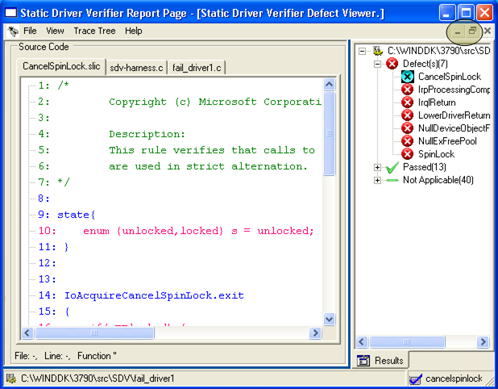
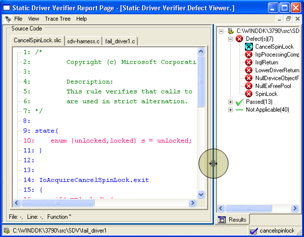

# Resizing the Defect Viewer Windows

To minimize or maximize the Defect Viewer (all three windows), use the **Minimize** or **Maximize** buttons that appear in the far right corner of the Static Driver Verifier Report just below the **Minimize** and **Maximize** buttons for the Static Driver Verifier Report Page, as shown in the following screen shot.

To resize a Defect Viewer window, place the cursor over the window border until the icon changes, and then drag the border to the desired position, as shown in the following screen shot.

 

 

[Send comments about this topic to Microsoft](mailto:wsddocfb@microsoft.com?subject=Documentation%20feedback%20[devtest\devtest]:%20Resizing%20the%20Defect%20Viewer%20Windows%20%20RELEASE:%20%2811/17/2016%29&body=%0A%0APRIVACY%20STATEMENT%0A%0AWe%20use%20your%20feedback%20to%20improve%20the%20documentation.%20We%20don't%20use%20your%20email%20address%20for%20any%20other%20purpose,%20and%20we'll%20remove%20your%20email%20address%20from%20our%20system%20after%20the%20issue%20that%20you're%20reporting%20is%20fixed.%20While%20we're%20working%20to%20fix%20this%20issue,%20we%20might%20send%20you%20an%20email%20message%20to%20ask%20for%20more%20info.%20Later,%20we%20might%20also%20send%20you%20an%20email%20message%20to%20let%20you%20know%20that%20we've%20addressed%20your%20feedback.%0A%0AFor%20more%20info%20about%20Microsoft's%20privacy%20policy,%20see%20http://privacy.microsoft.com/default.aspx. "Send comments about this topic to Microsoft")

