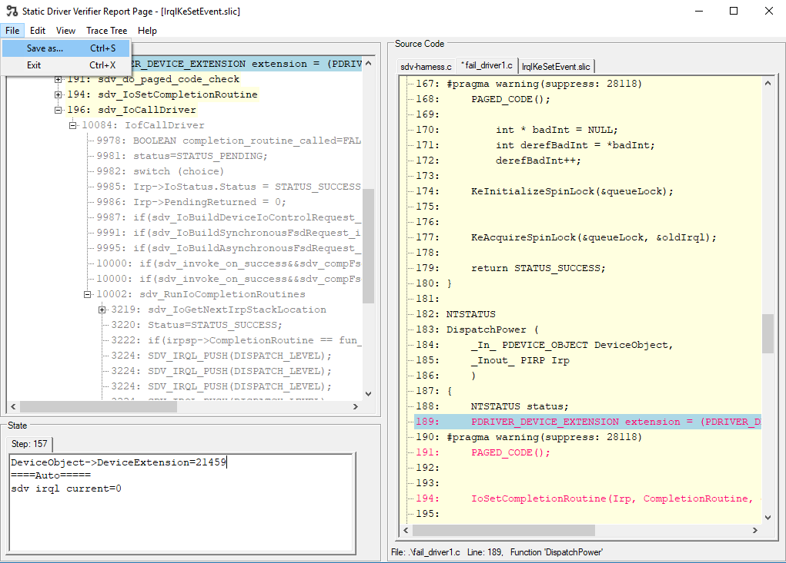

# Saving Defect Traces

The Static Driver Verifier Defect Viewer has functionality that allows you to save a specific defect trace in an easily shareable format.  

To save a trace, select "Save as..." from the file menu, or press Ctrl-S.  

Then specify a folder where the trace folder ("sdvdefect") will be placed.

The saved defect trace will contain copies of the relevant source code, the defect trace, and the necessary SDV files and executables to view the trace.  To view the trace, simply double-click the sdvdefect.exe file.

