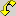

# State Pane


The **State** pane displays Boolean expressions for the values of variables in the driver, the operating system model, and the rule. SDV uses these expressions to construct an abstraction of the driver, the operating system model, and the rule, and uses them in the verification.

The following screen shot shows an example **State** pane in the Defect Viewer.


The **State** pane is a component of the Defect Viewer. When a code element is highlighted in the [Trace Tree pane](trace-tree-pane.md), and the corresponding line of source code is highlighted in the [Source Code pane](source-code-pane.md), the **State** pane displays the Boolean expressions (from the set of expressions that SDV is tracking for the driver) that evaluate to **TRUE** before the line of code is executed.

### <span id="tracking_boolean_expressions"></span><span id="TRACKING_BOOLEAN_EXPRESSIONS"></span>Tracking Boolean Expressions

While verifying each rule for the driver, SDV tracks a set of Boolean expressions. The Boolean expressions displayed in the **State** pane are the expressions in that set that evaluate to **TRUE**. If the element in the **Trace Tree** pane changes the value of any expression, the content of the **State** pane change to display the new set of expressions that evaluate to **TRUE**.

### <span id="interpreting_expressions_in_the_state_pane"></span><span id="INTERPRETING_EXPRESSIONS_IN_THE_STATE_PANE"></span>Interpreting Expressions in the State Pane

Most expressions that appear in the **State** pane are related to variables that are evident in the rule code. You can use source code for the rule (in the *RuleName*.slic file in the **Source Code** pane) to help you to interpret the expressions.

However, some expressions appear in the **State** pane without any details about their internal representation that might help you to interpret them. For example,

```
x!=x
```

To SDV, this expression represents a condition in which the value of variable *x* at this point in the trace is not equal to the value of the same variable at a different point in the trace. Use the driver source code, the rule code (\*.slic), and the elements in the **Trace Tree** pane to help you to interpret the expressions.

### <span id="step_tabs_in_the_state_pane"></span><span id="STEP_TABS_IN_THE_STATE_PANE"></span>Step Tabs in the State Pane

The Boolean expressions in the **State** pane are displayed on tabs. Each tab represents a step in the trace through all of the source code used in the verification. The number on the step tab represents the order of that step in the trace.

Typically, because each line of source code represents only one step in the trace, there will be only one step tab in the **State** pane. However, complex code can generate many steps.

For example, the following screen shot shows the State pane displaying a line of code that includes a function pointer. In this case, each step tab represents a step in the resolution of the pointer, the calling of the pointed-to function, and its result. (The number of step tabs reveals how many steps it takes for SDV to resolve the function pointer.)


To view each step tab in the **State** pane in order, select the associated line of code in the **Source Code** pane. Then, click the line of code in the **Source Code** pane repeatedly. Each time you click the selected line of code, SDV displays the next step tab until you have cycled through all of the step tabs. The curved yellow arrow () indicates the selected step. You can also click any tab in the **State** pane to view its content.

### <span id="comment"></span><span id="COMMENT"></span>Comment

SDV often tracks expressions in the **State** pane that do not appear in the rule and do not appear to be directly related to the rule. These expressions result from sophisticated heuristics that SDV uses in its attempts to correlate different values and different rule violations. In some situations, SDV cannot correctly evaluate the expression. In these cases, SDV provides a message that says that the current state is unknown, and displays the expression from the step with the last known state. See, the following code example for an explanation:

```
Unknown state. Last known state from step 120.
sdv irql current ==2
sdv irql current!=1
sdv irql current!=0
```

 

 


