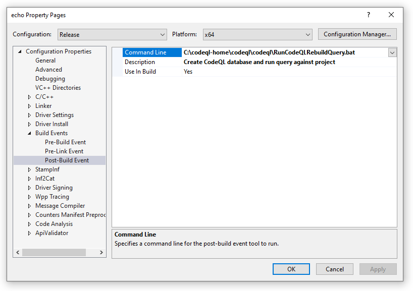

# CodeQL and the Static Tools Logo Test

Microsoft is committed to mitigating the attack surface for the Windows operating system, and ensuring that third party drivers meet a strong security bar is critical to accomplishing that goal.  One step in setting this security bar that Microsoft is taking is adding a new requirement to the [Windows Hardware Compatibility Program](/windows-hardware/design/compatibility) (WHCP).  This requirement states that all driver submissions must use the [CodeQL](https://securitylab.github.com/tools/codeql) engine on driver source code and fix any violations that are deemed **“Must-Fix”**.

[CodeQL](https://securitylab.github.com/tools/codeql), by GitHub, is a powerful static analysis technology for securing software. The combination of an extensive suite of high-value security queries and a robust platform make it an invaluable tool for securing third party driver code.

Usage of CodeQL for the purpose of WHCP testing is acceptable under the **[Hardware Lab Kit (HLK)](/windows-hardware/test/hlk/) End User License Agreement**.  For WHCP participants, the HLK's EULA overwrites GitHub's CodeQL Terms and Conditions.  The HLK EULA states that CodeQL **can be used** during automated analysis, CI or CD, as part of normal engineering processes for the purposes of analyzing drivers to be submitted and certified as part of the WHCP.

The requirement to analyze the driver source code and fix any **“Must-Fix”** violations will be enforced by the [Static Tools Logo Test](/windows-hardware/test/hlk/testref/6ab6df93-423c-4af6-ad48-8ea1049155ae).

This topic describes how to:

- Use CodeQL to analyze your driver source code for known high impact security issues.
- Ensure the Static Tools Logo Test can consume the results of running CodeQL.
- Determine which **“Must-Fix”** [queries](#must-fix-queries) must be run without error for certification, as part of the WHCP.

## Concepts for CodeQL

**CodeQL** is the analysis engine used by developers to perform security analysis.  A **CodeQL database** is a directory containing:

- Queryable data, extracted from driver source code.
- A source reference, for displaying query results directly in source code.  A **query** can be thought of as a “check” or “rule”.  Each query represents a distinct security vulnerability that is being searched for. For more information, see [Writing queries](https://codeql.github.com/docs/writing-codeql-queries/codeql-queries/) in the CodeQL docs.
- Query results.
- Log files generated during database creation, query execution, and other operations.

This topic details how to perform analysis using CodeQL command line interface (CLI) with a focus on driver developers for Windows.  Supplementary documentation can be found at [CodeQL Getting Started](https://codeql.github.com/docs/codeql-cli/getting-started-with-the-codeql-cli/).

We will use the [CodeQL command line tools (CLI)](https://codeql.github.com/docs/codeql-cli/) to create a CodeQL database from a variety of compiled and interpreted languages, and then analyze that database using a driver-specific [query suite](https://codeql.github.com/docs/codeql-cli/creating-codeql-query-suites/).

## CodeQL Windows Setup

### Download, install and test CodeQL

1. The first task will be to create a directory to contain CodeQL.  This example will use `C:\codeql-home\`

```command
C:\> mkdir C:\codeql-home
```

2. Navigate to the Github [CodeQL Download Page](https://github.com/github/codeql-cli-binaries/releases/)
3. Download the latest version of the zip file. For example for 64 bit Windows "codeql-win64.zip".
4. Unzip the codeql folder in the zip file to a directory, for example,  `C:\codeql-home\codeql\`.
5. Confirm that the CodeQL command works by displaying the help.

```command
C:\codeql-home\codeql\>codeql --help
Usage: codeql <command> <argument>...
Create and query CodeQL databases, or work with the QL language.

GitHub makes this program freely available for the analysis of open-source software and certain other uses, but it is
not itself free software. Type codeql --license to see the license terms.

      --license              Show the license terms for the CodeQL toolchain.
Common options:
  -h, --help                 Show this help text.
  -v, --verbose              Incrementally increase the number of progress messages printed.
  -q, --quiet                Incrementally decrease the number of progress messages printed.
Some advanced options have been hidden; try --help -v for a fuller view.
Commands:
  query     Compile and execute QL code.
  bqrs      Get information from .bqrs files.
  database  Create, analyze and process CodeQL databases.
  dataset   [Plumbing] Work with raw QL datasets.
  test      Execute QL unit tests.
  resolve   [Deep plumbing] Helper commands to resolve disk locations etc.
  execute   [Deep plumbing] Low-level commands that need special JVM options.
  version   Show the version of the CodeQL toolchain.
  generate  Generate formatted QL documentation.
```

### Clone the repository to access the driver-specific queries

1. Navigate to the [Microsoft CodeQL GitHub repository](https://github.com/microsoft/Windows-Driver-Developer-Supplemental-Tools).

2. [Clone](https://github.com/git-guides/git-clone) the repository to download all CodeQL queries and [query suites](https://codeql.github.com/docs/codeql-cli/creating-codeql-query-suites/) with driver-specific queries.

```command
C:\codeql-home\>git clone https://github.com/microsoft/Windows-Driver-Developer-Supplemental-Tools.git --recursive
```

> [!NOTE]
> Usage of CodeQL for the purpose of WHCP testing is acceptable under the **[Hardware Lab Kit (HLK)](/windows-hardware/test/hlk/) End User License Agreement**.  For WHCP participants, the HLK's EULA overwrites GitHub's CodeQL Terms and Conditions.  The HLK EULA states that CodeQL **can be used** during automated analysis, CI or CD, as part of normal engineering processes for the purposes of analyzing drivers to be submitted and certified as part of the WHCP.

This page assumes a Windows development environment and that the repository will be installed under *C:\codeql-home*.

## Building your CodeQL Database

The next steps create a CodeQL database that you can use for analysis.

Create a directory to keep CodeQL databases (the databases folder).  This example will use *C:\codeql-home\databases*

```command
mkdir C:\codeql-home\databases
```

In general, the command used to create a CodeQL database will look like the following:

```command
codeql database create -l=[cpp/csharp/python/java/javascript/go/xml] -s=<path to source code> -c=<command to build> <database folder>\<project name> -j 0
```

For help using the database create command, type:

```command
codeql database create --help
```

In this example, CodeQL uses the MSBuild compiler to process the C++ code to prepare it to be analyzed.


> [!NOTE]
> CodeQL does not require MSBuild or Visual Studio to be used. See [supported languges and frameworks](https://codeql.github.com/docs/codeql-overview/supported-languages-and-frameworks/) for a list of which compilers are supported.

### Example

Using a command line environment that is used for building driver source code, such as the [Enterprise Windows Driver Kit (EWDK)](../develop/using-the-enterprise-wdk.md), navigate to the CodeQL tools folder where the repository was cloned. If you are building the driver using Visual Studio, you can configure the CodeQL queries to run as a post build event as discussed in [Visual Studio Post-Build Event](#visual-studio-post-build-event) in this topic.

This example will process the evaluate the kmdfecho.sln driver sample, which is available on GitHub.

https://github.com/Microsoft/Windows-driver-samples/tree/master/general/echo/kmdf

The example below will place the kmdf sample in the `C:\codeql-home\drivers\kmdf` directory.  

Run the following commands to create a new CodeQL database under *C:\codeql-home\databases\kmdf*.

```command
C:\codeql-home>C:\codeql-home\codeql\codeql.cmd database create -l=cpp -s=C:\codeql-home\drivers\kmdf -c "msbuild /t:rebuild "C:\codeql-home\drivers\kmdf\kmdfecho.sln" /p:UseSharedCompilation=false" "C:\codeql-home\databases\kmdf" -j 0
```

The *“-j 0”* flag indicates to use as many threads as there are CPU’s in the import step of creating the database.

This example uses this argument to find and build the driver project. The msbuild command must be available in the path.

```command
msbuild /t:rebuild "C:\codeql-home\drivers\kmdf\kmdfecho.sln"
```

## Summary of directory locations

At this point in our example setup, the following directories will be present.

| Description            | Location                           |
|------------------------|------------------------------------|
| Codeql.exe             | C:\codeql-home\codeql\codeql       |
| C++ Rules              | C:\codeql-home\codeql\cpp          |
| Databases              | C:\codeql-home\databases           |
| Driver code under test | C:\codeql-home\drivers\kmdf        |
| Query suites with driver-specific queries | C:\codeql-home\Windows-Driver-Developer-Supplemental-Tools\codeql\windows-drivers\suites      |

## Perform Analysis

At this point, the set-up is complete and the next step is to perform the actual analysis on the driver source code.

CodeQL CLI tools can perform analysis of the database that has been created in the previous step and can run queries or suites of queries.  The findings are reported as output in *CSV* or *SARIF* format.

For the purposes of this example, it is assumed that the suite of queries to be run on driver source code is the *windows_driver_recommended.qls* suite that is included when the [Microsoft CodeQL repository](https://github.com/microsoft/Windows-Driver-Developer-Supplemental-Tools) is cloned.

The *"database analyze"* command to execute analysis uses the following syntax:

```command
codeql database analyze <database> <path to query, suite or directory> 
--search-path=<path to search for packages> 
--format=[csv/sarif-latest/sarifv1/sarifv2/sarifv2.1.0/graphtext/dgml] 
--output=<output file directory>\output file name> 
-j 0
```
The *“-j 0”* flag indicates to use as many threads as there are CPU’s in the analysis portion.

Display help on the codeql database analyze command using the `--help` parameter.

```command
C:\codeql-home\codeql>codeql database analyze --help
Usage: codeql database analyze [OPTIONS] <database> [<query|dir|suite>...]
Analyze a database, producing meaningful results in the context of the source code.

Run a query suite (or some individual queries) against a CodeQL database, producing results, styled as alerts or paths,
in SARIF or another interpreted format.

...

```

To evaluate the *windows_driver_recommended.qls* query suite against the kmdf echo driver with the results returned in SARIF format use the command below.  The *windows_driver_recommended.qls* query suite is a superset of all queries that Microsoft has deemed as valuable for driver developers.  Read more about query suites in the ["Query Suites"](#query-suites) section below.

```command
C:\codeql-home>c:\codeql-home\codeql\codeql.cmd database analyze "C:\codeql-home\databases\kmdf" windows_driver_recommended.qls --format=sarifv2.1.0 --output=C:\codeql-home\databases\kmdfecho1.sarif -j 0
```

Output similar to the following should be displayed:

```command
Running queries.
Compiling query plan for C:\codeql-home\Windows-Driver-Developer-Supplemental-Tools\codeql\codeql-queries\cpp\ql\src\Best Practices\Likely Errors\OffsetUseBeforeRangeCheck.ql.
[1/22] Found in cache: C:\codeql-home\Windows-Driver-Developer-Supplemental-Tools\codeql\codeql-queries\cpp\ql\src\Best Practices\Likely Errors\OffsetUseBeforeRangeCheck.ql.
Compiling query plan for C:\codeql-home\Windows-Driver-Developer-Supplemental-Tools\codeql\codeql-queries\cpp\ql\src\Likely Bugs\Arithmetic\IntMultToLong.ql.
Compiling query plan for C:\codeql-home\Windows-Driver-Developer-Supplemental-Tools\codeql\codeql-queries\cpp\ql\src\Likely Bugs\Arithmetic\BadAdditionOverflowCheck.ql.
[2/22] Found in cache: C:\codeql-home\Windows-Driver-Developer-Supplemental-Tools\codeql\codeql-queries\cpp\ql\src\Likely Bugs\Arithmetic\BadAdditionOverflowCheck.ql.
Compiling query plan for C:\codeql-home\Windows-Driver-Developer-Supplemental-Tools\codeql\codeql-queries\cpp\ql\src\Likely Bugs\Arithmetic\SignedOverflowCheck.ql.
[3/22] Found in cache: C:\codeql-home\Windows-Driver-Developer-Supplemental-Tools\codeql\codeql-queries\cpp\ql\src\Likely Bugs\Arithmetic\IntMultToLong.ql.
Compiling query plan for C:\codeql-home\Windows-Driver-Developer-Supplemental-Tools\codeql\codeql-queries\cpp\ql\src\Likely Bugs\Conversion\CastArrayPointerArithmetic.ql.
[4/22] Found in cache: C:\codeql-home\Windows-Driver-Developer-Supplemental-Tools\codeql\codeql-queries\cpp\ql\src\Likely Bugs\Conversion\CastArrayPointerArithmetic.ql.
Compiling query plan for C:\codeql-home\Windows-Driver-Developer-Supplemental-Tools\codeql\codeql-queries\cpp\ql\src\Likely Bugs\Likely Typos\IncorrectNotOperatorUsage.ql.
[5/22] Found in cache: C:\codeql-home\Windows-Driver-Developer-Supplemental-Tools\codeql\codeql-queries\cpp\ql\src\Likely Bugs\Likely Typos\IncorrectNotOperatorUsage.ql.
Compiling query plan for C:\codeql-home\Windows-Driver-Developer-Supplemental-Tools\codeql\codeql-queries\cpp\ql\src\Likely Bugs\Memory Management\PointerOverflow.ql.
[6/22] Found in cache: C:\codeql-home\Windows-Driver-Developer-Supplemental-Tools\codeql\codeql-queries\cpp\ql\src\Likely Bugs\Arithmetic\SignedOverflowCheck.ql.
Compiling query plan for C:\codeql-home\Windows-Driver-Developer-Supplemental-Tools\codeql\codeql-queries\cpp\ql\src\Likely Bugs\Memory Management\SuspiciousSizeof.ql.
[7/22] Found in cache: C:\codeql-home\Windows-Driver-Developer-Supplemental-Tools\codeql\codeql-queries\cpp\ql\src\Likely Bugs\Memory Management\SuspiciousSizeof.ql.
Compiling query plan for C:\codeql-home\Windows-Driver-Developer-Supplemental-Tools\codeql\codeql-queries\cpp\ql\src\Likely Bugs\Memory Management\UninitializedLocal.ql.
[8/22] Found in cache: C:\codeql-home\Windows-Driver-Developer-Supplemental-Tools\codeql\codeql-queries\cpp\ql\src\Likely Bugs\Memory Management\PointerOverflow.ql.
Compiling query plan for C:\codeql-home\Windows-Driver-Developer-Supplemental-Tools\codeql\codeql-queries\cpp\ql\src\Likely Bugs\Underspecified Functions\TooFewArguments.ql.
[9/22] Found in cache: C:\codeql-home\Windows-Driver-Developer-Supplemental-Tools\codeql\codeql-queries\cpp\ql\src\Likely Bugs\Memory Management\UninitializedLocal.ql.
Compiling query plan for C:\codeql-home\Windows-Driver-Developer-Supplemental-Tools\codeql\codeql-queries\cpp\ql\src\Security\CWE\CWE-121\UnterminatedVarargsCall.ql.
[10/22] Found in cache: C:\codeql-home\Windows-Driver-Developer-Supplemental-Tools\codeql\codeql-queries\cpp\ql\src\Likely Bugs\Underspecified Functions\TooFewArguments.ql.
Compiling query plan for C:\codeql-home\Windows-Driver-Developer-Supplemental-Tools\codeql\codeql-queries\cpp\ql\src\Security\CWE\CWE-190\ComparisonWithWiderType.ql.
[11/22] Found in cache: C:\codeql-home\Windows-Driver-Developer-Supplemental-Tools\codeql\codeql-queries\cpp\ql\src\Security\CWE\CWE-121\UnterminatedVarargsCall.ql.
Compiling query plan for C:\codeql-home\Windows-Driver-Developer-Supplemental-Tools\codeql\codeql-queries\cpp\ql\src\Security\CWE\CWE-253\HResultBooleanConversion.ql.
[12/22] Found in cache: C:\codeql-home\Windows-Driver-Developer-Supplemental-Tools\codeql\codeql-queries\cpp\ql\src\Security\CWE\CWE-190\ComparisonWithWiderType.ql.
Compiling query plan for C:\codeql-home\Windows-Driver-Developer-Supplemental-Tools\codeql\codeql-queries\cpp\ql\src\Security\CWE\CWE-457\ConditionallyUninitializedVariable.ql.
[13/22] Found in cache: C:\codeql-home\Windows-Driver-Developer-Supplemental-Tools\codeql\codeql-queries\cpp\ql\src\Security\CWE\CWE-253\HResultBooleanConversion.ql.
Compiling query plan for C:\codeql-home\Windows-Driver-Developer-Supplemental-Tools\codeql\codeql-queries\cpp\ql\src\Security\CWE\CWE-468\IncorrectPointerScaling.ql.
[14/22] Found in cache: C:\codeql-home\Windows-Driver-Developer-Supplemental-Tools\codeql\codeql-queries\cpp\ql\src\Security\CWE\CWE-468\IncorrectPointerScaling.ql.
Compiling query plan for C:\codeql-home\Windows-Driver-Developer-Supplemental-Tools\codeql\codeql-queries\cpp\ql\src\Security\CWE\CWE-468\IncorrectPointerScalingVoid.ql.
[15/22] Found in cache: C:\codeql-home\Windows-Driver-Developer-Supplemental-Tools\codeql\codeql-queries\cpp\ql\src\Security\CWE\CWE-468\IncorrectPointerScalingVoid.ql.
Compiling query plan for C:\codeql-home\Windows-Driver-Developer-Supplemental-Tools\codeql\codeql-queries\cpp\ql\src\Security\CWE\CWE-468\SuspiciousAddWithSizeof.ql.
[16/22] Found in cache: C:\codeql-home\Windows-Driver-Developer-Supplemental-Tools\codeql\codeql-queries\cpp\ql\src\Security\CWE\CWE-468\SuspiciousAddWithSizeof.ql.
Compiling query plan for C:\codeql-home\Windows-Driver-Developer-Supplemental-Tools\codeql\codeql-queries\cpp\ql\src\Security\CWE\CWE-676\PotentiallyDangerousFunction.ql.
[17/22] Found in cache: C:\codeql-home\Windows-Driver-Developer-Supplemental-Tools\codeql\codeql-queries\cpp\ql\src\Security\CWE\CWE-676\PotentiallyDangerousFunction.ql.
Compiling query plan for C:\codeql-home\Windows-Driver-Developer-Supplemental-Tools\codeql\codeql-queries\cpp\ql\src\Security\CWE\CWE-704\WcharCharConversion.ql.
[18/22] Found in cache: C:\codeql-home\Windows-Driver-Developer-Supplemental-Tools\codeql\codeql-queries\cpp\ql\src\Security\CWE\CWE-704\WcharCharConversion.ql.
Compiling query plan for C:\codeql-home\Windows-Driver-Developer-Supplemental-Tools\codeql\windows-drivers\queries\Likely Bugs\Memory Management\UseAfterFree\ProbableUseAfterFree.ql.
[19/22 comp 1m39s] Compiled C:\codeql-home\Windows-Driver-Developer-Supplemental-Tools\codeql\codeql-queries\cpp\ql\src\Security\CWE\CWE-457\ConditionallyUninitializedVariable.ql.
Compiling query plan for C:\codeql-home\Windows-Driver-Developer-Supplemental-Tools\codeql\windows-drivers\queries\Likely Bugs\Memory Management\UseAfterFree\UseAfterFree.ql.
[20/22 comp 2m24s] Compiled C:\codeql-home\Windows-Driver-Developer-Supplemental-Tools\codeql\windows-drivers\queries\Likely Bugs\Memory Management\UseAfterFree\ProbableUseAfterFree.ql.
Compiling query plan for C:\codeql-home\Windows-Driver-Developer-Supplemental-Tools\codeql\windows-drivers\queries\Windows\wdk\wdk-deprecated-api.ql.
[21/22 comp 1m1s] Compiled C:\codeql-home\Windows-Driver-Developer-Supplemental-Tools\codeql\windows-drivers\queries\Likely Bugs\Memory Management\UseAfterFree\UseAfterFree.ql.
[22/22 comp 9.6s] Compiled C:\codeql-home\Windows-Driver-Developer-Supplemental-Tools\codeql\windows-drivers\queries\Windows\wdk\wdk-deprecated-api.ql.
Starting evaluation of codeql-cpp\Likely Bugs\Arithmetic\BadAdditionOverflowCheck.ql.
Starting evaluation of codeql-cpp\Likely Bugs\Memory Management\PointerOverflow.ql.
Starting evaluation of codeql-cpp\Likely Bugs\Memory Management\SuspiciousSizeof.ql.
Starting evaluation of codeql-cpp\Likely Bugs\Arithmetic\SignedOverflowCheck.ql.
Starting evaluation of codeql-cpp\Likely Bugs\Likely Typos\IncorrectNotOperatorUsage.ql.
Starting evaluation of codeql-cpp\Likely Bugs\Conversion\CastArrayPointerArithmetic.ql.
Starting evaluation of codeql-cpp\Likely Bugs\Arithmetic\IntMultToLong.ql.
Starting evaluation of codeql-cpp\Best Practices\Likely Errors\OffsetUseBeforeRangeCheck.ql.
Starting evaluation of codeql-cpp\Likely Bugs\Memory Management\UninitializedLocal.ql.
Starting evaluation of codeql-cpp\Likely Bugs\Underspecified Functions\TooFewArguments.ql.
Starting evaluation of codeql-cpp\Security\CWE\CWE-121\UnterminatedVarargsCall.ql.
Starting evaluation of codeql-cpp\Security\CWE\CWE-190\ComparisonWithWiderType.ql.
Starting evaluation of codeql-cpp\Security\CWE\CWE-253\HResultBooleanConversion.ql.
Starting evaluation of codeql-cpp\Security\CWE\CWE-468\IncorrectPointerScaling.ql.
Starting evaluation of codeql-cpp\Security\CWE\CWE-468\IncorrectPointerScalingVoid.ql.
Starting evaluation of codeql-cpp\Security\CWE\CWE-468\SuspiciousAddWithSizeof.ql.
Starting evaluation of codeql-cpp\Security\CWE\CWE-676\PotentiallyDangerousFunction.ql.
Starting evaluation of codeql-cpp\Security\CWE\CWE-704\WcharCharConversion.ql.
Starting evaluation of codeql-cpp\Security\CWE\CWE-457\ConditionallyUninitializedVariable.ql.
Starting evaluation of windows-drivers\queries\Likely Bugs\Memory Management\UseAfterFree\ProbableUseAfterFree.ql.
Starting evaluation of windows-drivers\queries\Likely Bugs\Memory Management\UseAfterFree\UseAfterFree.ql.
Starting evaluation of windows-drivers\queries\Windows\wdk\wdk-deprecated-api.ql.
[1/22 eval 16.1s] Evaluation done; writing results to codeql-cpp\Security\CWE\CWE-676\PotentiallyDangerousFunction.bqrs.
[2/22 eval 16.3s] Evaluation done; writing results to codeql-cpp\Security\CWE\CWE-704\WcharCharConversion.bqrs.
[3/22 eval 17.5s] Evaluation done; writing results to codeql-cpp\Best Practices\Likely Errors\OffsetUseBeforeRangeCheck.bqrs.
[4/22 eval 17.6s] Evaluation done; writing results to codeql-cpp\Likely Bugs\Memory Management\SuspiciousSizeof.bqrs.
[5/22 eval 16.5s] Evaluation done; writing results to codeql-cpp\Security\CWE\CWE-468\SuspiciousAddWithSizeof.bqrs.
[6/22 eval 17.6s] Evaluation done; writing results to codeql-cpp\Likely Bugs\Arithmetic\BadAdditionOverflowCheck.bqrs.
[7/22 eval 17.7s] Evaluation done; writing results to codeql-cpp\Likely Bugs\Likely Typos\IncorrectNotOperatorUsage.bqrs.
[8/22 eval 16.9s] Evaluation done; writing results to codeql-cpp\Security\CWE\CWE-253\HResultBooleanConversion.bqrs.
[9/22 eval 18.5s] Evaluation done; writing results to windows-drivers\queries\Windows\wdk\wdk-deprecated-api.bqrs.
[10/22 eval 19.4s] Evaluation done; writing results to codeql-cpp\Likely Bugs\Underspecified Functions\TooFewArguments.bqrs.
[11/22 eval 19.2s] Evaluation done; writing results to codeql-cpp\Security\CWE\CWE-121\UnterminatedVarargsCall.bqrs.
[12/22 eval 23.4s] Evaluation done; writing results to codeql-cpp\Security\CWE\CWE-468\IncorrectPointerScaling.bqrs.
[13/22 eval 23.2s] Evaluation done; writing results to codeql-cpp\Security\CWE\CWE-468\IncorrectPointerScalingVoid.bqrs.
[14/22 eval 26.3s] Evaluation done; writing results to codeql-cpp\Likely Bugs\Memory Management\UninitializedLocal.bqrs.
[15/22 eval 31.7s] Evaluation done; writing results to codeql-cpp\Likely Bugs\Conversion\CastArrayPointerArithmetic.bqrs.
[16/22 eval 32s] Evaluation done; writing results to windows-drivers\queries\Likely Bugs\Memory Management\UseAfterFree\ProbableUseAfterFree.bqrs.
[17/22 eval 33.5s] Evaluation done; writing results to codeql-cpp\Likely Bugs\Arithmetic\IntMultToLong.bqrs.
[18/22 eval 33.5s] Evaluation done; writing results to codeql-cpp\Security\CWE\CWE-190\ComparisonWithWiderType.bqrs.
[19/22 eval 33.8s] Evaluation done; writing results to codeql-cpp\Security\CWE\CWE-457\ConditionallyUninitializedVariable.bqrs.
[20/22 eval 36.5s] Evaluation done; writing results to windows-drivers\queries\Likely Bugs\Memory Management\UseAfterFree\UseAfterFree.bqrs.
[21/22 eval 38.9s] Evaluation done; writing results to codeql-cpp\Likely Bugs\Memory Management\PointerOverflow.bqrs.
[22/22 eval 46.1s] Evaluation done; writing results to codeql-cpp\Likely Bugs\Arithmetic\SignedOverflowCheck.bqrs.
Shutting down query evaluator.
Interpreting results.
```

You can specify a timeout for the entire operation with the *"–timeout=[seconds]"* flag.  This can be useful for analysis on queries without being limited by a single, long-running query.  More options to tweak analysis optimizations are described in [database analyze](https://codeql.github.com/docs/codeql-cli/analyzing-databases-with-the-codeql-cli/). 

## Query Suites

As part of the [Microsoft CodeQL GitHub repository](https://github.com/microsoft/Windows-Driver-Developer-Supplemental-Tools), Microsoft has provided two query suites to simplify the end-to-end driver developer workflow.  The *windows_driver_recommended.qls* query suite contains a superset of [all of the queries](#queries) that Microsoft has deemed valuable for driver developers.  

The *windows_driver_mustfix.qls* query suite contains [queries](#must-fix-queries) that are currently deemed as **"Must-Fix"** for WHCP certification. Both of these query suites will be updated regularly as Microsoft finalizes the list of available queries and the list of "Must-Fix" queries required for WHCP certification.  As a result, it is critical to regularly sync the repository using the ["git pull"](https://www.git-scm.com/docs/git-pull) command.

## Troubleshooting

For [database version](https://codeql.github.com/docs/codeql-cli/manual/version/) mismatches issues, the following tools may be helpful.

Use the codeql version command to display the version of the codeql exe.

```command
C:\codeql-home\codeql\>codeql version
CodeQL command-line toolchain release 2.4.0.
Copyright (C) 2019-2020 GitHub, Inc.
Unpacked in: C:\codeql-home\codeql\
   Analysis results depend critically on separately distributed query and
   extractor modules. To list modules that are visible to the toolchain,
   use 'codeql resolve qlpacks' and 'codeql resolve languages'.
```

The database upgrade command will update a database. Be aware that this is a one way upgrade and is not reversible. For more information, see [database upgrade](https://codeql.github.com/docs/codeql-cli/upgrading-codeql-databases/).

## Queries

This page will be updated to indicate which queries are officially deemed **"Must-Fix"** for WHCP certification.

The queries that Microsoft recommends running on *all* driver source code are:

| ID                       | Location   | [Common Weakness Enumeration](https://cwe.mitre.org/)   |
| ------------------------ | ---------- | ----------------------------- |
| [cpp/too-few-arguments](https://codeql.github.com/codeql-query-help/cpp/cpp-too-few-arguments/)   | *cpp/ql/src/Likely Bugs/Underspecified Functions/TooFewArguments.ql* | N/A |
| [cpp/bad-addition-overflow-check](https://codeql.github.com/codeql-query-help/cpp/cpp-bad-addition-overflow-check/)   | *cpp/ql/src/Likely Bugs/Arithmetic/BadAdditionOverflowCheck.ql* | [CWE-190](https://cwe.mitre.org/data/definitions/190.html), [CWE-192](https://cwe.mitre.org/data/definitions/192.html) |
| [cpp/pointer-overflow-check](https://codeql.github.com/codeql-query-help/cpp/cpp-pointer-overflow-check/)   | *cpp/ql/src/Likely Bugs/Memory Management/PointerOverflow.ql* | N/A |
| [cpp/hresult-boolean-conversion](https://codeql.github.com/codeql-query-help/cpp/cpp-hresult-boolean-conversion/)   | *cpp/ql/src/Security/CWE/CWE-253/HResultBooleanConversion.ql* | [CWE-253](https://cwe.mitre.org/data/definitions/253.html) |
| [cpp/incorrect-string-type-conversion](https://codeql.github.com/codeql-query-help/cpp/cpp-incorrect-string-type-conversion/)   | *cpp/ql/src/Security/CWE/CWE-704/WcharCharConversion.ql* | [CWE-704](https://cwe.mitre.org/data/definitions/704.html) |
| [cpp/integer-multiplication-cast-to-long](https://codeql.github.com/codeql-query-help/cpp/cpp-integer-multiplication-cast-to-long/)   | *cpp/ql/src/Likely Bugs/Arithmetic/IntMultToLong.ql* | [CWE-190](https://cwe.mitre.org/data/definitions/190.html), [CWE-192](https://cwe.mitre.org/data/definitions/192.html), [CWE-197](https://cwe.mitre.org/data/definitions/197.html), [CWE-681](https://cwe.mitre.org/data/definitions/681.html) |
| [cpp/signed-overflow-check](https://codeql.github.com/codeql-query-help/cpp/cpp-signed-overflow-check/)   | *cpp/ql/src/Likely Bugs/Arithmetic/SignedOverflowCheck.ql* | N/A | 
| [cpp/upcast-array-pointer-arithmetic](https://codeql.github.com/codeql-query-help/cpp/cpp-upcast-array-pointer-arithmetic/)   | *cpp/ql/src/Likely Bugs/Conversion/CastArrayPointerArithmetic.ql* | [CWE-119](https://cwe.mitre.org/data/definitions/119.html), [CWE-843](https://cwe.mitre.org/data/definitions/843.html) |
| [cpp/comparison-with-wider-type](https://codeql.github.com/codeql-query-help/cpp/cpp-comparison-with-wider-type/)   | *cpp/ql/src/Security/CWE/CWE-190/ComparisonWithWiderType.ql* | [CWE-190](https://cwe.mitre.org/data/definitions/190.html), [CWE-197](https://cwe.mitre.org/data/definitions/197.html), [CWE-835](https://cwe.mitre.org/data/definitions/835.html) |
| [cpp/suspicious-add-sizeof](https://codeql.github.com/codeql-query-help/cpp/cpp-suspicious-add-sizeof/)   | *cpp/ql/src/Security/CWE/CWE-468/SuspiciousAddWithSizeof.ql* | [CWE-468](https://cwe.mitre.org/data/definitions/468.html) |
| [cpp/potentially-dangerous-function](https://codeql.github.com/codeql-query-help/cpp/cpp-potentially-dangerous-function/)   | *cpp/ql/src/Security/CWE/CWE-676/PotentiallyDangerousFunction.ql* | [CWE-676](https://codeql.github.com/codeql-query-help/cpp/cpp-potentially-dangerous-function/) 
| [cpp/incorrect-not-operator-usage](https://codeql.github.com/codeql-standard-libraries/cpp/Likely%20Bugs/Likely%20Typos/IncorrectNotOperatorUsage.ql/module.IncorrectNotOperatorUsage.html)   | *cpp/ql/src/Likely Bugs/Likely Typos/IncorrectNotOperatorUsage.ql* | [CWE-480](https://cwe.mitre.org/data/definitions/480.html) |
| [cpp/offset-use-before-range-check](https://github.com/github/codeql/blob/main/cpp/ql/src/Best%20Practices/Likely%20Errors/OffsetUseBeforeRangeCheck.qhelp)  | *cpp/ql/src/Best Practices/Likely Errors/OffsetUseBeforeRangeCheck.ql*   | N/A |
| [cpp/suspicious-add-sizeof](https://codeql.github.com/codeql-query-help/cpp/cpp-suspicious-add-sizeof/)   | *cpp/ql/src/Likely Bugs/Memory Management/SuspiciousSizeof.ql* | [CWE-468](https://codeql.github.com/codeql-query-help/cpp/cpp-suspicious-add-sizeof/) |
| [cpp/uninitialized-local](https://codeql.github.com/codeql-standard-libraries/cpp/Likely%20Bugs/Memory%20Management/UninitializedLocal.ql/module.UninitializedLocal.html)   | *cpp/ql/src/Likely Bugs/Memory Management/UninitializedLocal.ql* | [CWE-457](https://cwe.mitre.org/data/definitions/457.html), [CWE-665](https://cwe.mitre.org/data/definitions/665.html) |
| [cpp/unterminated-variadic-call](https://codeql.github.com/codeql-standard-libraries/cpp/Security/CWE/CWE-121/UnterminatedVarargsCall.ql/module.UnterminatedVarargsCall.html)   | *cpp/ql/src/Security/CWE/CWE-121/UnterminatedVarargsCall.ql* | [CWE-121](https://cwe.mitre.org/data/definitions/121.html) |
| [cpp/suspicious-pointer-scaling](https://github.com/github/codeql/blob/main/cpp/ql/src/Security/CWE/CWE-468/IncorrectPointerScalingChar.qhelp)   | *cpp/ql/src/Security/CWE/CWE-468/IncorrectPointerScaling.ql* | [CWE-468](https://cwe.mitre.org/data/definitions/468.html) |
| [cpp/suspicious-pointer-scaling-void](https://github.com/github/codeql/blob/main/cpp/ql/src/Security/CWE/CWE-468/IncorrectPointerScalingVoid.qhelp)   | *cpp/ql/src/Security/CWE/CWE-468/IncorrectPointerScalingVoid.ql* | [CWE-468](https://cwe.mitre.org/data/definitions/468.html) |
| [cpp/conditionally-uninitialized-variable](https://codeql.github.com/codeql-standard-libraries/cpp/Security/CWE/CWE-457/ConditionallyUninitializedVariable.ql/module.ConditionallyUninitializedVariable.html)   | *cpp/ql/src/Security/CWE/CWE-457/ConditionallyUninitializedVariable.ql.* | [CWE-457](https://cwe.mitre.org/data/definitions/457.html) |
| [cpp/use-after-free](./codeql-windows-driver-useafterfree.md)   | *Windows-Driver-Developer-Supplemental-Tools/codeql/windows-drivers/queries/Likely Bugs/Memory Management/UseAfterFree\UseAfterFree.ql* | N/A |
| [cpp/windows/wdk/deprecated-api](./codeql-windows-driver-wdkdeprecatedapi.md)   | *Windows-Driver-Developer-Supplemental-Tools/codeql/windows-drivers/queries/Windows/wdk/wdk-deprecated-api.ql* | N/A |
| [Likely Bugs/Boundary Violations/PaddingByteInformationDisclosure.ql](./codeql-windows-driver-padding-byte-information-disclosure.md)   | *Windows-Driver-Developer-Supplemental-Tools/codeql/windows-drivers/queries/Likely Bugs/Boundary Violations/PaddingByteInformationDisclosure.ql* | N/A |
| [Likely Bugs/Conversion/BadOverflowGuard.ql](./codeql-windows-driver-badoverflowguard.md)   | *Windows-Driver-Developer-Supplemental-Tools/codeql/windows-drivers/queries/Likely Bugs/Conversion/BadOverflowGuard.ql* | N/A |
| [Likely Bugs/Conversion/InfiniteLoop.ql](./codeql-windows-driver-infiniteloop.md)   | *Windows-Driver-Developer-Supplemental-Tools/codeql/windows-drivers/queries/Likely Bugs/Conversion/InfiniteLoop.ql* | N/A |
| [Likely Bugs/UninitializedPtrField.ql](./codeql-windows-driver-uninitializedptrfield.md)   | *Windows-Driver-Developer-Supplemental-Tools/codeql/windows-drivers/queries/Likely Bugs/UninitializedPtrField.ql* | N/A |
| [cpp/Security/Cryptography/HardcodedIVCNG.ql](./codeql-windows-driver-hardcodedivcng.md)   | *Windows-Driver-Developer-Supplemental-Tools/codeql/windows-drivers/queries/Security/Crytpography/HardcodedIVCNG.ql* | N/A |

These queries are a part of the *windows_driver_recommended.qls* query suite in the [Microsoft GitHub CodeQL repository](https://github.com/microsoft/Windows-Driver-Developer-Supplemental-Tools).  The "Common Weakness Enumeration" (CWE) column specifies what kinds of security issues the given query searches for.  See [Mitre's page on CWE](https://cwe.mitre.org/) for more details around CWE's. 

### Must-Fix Queries

The subset of queries below are currently deemed as **"Must-Fix"** for WHCP certification.  

| ID            | Location | [Common Weakness Enumeration](https://cwe.mitre.org/)   |
| ------------------------ | ---------- | ----------------------------- |
| [cpp/too-few-arguments](https://codeql.github.com/codeql-query-help/cpp/cpp-too-few-arguments/)   | *cpp/ql/src/Likely Bugs/Underspecified Functions/TooFewArguments.ql* | N/A |
| [cpp/bad-addition-overflow-check](https://codeql.github.com/codeql-query-help/cpp/cpp-bad-addition-overflow-check/)   | *cpp/ql/src/Likely Bugs/Arithmetic/BadAdditionOverflowCheck.ql* | [CWE-190](https://cwe.mitre.org/data/definitions/190.html), [CWE-192](https://cwe.mitre.org/data/definitions/192.html) |
| [cpp/pointer-overflow-check](https://codeql.github.com/codeql-query-help/cpp/cpp-pointer-overflow-check/)   | *cpp/ql/src/Likely Bugs/Memory Management/PointerOverflow.ql*| N/A |
| [cpp/hresult-boolean-conversion](https://codeql.github.com/codeql-query-help/cpp/cpp-hresult-boolean-conversion/)   | *cpp/ql/src/Security/CWE/CWE-253/HResultBooleanConversion.ql* | [CWE-253](https://cwe.mitre.org/data/definitions/253.html) |
| [cpp/incorrect-string-type-conversion](https://codeql.github.com/codeql-query-help/cpp/cpp-incorrect-string-type-conversion/)   | *cpp/ql/src/Security/CWE/CWE-704/WcharCharConversion.ql* | [CWE-704](https://cwe.mitre.org/data/definitions/704.html) |
| [cpp/conditionally-uninitialized-variable](https://codeql.github.com/codeql-standard-libraries/cpp/Security/CWE/CWE-457/ConditionallyUninitializedVariable.ql/module.ConditionallyUninitializedVariable.html)   | *cpp/ql/src/Security/CWE/CWE-457/ConditionallyUninitializedVariable.ql.* | [CWE-457](https://cwe.mitre.org/data/definitions/457.html) |
| [cpp/comparison-with-wider-type](https://codeql.github.com/codeql-query-help/cpp/cpp-comparison-with-wider-type/)   | *cpp/ql/src/Security/CWE/CWE-190/ComparisonWithWiderType.ql*  | [CWE-190](https://cwe.mitre.org/data/definitions/190.html), [CWE-197](https://cwe.mitre.org/data/definitions/197.html), [CWE-835](https://cwe.mitre.org/data/definitions/835.html) |
| [cpp/uninitialized-local](https://codeql.github.com/codeql-standard-libraries/cpp/Likely%20Bugs/Memory%20Management/UninitializedLocal.ql/module.UninitializedLocal.html)   | *cpp/ql/src/Likely Bugs/Memory Management/UninitializedLocal.ql* | [CWE-457](https://cwe.mitre.org/data/definitions/457.html), [CWE-665](https://cwe.mitre.org/data/definitions/665.html) |
| [cpp/windows/wdk/deprecated-api](./codeql-windows-driver-wdkdeprecatedapi.md)   | *Windows-Driver-Developer-Supplemental-Tools/codeql/windows-drivers/queries/Windows/wdk/wdk-deprecated-api.ql* | N/A |

These queries are a part of the *windows_driver_mustfix.qls* query suite in the [Microsoft GitHub CodeQL repository](https://github.com/microsoft/Windows-Driver-Developer-Supplemental-Tools).

## View Analysis

The results of running the analysis command in the previous section can be viewed in a [SARIF](https://codeql.github.com/docs/codeql-overview/codeql-glossary/#sarif-file) file format.  Details regarding SARIF output can be found at [SARIF Output](https://codeql.github.com/docs/codeql-cli/sarif-output/). Information on the SARIF Standard is available at [OASIS Static Analysis Results Interchange Format (SARIF)](https://github.com/oasis-tcs/sarif-spec).

The SARIF file contains a **result** section for each query that was run and includes details regarding the completed analysis.  For example, if the query found a vulnerability, the SARIF file will include details as to what the vulnerability is and where it found the defect. If no vulnerabilities are found, the results section will be blank.

```xml
    "results" : [ ],
```

In order to review the results, install the [Microsoft SARIF Viewer for Visual Studio](https://marketplace.visualstudio.com/items?itemName=WDGIS.MicrosoftSarifViewer) and follow the instructions on that page.  Alternatively, you can install the [SARIF extension for Visual Studio Code](https://marketplace.visualstudio.com/items?itemName=MS-SarifVSCode.sarif-viewer).

> [!NOTE]
> It is important to note that a query's classification of "error", "warning", or "problem" **should be ignored** for drivers certifying with the Static Tools Logo Test.  A driver that has a defect from a query that is marked ["Must-Fix"](#must-fix-queries) **will not pass the Static Tools Logo Test** regardless of the query classification in the raw query file (ie. "warning"). 
## Driver Verification Log (DVL) Consumption of SARIF Output

Microsoft will enforce the requirement of running CodeQL queries with the Static Tools Logo Test.  The Static Tools Logo Test uses a [Driver Verification Log (DVL)](../develop/creating-a-driver-verification-log.md) to gather results from different static analyses run on driver source code.  This DVL is then parsed as part of the Static Tools Logo Test used in an HLK test.

CodeQL results follow the same model of using a DVL to show that the driver being certified ran the appropriate CodeQL queries in order to pass the HLK test for certification.

Place the .sarif file in the same directory as the .vcxproj file for which a DVL is being generated.  The exact name of the results file does not matter, as long as the file ends with *".sarif"*. The ability to submit a SARIF results file is available in the WDK, preview build 20190 and later.

Instructions for how to generate a DVL can be found on [Creating a Driver Verification Log](../develop/creating-a-driver-verification-log.md). Guidance for where to place the DVL for consumption by the Static Tools Logo HLK Test can be found in [Running the test](/windows-hardware/test/hlk/testref/6ab6df93-423c-4af6-ad48-8ea1049155ae#running-the-test).

## Visual Studio Post-Build Event

If you are building the driver using Visual Studio, you can configure the CodeQL queries to run as a post build event.

In this example, a small batch file is created in the target location and called as a post build event. For more information about Visual Studio C++ build events, see [Specifying build events](/cpp/build/specifying-build-events).

1. Create a small batch file that re-creates the CodeQL database and then runs the desired queries using that up to date database.  In this example, the batch file will be named `RunCodeQLRebuildQuery.bat`. Modify the paths shown in the example  batch file to match your directory locations.

```command
ECHO ">>> Running CodeQL Security Rule V 1.0 <<<"
ECHO ">>> Removing previously created rules database <<<"
rmdir /s/q C:\codeql-home\databases\kmdf
CALL C:\codeql-home\codeql\codeql\codeql.cmd database create -l=cpp -s="C:\codeql-home\drivers\kmdf" -c "msbuild /p:Configuration=Release /p:Platform=x64 C:\codeql-home\drivers\kmdf\kmdfecho.sln /t:rebuild /p:PostBuildEventUseInBuild=false " "C:\codeql-home\databases\kmdf" -j 0
CALL C:\codeql-home\codeql\codeql\codeql database analyze "C:\codeql-home\databases\kmdf" "C:\codeql-home\Windows-Driver-Developer-Supplemental-Tools\codeql\codeql-queries\cpp\ql\src\Likely Bugs\Underspecified Functions" --format=sarifv2.1.0 --output=C:\codeql-home\databases\kmdf.sarif -j 0 --rerun
ECHO ">>> Loading SARIF Results in Visual Studio <<<"
CALL devenv /Edit C:\codeql-home\databases\kmdf.sarif
SET ERRORLEVEL = 0
```

2. The [devenv.exe / Edit](/visualstudio/ide/reference/edit-devenv-exe) option is used in the batch file to open the SARIF results file in the existing instance of Visual Studio. To view the SARIF results install the [Microsoft SARIF Viewer for Visual Studio](https://marketplace.visualstudio.com/items?itemName=WDGIS.MicrosoftSarifViewer). Refer to the instructions on that page for more information.

3. In the driver project, navigate to project properties. In the  **Configuration** pull down, select the build configuration that you wish to check with CodeQL. For example for the *Release* configuration. Because creating the CodeQL database and running the queries takes a few minutes, you may decide to not run CodeQL on the Debug configurations of your project.

4. Select **Build Events** and **Post-Build Event** in the driver project properties.

5. Provide a path to the batch file and a description of the post build event.



6. When the project builds, at the end of the build output, the results from the running the batch file will be displayed.

```command
...

1>Starting evaluation of codeql-cpp\Likely Bugs\Underspecified Functions\MistypedFunctionArguments.ql.
1>Starting evaluation of codeql-cpp\Likely Bugs\Underspecified Functions\TooManyArguments.ql.
1>Starting evaluation of codeql-cpp\Likely Bugs\Underspecified Functions\TooFewArguments.ql.
1>Starting evaluation of codeql-cpp\Likely Bugs\Underspecified Functions\ImplicitFunctionDeclaration.ql.
1>[1/4 eval 4.4s] Evaluation done; writing results to codeql-cpp\Likely Bugs\Underspecified Functions\TooManyArguments.bqrs.
1>[2/4 eval 4.4s] Evaluation done; writing results to codeql-cpp\Likely Bugs\Underspecified Functions\TooFewArguments.bqrs.
1>[3/4 eval 4.5s] Evaluation done; writing results to codeql-cpp\Likely Bugs\Underspecified Functions\ImplicitFunctionDeclaration.bqrs.
1>[4/4 eval 5.2s] Evaluation done; writing results to codeql-cpp\Likely Bugs\Underspecified Functions\MistypedFunctionArguments.bqrs.
1>Shutting down query evaluator.
1>Interpreting results.
1>">>> Loading SARIF Results in Visual Studio <<<"
```

7. Review the SARIF file results and work to remediate any issues that are identified. For more information, see [View Analysis](#view-analysis) earlier in this topic.

## Frequently Asked Questions (FAQ's)

#### When will this be required for device certification?

See the latest WHCP requirements for further details for when this requirement takes effect.

#### What is the motivation behind requiring CodeQL be run on driver source code?

The motivation for requiring CodeQL to be run on driver source code can be summarized by two main reasons:

1. Security of Windows is paramount.  Requiring CodeQL to be run on driver source code is one step in helping improve the security of components which get certified by Microsoft.
2. CodeQL is [used at Microsoft](https://msrc-blog.microsoft.com/2018/08/16/vulnerability-hunting-with-semmle-ql-part-1/) to find security defects and  CodeQL queries are actively developed by security engineers at Microsoft.  Microsoft is committed to ensuring that its hardware ecosystem benefits from the same high-quality tooling that is used at Microsoft.

#### Which license governs the usage of CodeQL for driver developers?

Usage of CodeQL for the purpose of WHCP testing is acceptable under the **[Hardware Lab Kit (HLK)](/windows-hardware/test/hlk/) End User License Agreement**.  For WHCP participants, the HLK's EULA overwrites GitHub's CodeQL Terms and Conditions.  The HLK EULA states that CodeQL **can be used** during automated analysis, CI or CD, as part of normal engineering processes for the purposes of analyzing drivers to be submitted and certified as part of the WHCP.

#### Do I need to use Visual Studio or msbuild to run CodeQL?

CodeQL **does not require MSBuild or Visual Studio to be used**. See [supported languges and frameworks](https://codeql.github.com/docs/codeql-overview/supported-languages-and-frameworks/) for a list of which compilers are supported.

#### How does the HLK verify that my driver was scanned by CodeQL?

The Static Tools Logo Test in the HLK is the test that enforces this requirement.  Details on how to pass the Static Tools Logo Test can be found on its [MS Docs page](/windows-hardware/test/hlk/testref/6ab6df93-423c-4af6-ad48-8ea1049155ae).

#### Are all defects reported by CodeQL true defects?

Every CodeQL 	query has a varying level of precision.  The goal is to minimize false positives, but they will happen by definition.  The set of "Must-Fix" queries have been hand-picked because after extensive testing, nearly 0 false positives were observed.  If you are seeing false positives from a query in the set of "Must-Fix" queries, **email stlogohelp@microsoft.com** immediately.

#### Does a query's classification of either "warning" or "error" matter for the purposes of the Static Tools Logo Test?

It is important to note that a query's classification of "error", "warning", or "problem" **should be ignored** for drivers certifying with the Static Tools Logo Test.  A driver that has a defect from a query that is marked ["Must-Fix"](#must-fix-queries) **will not pass the Static Tools Logo Test** regardless of the query classification in the raw query file (ie. "warning"). 

#### Can I generate a DVL on Visual Studio solutions? 

No, DVL generation must be run at the project level and cannot be run on [Visual Studio solutions](/visualstudio/get-started/tutorial-projects-solutions#:~:text=A%20solution%20is%20simply%20a,projects%20that%20the%20solution%20contains.).  Instructions for how to generate a DVL can be found on [Creating a Driver Verification Log](/windows-hardware/drivers/develop/creating-a-driver-verification-log).

#### Can I generate a Driver Verification Log (DVL) outside of the context of msbuild or Visual Studio?

Microsoft ships as part of the Windows Driver Kit (WDK) and Enterprise WDK (eWDK) a component called *dvl.exe* which can be used to generate Driver Verification Logs (DVLs).  Starting in WDK/eWDK preview versions 21342 and above, it is possible to generate a DVL from the command line outside of the context of msbuild or Visual Studio by passing a driver name and architecture.  See [Creating a Driver Verification Log](/windows-hardware/drivers/develop/creating-a-driver-verification-log) for more details.

#### I have comments or questions around how to use CodeQL on my driver, where do I send feedback?

Send all feedback and questions to [stlogohelp@microsoft.com](mailto:stlogohelp@microsoft.com).
