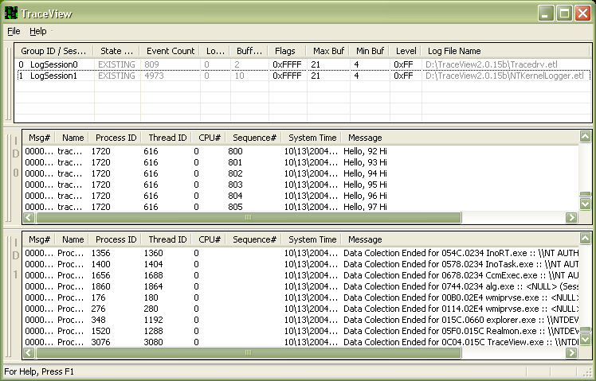

# Trace Message Lists

TraceView displays one *Trace Message List* for each trace session or trace log in the [Trace Session List](trace-session-list.md). The Trace Message List might be empty, such as when a trace session first begins, or it might contain numerous trace messages.

The following screen shot shows a Trace Session List that displays two existing logs: one for Tracedrv, which is a sample trace-instrumented driver that is included in the WDK, and one for the [NT Kernel Logger trace session](nt-kernel-logger-trace-session.md). There is one Trace Message List for each trace session.

The session IDs on the left border of each Trace Message List help you associate the Trace Message List with the trace session. In this example, the top Trace Message List, which is named "ID 0," corresponds to session 0, which is *LogSession0*; the session that displays the Tracedrv.etl log in the Trace Session List.

The bottom Trace Message List, which is named "ID 1," corresponds to session 1, which is LogSession1; the session that displays the NTKernelLogger.etl log in the Trace Session List.

The following topics describe the contents and features of the Trace Message List:

[Trace Message List Columns](trace-message-list-columns.md)

[Trace Message List Features](trace-message-list-features.md)

 

 

