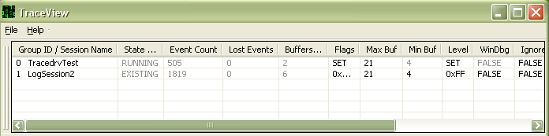

# Trace Session List

TraceView displays trace sessions and trace logs in the *Trace Session List*. There is one row in the Trace Session List for each running trace session or trace log.

The following screen shot shows the Trace Session List displaying one running trace session and one trace log file.

The following topics describe the contents and features of the Trace Session List:

[Trace Session List Columns](trace-session-list-columns.md)

[Trace Session List Features](trace-session-list-features.md)

 

 

