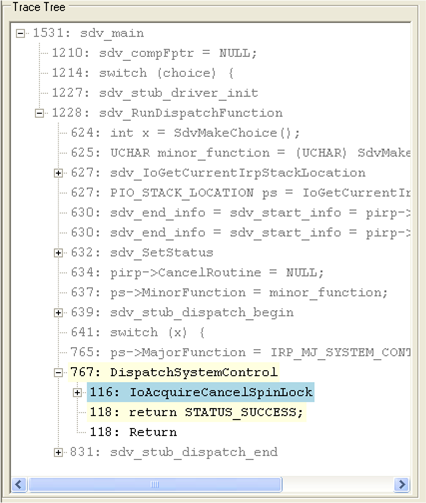

# Trace Tree Pane

The **Trace Tree** pane displays a trace of the critical elements of the source code that were executed in the path to the rule violation, as shown in the following screen shot.

These critical elements, such as function calls and assignments, come from all of the source files that were used to detect the rule violation, including SDV operating system model code (sdv-harness.c file), SDV rule source files (\*.slic), and the driver's source code. The code elements appear in the order that they were executed, even if they originated in different files.

SDV coordinates the display in the **Trace Tree** pane with the display in the [Source Code pane](source-code-pane.md) and the [State pane](state-pane.md). As you step through the source code in the **Trace Tree** pane, SDV automatically highlights the corresponding line of code in the **Source Code** pane and displays the values of variables at the corresponding point in the **State** pane.

This section includes:

[Understanding the Trace Tree Pane](understanding-the-trace-tree-pane.md)

[Color Coding in the Trace Tree Pane](color-coding-in-the-trace-tree-pane.md)

[Trace Tree Pane Actions](trace-tree-pane-actions.md)

 

 

