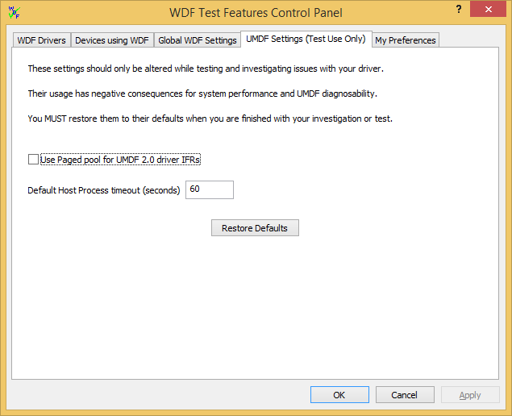

# UMDF Settings (Test Use Only) Tab

This topic details WDF Verifier's **UMDF Settings (Test Use Only)** page. On this page, you can change settings that can help test an overall system with one or more User-Mode Driver Framework (UMDF) drivers.

Use these settings for testing purposes. When you're done testing, click the **Restore Defaults** button. Otherwise, your computer may exhibit significant performance reduction.

By default, the [UMDF In-Flight Recorder (IFR)](../wdf/using-the-framework-s-event-logger.md) is stored in non-paged memory so that the log can be preserved in the event of a system crash. In rare cases, however, you might need to free up space in non-paged memory. For example, perhaps you are stress testing a system with multiple UMDF drivers, [device pooling](../wdf/using-device-pooling-in-umdf-drivers.md) is off, and non-paged memory is at a premium. You can obtain a small increase in available non-paged memory by selecting the **Use Paged pool** box.

Also, sometimes analysis tools such as Driver Verifier can decrease system performance enough in CPU-intensive tests that the default UMDF timeout triggers even though the driver did nothing wrong. In this case, increasing the timeout value may reduce this type of accidental timeout.

**Warning**  
Using these options actually reduces the likelihood of catching or diagnosing a UMDF driver failure, so you should use them only when needed. They are more likely to be of use for testing an overall system.

 

 

