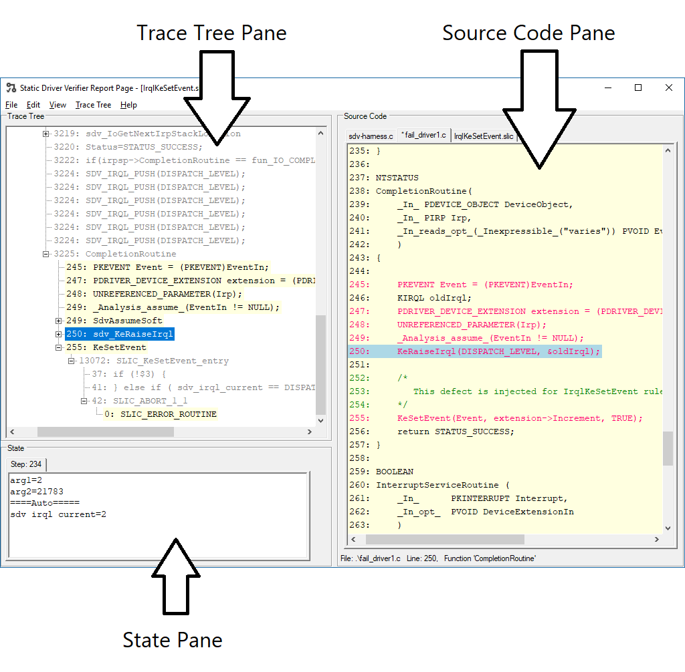

# Understanding the Trace Viewer

The Trace Viewer is available when SDV detects at least one rule violation of a rule selected for verification.

The Trace Viewer consists of three windows.

-   [Trace Tree pane](trace-tree-pane.md)

-   [Source Code pane](source-code-pane.md)

-   [State pane](state-pane.md)

The following screen shot shows the Defect Viewer window and its Trace-Tree, Source-Code.

SDV automatically coordinates the display in the three Defect Viewer windows. For example, if you select a source code element in the **Trace Tree** pane, SDV automatically moves the cursor to the corresponding line of code in the **Source Code** pane (and vice versa).

Similarly, if the source code element that is selected in the **Trace Tree** or **Source Code** panes changes the values of variables that SDV monitors, those changes automatically appear in the **State** pane.

 

 

