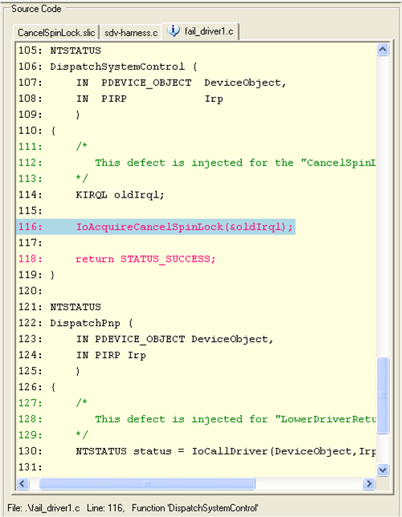

# Understanding the Source Code Pane

The **Source Code** pane displays all of the source code files that are involved in detecting a rule violation, including SDV operating system model code (sdv-harness.c file), SDV rule code (\*.slic files), and the driver's source code.

The following screen shot shows an example **Source Code** pane.

Unlike the [Trace Tree pane](trace-tree-pane.md), the **Source Code** pane displays the entire file—not just the executed code elements—and it displays each source file on a separate tab. This arrangement makes it easy to determine the origin of the code elements in the trace. Source code files that are not involved in the rule violation do not appear in the **Source Code** pane, even if they are in the driver's sources directory.

SDV coordinates the display in the **Source Code** pane with the display in the **Trace Tree** pane and the [State pane](state-pane.md). As you step through the source code elements in the **Trace Tree** pane, SDV automatically highlights the line of code in the **Source Code** pane that contains the element and displays the values of variables at the corresponding point in the **State** pane.

Similarly, when you select a line of *executed* code in the **Source Code** pane, the highlight in the **Trace Tree** pane moves to the corresponding action elements from that line of code. Because the **Trace Tree** pane displays only code that is executed in the path to the rule violation, when you select a line of *unexecuted* code in the **Source Code** pane, the highlight in the **Trace Tree** pane moves to the top node (*main*).

The **Source Code** pane is a component of the Defect Viewer.

 

 

