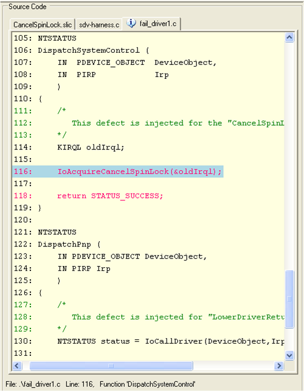

# Using the Static Driver Verifier Report

The SDV Report is an interactive display of the verification results. This section explains how to use the SDV Report to locate a coding error in the driver. For detailed information about the report, the features of the windows, and the elements in the windows, see [Static Driver Verifier Report](static-driver-verifier-report.md).

### Open the Static Driver Verifier Defect Viewer

If SDV reported any "defects" (rule violations) in the **Results** pane, you can view the code involved in the violation in the [Defect Viewer](defect-viewer.md) window of the Static Driver Verifier Report. The Defect Viewer window displays the code in the path to the rule violation. There is one **Defect Viewer** window for each rule that was violated (you can view only one **Defect Viewer** window at a time).

To open the Defect Viewer window for a defect:

-   Select a rule from the list under the **Defect(s)** node () in the **Results** pane, and then double-click the rule name.

This procedure works only for defects. SDV does not generate a **Defect Viewer** window if the results of a verification are not defects, such as passes, timeouts, spaceouts, not applicable, or any other non-defect result.

The following screen shot shows a Static Driver Verifier Report page.

### Review the Rule

Before trying to find the rule violation in the code, become familiar with the rules that the driver violated.

The [Static Driver Verifier Rules](https://msdn.microsoft.com/library/windows/hardware/ff551714) section includes a topic that explains each rule, for example, [CancelSpinLock](https://msdn.microsoft.com/library/windows/hardware/ff542478).

To see the code for the rule, in the **Source Code** pane of the Static Driver Verifier Report, click the tab with the rule code, such as CancelSpinLock.slic.

For example, the **CancelSpinLock** rule is violated if the driver calls [**IoAcquireCancelSpinLock**](https://msdn.microsoft.com/library/windows/hardware/ff548196) or [**IoReleaseCancelSpinLock**](https://msdn.microsoft.com/library/windows/hardware/ff549550) out of order, or if the driver exits the routine before releasing the spin lock.

### Trace the Defect Path

When the **Defect Viewer** window opens, the element in the **Trace Tree** pane that represents the first critical driver call in the defect path is selected. In the **Source Code** pane, the associated line of source code is highlighted in blue.

The following screen shot shows the opening view of the **Static Driver Verifier Defect Viewer** window for a violation of the [CancelSpinLock](https://msdn.microsoft.com/library/windows/hardware/ff542478) rule by the Fail\_Driver1 sample driver. In this example, the first driver call in the path to a violation of the CancelSpinLock rule is a call to [**IoAcquireCancelSpinLock**](https://msdn.microsoft.com/library/windows/hardware/ff548196) in the driver's **DispatchSystemControl** routine.

### Use the Source Code Pane

The [Source Code pane](source-code-pane.md) displays the source files used in the verification. When an element in the **Trace Tree** pane is selected, the source code file that is associated with the element appears on the top of the file stack in the adjacent **Source Code** pane. To see a different source file, click the tab for the source file in the **Source Code** pane.

The following screen shot shows the Source Code pane. In this **Source Code** pane, the lines of code that are highlighted in pale blue are the ones that are associated with the selected element in the **Trace Tree** pane.

The lines in the driver code that are executed in the path to the defect are displayed in red text. By looking only at the lines of red text, such as line 116 and 118 in this example, you can sometimes see the defect, especially a simple defect like the one used in this example. In this case, the driver acquires the spin lock, and then returns from the dispatch routine without releasing the spin lock.

### Step Through the Trace

To begin tracing, select an element in the **Trace Tree** pane, and then press the DOWN ARROW key. Each time you press DOWN ARROW, the next element in the **Trace Tree** pane is selected.

As you step through the elements in the **Trace Tree** pane, watch the **Source Code** pane for elements from the driver code. To expand a collapsed section of code, press the RIGHT ARROW key. To collapse an expanded section of code, press the LEFT ARROW key. The cursor skips all collapsed sections of code.

As you scroll down through the elements in the **Trace Tree** pane, the source code file in which the selected element originates moves to the top of the stack of files in the **Source Code** pane and the associated line of code is highlighted.

The following screen shot shows the Static Driver Verifier Defect Viewer with the Trace Tree and Source Code panes.

### Use the Rule File and State Pane

You can use the [State Pane](state-pane.md) to view the set of Boolean expressions that represent the values of variables that SDV tracks during the verification.

The Boolean expressions displayed in the **State** pane are the expressions in that set that evaluate to **TRUE**. If the element in the Trace Tree pane changes the value of any expression, the content of the **State** pane change to display the new set of expressions that evaluate to **TRUE**.

When you step through the **Trace Tree** pane, you can observe how SDV uses the values of these variables to evaluate the expressions used in the rules file (\*.slic).

The following screen shot of the Static Driver Verifier Report page shows how SDV tests indicate if the driver had previously acquired a spin lock. SDV tests to see if the driver had previously acquired a spin lock, that is, if the value of the **s** variable is **1**, meaning locked. In this case, **s!=1** (unlocked), as displayed in the [State pane](state-pane.md), so SDV sets the value of **s** to **1**, indicating that the lock is acquired.

### Find the ABORT Routine

When the driver code violates a rule, the **Trace Tree** pane contains an **ABORT** routine for reporting the defect.

When the code path to a defect is long and complex, it is often useful to scroll down in the **Trace Tree** pane until you find the **ABORT** routine, and then use the UP ARROW key to find the code that most immediately triggered the defect report.

For example, as shown in the following screen shot, the ABORT routine is associated with a line from the CancelSpinLock.slic file that reports the defect after testing whether the lock is acquired (**s==locked**). The test is part of a subroutine that is performed when the dispatch routine ends. From this information, you can infer that the driver failed to release a spin lock before returning from the dispatch routine.

### Close the Static Driver Verifier Defect Viewer

After you identify the code error that caused the defect, you can close the **Static Driver Verifier Defect Viewer** window for the current rule, and then open the **Defect Viewer** for a different rule.

To close the Defect Viewer for a rule:

-   From the **File** menu, select **Exit**.

You can also click the **Close** button (**X**) for the **Defect Viewer**. It is located just below the **Close** button (**X**) for the Static Driver Verifier Report.

The following screen shot shows how to close the Defect Viewer.

 

 

