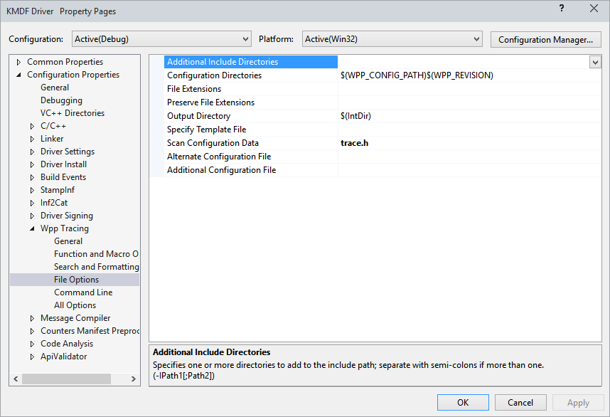
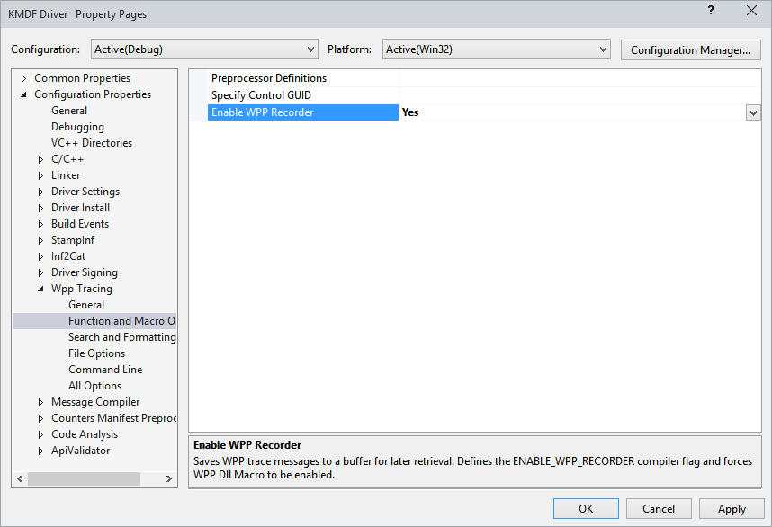
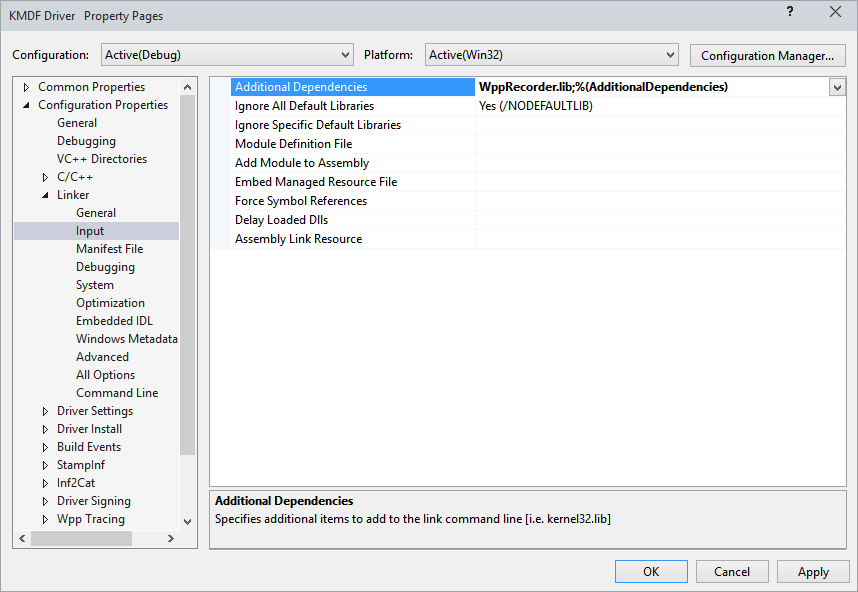

# Inflight Trace Recorder (IFR) for logging traces


**Summary**

-   How to enable Inflight Trace Recorder in Visual Studio
-   How to send trace messages to the WPP default log or a custom log
-   How to view trace messages in the debugger

**Applies to:**

-   Minimum OS: Windows 8 for KMDF and WDM driver developers
-   Minimum OS: Windows 10 for UMDF (2.15) driver developers

**Important APIs**

-   [**WppRecorderLogGetDefault**](https://msdn.microsoft.com/library/windows/hardware/dn895240)
-   [**WppRecorderLogCreate (Kernel-mode drivers only)**](https://msdn.microsoft.com/library/windows/hardware/dn914615)
-   [**WppRecorderDumpLiveDriverData**](https://msdn.microsoft.com/library/windows/hardware/dn914612)

*Inflight Trace Recorder (IFR)* is a new tracing feature that allows a trace provider, such as a kernel-mode driver, to get trace logs with minimal setup and create a set of in-memory buffers where the latest WPP log messages are preserved.

Windows provides several mechanisms for adding trace messages to your drivers that can help you to diagnose and debug issues in your driver during development. One such mechanism is [WPP software tracing](wpp-software-tracing.md). It includes a [WPP preprocessor](wpp-preprocessor.md) that allows the trace provider to have printf-style trace messages that have a smaller memory footprint. However, to view a log of trace messages, the provider must be enabled, a trace controller such as [TraceView](traceview.md) or [Tracelog](tracelog.md) must stop and start trace sessions in order to create the log, and then, a consumer, such as a TraceView must format and display the log.

Windows 10 introduces a new feature: IFR that leverages the WPP infrastructure. If the driver enables WPP tracing and IFR, trace logging is turned on automatically and you can easily view messages without starting or stopping trace sessions.

IFR allocates one page of memory from the non-paged pool for the driver, called the *default log*. The log collects trace messages that are sent by the driver, and you can view the output of the buffer in a kernel debugger when the driver runs. In case of a crash, you can get the most recent trace messages in a dump. You don't need to reconstruct a crash just to collect trace data.

The default log is beneficial mainly because the driver can get a trace log with minimal configuration. It's important to note that the driver has no control over the size of the default log. Because all trace messages are sent to one circular buffer, the latest messages overwrite earlier messages regardless of the level of information. Potentially, you can miss an error message and only see information messages.

To get better control over the log bugger, IFR allows a driver to create and manage custom buffers.

**Note**  In this release of Windows, only kernel-mode drivers (KMDF and WDM) can create custom buffers. UMDF drivers cannot create custom buffers.


-   The driver can create multiple buffers for different purposes, so that a verbose logger does not flood the buffer.
-   The driver can control the size of the custom buffer and the error partition (discussed later) of the custom buffer.
-   The driver can specify a string identifier for a custom log. While viewing the trace messages, you can differentiate messages from different buffers.
-   Because IFR is built on WPP, even with IFR enabled for the driver, you can view WPP messages in [TraceView](traceview.md). However, to view those messages, you must enable the trace provider and start a session.

**Important**  
The messages in IFR do not have a timestamp associated with them.

You can only view the trace messages in Windows Debugger.


## <span id="Before_you_begin..."></span><span id="before_you_begin..."></span><span id="BEFORE_YOU_BEGIN..."></span>Before you begin...


-   Familiarize yourself with [WPP software tracing](wpp-software-tracing.md) such as [adding WPP software tracing to your driver](adding-wpp-software-tracing-to-a-windows-driver.md) and [declaring and calling WPP macros](adding-wpp-macros-to-a-trace-provider.md).
-   Read this blog article about, [How to include and view WPP trace messages in a driver’s public PDB files](http://blogs.msdn.com/b/usbcoreblog/archive/2013/06/29/wpp-blog-post.aspx).
-   Study the toaster sample. It has been modified to demonstrate how to enable IFR and use it. For more information, see [Toaster Sample Driver](http://go.microsoft.com/fwlink/p/?LinkId=617723).

## <span id="Enable_WPP_software_tracing"></span><span id="enable_wpp_software_tracing"></span><span id="ENABLE_WPP_SOFTWARE_TRACING"></span>Enable WPP software tracing


Before you can configure your driver to use IFR, you must first set up your driver as a WPP [Trace Provider](trace-provider.md).

-   If you created your driver by using a WDF driver template provided in Visual Studio, WPP tracing is enabled. View the tracing-related settings in project properties.

    1.  In Visual Studio, right-click the project that you wish to enable in Solutions Explorer and click **Properties.**
    2.  Set the Configuration and Platform to the build targets that you intend to support (for example, All Configurations and All Platforms).
    3.  In the project property page, select **Configuration Properties** and click **WPP Tracing**.
    4.  Under **General**, click **Run Wpp Tracing**, select **Yes** from the drop-down menu, and click **OK**.

        

    5.  Under **File Options**, set the value of **Scan Configuration Data** to the name of the trace information file that contains debug tracing related function definitions and macros. In this example, the definitions are in Trace.h.

        

-   If you are not using one of the WDF driver templates, set up WPP software tracing. Create a header file (similar to trace.h provided with WDF templates). That header file contains WPP macros ([WPP\_INIT\_TRACING](https://msdn.microsoft.com/library/windows/hardware/ff556191), [WPP\_CLEANUP](https://msdn.microsoft.com/library/windows/hardware/ff556179)) and WPP control flags and trace message statements. For instructions, see [Adding WPP Software Tracing to a Windows Driver](adding-wpp-software-tracing-to-a-windows-driver.md).

    Make sure that you perform these tasks:

    -   Define a GUID for your driver as a trace provider.

        **Syntax for WPP\_CONTROL\_GUIDS**

        ```ManagedCPlusPlus
        #define WPP_CONTROL_GUIDS \
            WPP_DEFINE_CONTROL_GUID(GUIDFriendlyName, (ControlGUID),  \
                WPP_DEFINE_BIT(NameOfTraceFlag1)  \
                WPP_DEFINE_BIT(NameOfTraceFlag2)  \
                .............................   \
                .............................   \
                WPP_DEFINE_BIT(NameOfTraceFlag31) 
        ```

    -   Include the trace header file (in this example, Trace.h) in source files that will print trace statements.
    -   Include [Trace Message Format](trace-message-format-file.md) files associated with your source files, (*&lt;source file&gt;*.tmh) in source files that contains trace messages to print.
        ```ManagedCPlusPlus
        #include "trace.h"
        //
        // This tmh is generated by the WPP Preprocessor.
        //
        #include "MyDriver.tmh"
        ```

    -   Initialize WPP in [DriverEntry](28131-driverentry-saving-pointer-to-buffer.md) of your driver.
        ```ManagedCPlusPlus
        //
        // WPP Initialization
        //
        WPP_INIT_TRACING(DriverObject, RegistryPath);

        ```

    -   Release WPP resources in your driver unload method.
        ```ManagedCPlusPlus
        //
        // WPP release resources
        //

        WPP_CLEANUP( DriverObject) );
        ```

## <span id="step_2"></span><span id="STEP_2"></span>Enable IFR


After adding WPP software tracing to your driver, the IFR infrastructure is already in place. You only need to enable the functionality in project properties.

1.  In Visual Studio, right-click the project that you wish to enable in Solutions Explorer and click **Properties.**
2.  Set the Configuration and Platform to the build targets that you intend to support (for example, All Configurations and All Platforms).
3.  In the project property page, click **Configuration Properties** and click **WPP Tracing**.
4.  Under **Function and Macro Options**, click **Enable WPP Recorder**, select **Yes** from the drop-down menu, and click **OK**.

    This defines the **ENABLE\_WPP\_RECORDER** compiler flag and also sets the Enable DLL macro (**-dll** for UMDF drivers and **-km** for KMDF drivers).

    Even with the IFR enabled, the WPP messages can still be recorded without using the IFR by using a tool such as Traceview included in the Windows Driver Kit (WDK).

    

5.  Link the driver project with WppRecorder.lib.

    1.  In project properties, click **Configuration Properties** and click **Linker**.
    2.  Under **Input**, add **$(DDK\_LIB\_PATH)\\wpprecorder.lib** to the **Additional Dependencies** field.

    

6.  Add **Wpprecorder.h** to each source file that calls IFR APIs, such as [**WppRecorderLogCreate**](https://msdn.microsoft.com/library/windows/hardware/dn914615) to set up your own IFR log. Call the APIs after the [WPP\_INIT\_TRACING](https://msdn.microsoft.com/library/windows/hardware/ff556191) call in the *DriverEntry* routine of a KMDF or UMDF 2.15 driver.

## <span id="Use__the_default_log"></span><span id="use__the_default_log"></span><span id="USE__THE_DEFAULT_LOG"></span>Use the default log


After WPP is enabled for the driver project, WPP creates a default log. The buffer size of the default log to which WPP prints is 4096 bytes. For a debug build, the buffer is 24576 bytes.

If the default log buffer fails to allocate, trace messages are sent to the WPP. That is, the trace message are not recorded through the IFR, but the traces can still be seen as live WPP traces. To determine whether the default log was created, the driver must call [**WppRecorderIsDefaultLogAvailable**](https://msdn.microsoft.com/library/windows/hardware/dn914614). If the default log does not exist and the driver wants to use IFR, the driver must create a log. For more information, see [Create a custom log](#create).

1.  Initialize a [**RECORDER\_CONFIGURE\_PARAMS**](https://msdn.microsoft.com/library/windows/hardware/dn914606) structure by calling [**RECORDER\_CONFIGURE\_PARAMS\_INIT**](https://msdn.microsoft.com/library/windows/hardware/dn914607). The macro sets the **CreateDefaultLog** member to TRUE, which indicates that the driver wants to use the default log.
2.  Call [**WppRecorderConfigure**](https://msdn.microsoft.com/library/windows/hardware/dn914611) by specifying the address of the initialized [**RECORDER\_CONFIGURE\_PARAMS**](https://msdn.microsoft.com/library/windows/hardware/dn914606) structure.
3.  You can get a RECORDER\_LOG opaque handle to the default log by calling [**WppRecorderLogGetDefault**](https://msdn.microsoft.com/library/windows/hardware/dn895240).
4.  Print trace messages to the default log by calling the trace macros declared in Trace.h. For more information, see [Define trace functions](#define).
5.  View traces messages in the debugger. For more information, see [View the trace messages](#view).

**Note**  To disable the default log, set the **CreateDefaultLog** member of the [**RECORDER\_CONFIGURE\_PARAMS**](https://msdn.microsoft.com/library/windows/hardware/dn914606) to FALSE, and then call [**WppRecorderConfigure**](https://msdn.microsoft.com/library/windows/hardware/dn914611).


In this example, the driver gets a handle to the default log.

```ManagedCPlusPlus

NTSTATUS
DriverEntry(
_In_ PDRIVER_OBJECT  DriverObject,
_In_ PUNICODE_STRING RegistryPath
)
{
    WDF_DRIVER_CONFIG config;
    NTSTATUS status;
    WDF_OBJECT_ATTRIBUTES attributes;

    RECORDER_CONFIGURE_PARAMS recorderConfig;

    RECORDER_LOG logHandle = NULL;

        // Initialize WPP Tracing.

    WPP_INIT_TRACING(DriverObject, RegistryPath);

    // If a default log is available, store the handle to the default log.

    if (WppRecorderIsDefaultLogAvailable())
    {
        RECORDER_CONFIGURE_PARAMS_INIT(&recorderConfig);

        WppRecorderConfigure(&recorderConfig);

        logHandle = WppRecorderLogGetDefault();

    }

    PrintEvents(logHandle, TRACE_LEVEL_INFORMATION, TRACE_DRIVER, "%!FUNC! Entry");

    //
    // Register a cleanup callback so that we can call WPP_CLEANUP when
    // the framework driver object is deleted during driver unload.
    //
    WDF_OBJECT_ATTRIBUTES_INIT(&attributes);
    attributes.EvtCleanupCallback = KMDFWPPEvtDriverContextCleanup;

    WDF_DRIVER_CONFIG_INIT(&config,
        KMDFWPPEvtDeviceAdd
        );

    status = WdfDriverCreate(DriverObject,
        RegistryPath,
        &attributes,
        &config,
        WDF_NO_HANDLE
        );

    if (!NT_SUCCESS(status)) {
        PrintEvents(logHandle, TRACE_LEVEL_ERROR, TRACE_DRIVER, "WdfDriverCreate failed %!STATUS!", status);
        WPP_CLEANUP(DriverObject);
        return status;
    }

    PrintEvents(logHandle, TRACE_LEVEL_INFORMATION, TRACE_DRIVER, "%!FUNC! Exit");

    return status;
}
```

## <span id="create"></span><span id="CREATE"></span>Create a custom log (Kernel-mode drivers only)


The default log for IFR uses 4096 block of non-paged pool memory. All trace messages are written to a circular buffer. At times, the latest messages can overwrite the previous messages.

For example, your driver has separate flow paths for control and data transfer requests. If activities from both are logged to the same buffer, most likely, the control trace messages will be overwritten by the data transfer messages. In this case, you can configure separate buffers for those requests.

In another example, you have two devices, and one device sends more trace messages more than the other. If a driver uses the default log, that device can flood the buffer and messages from the other device can get dropped. Instead, the driver can create two custom logs so that each device can send messages to its buffer, and you can view messages from each device, separately.

1.  Initialize a [**RECORDER\_LOG\_CREATE\_PARAMS**](https://msdn.microsoft.com/library/windows/hardware/dn914608) structure by calling [**RECORDER\_LOG\_CREATE\_PARAMS\_INIT**](https://msdn.microsoft.com/library/windows/hardware/dn914609). WPP uses the default log parameters unless the members of the structure are modified.
2.  Optional. Set the **TotalBufferSize** member to the desired size . By default, the size is set to 1024 bytes (see RECORDER\_LOG\_DEFAULT\_BUFFER\_SIZE in Wpprecorder.h).
    **Note**  WPP allocates buffer for the log from the non-paged pool. The log is divided into two circular buffers called partitions: general and error. The error partition only shows messages of TRACE\_LEVEL\_ERROR. Messages related to all other levels are sent to the general partition. The partitions are designed to prevent verbose trace providers from overwriting their own error messages with lower priority messages. The caller specifies the buffer size in **TotalBufferSize**, which indicates the total size of those partitions. The error partition cannot exceed half the total buffer size. The buffer sizes can be modified after initialization.


3.  Optional. Set the **LogIdentifier** to a string that will help you identify trace messages from this buffer. The string must not exceed 16 characters in length.
4.  Call [**WppRecorderLogCreate**](https://msdn.microsoft.com/library/windows/hardware/dn914615) by specifying the address of the populated [**RECORDER\_LOG\_CREATE\_PARAMS**](https://msdn.microsoft.com/library/windows/hardware/dn914608) structure.
5.  Print trace messages to this new buffer by calling trace macros and passing the RECORDER\_LOG handle received by the [**WppRecorderLogCreate**](https://msdn.microsoft.com/library/windows/hardware/dn914615) call.
6.  View traces messages in the debugger. For more information, see [View the trace messages](#view).

The system defines maximum and minimum buffer sizes in the registry. You can set these values appropriately to conserve memory and configure logging capabilities.

```
HKEY_LOCAL_MACHINE\SYSTEM\CurrentControlSet\Services\<serviceName>\Parameters
   WppRecorder_PerBufferMinBytes
   Data type
   REG_DWORD
   Description
   The minimum number of bytes that can be allocated to a  log buffer.  The default is 256 bytes.

   WppRecorder_PerBufferMaxBytes
   Data type
   REG_DWORD
   Description
   The maximum number of bytes that can be allocated to a  log buffer.  The default is 8192 bytes.

   LogPages
   Data type
   REG_DWORD
   Description
   The number of pages to store the default log. The default is 1.

   VerboseOn
   Data type
   REG_DWORD
   Description
   By default (0), IFR only logs errors, warnings, and informational events. Setting this value to 1 adds the verbose output to get logged. 
```

If the size specified in [**RECORDER\_LOG\_CREATE\_PARAMS**](https://msdn.microsoft.com/library/windows/hardware/dn914608) is less than the minimum number of bytes, [**WppRecorderLogCreate**](https://msdn.microsoft.com/library/windows/hardware/dn914615) allocates **WppRecorder\_PerBufferMinBytes** bytes. Similarly, if the size exceeds the maximum value, **WppRecorderLogCreate** allocates **WppRecorder\_PerBufferMaxBytes** bytes.

To delete the custom log, call [**WppRecorderLogDelete**](https://msdn.microsoft.com/library/windows/hardware/dn914616) before calling [WPP\_CLEANUP](https://msdn.microsoft.com/library/windows/hardware/ff556179). After a thread enters this function, all threads must not log into this buffer anymore. You can call this function in the [*EvtDriverUnload*](https://msdn.microsoft.com/library/windows/hardware/ff541694) implementation of the driver.

This example code is a snippet from the driver's DriverEntry function. In this example, the driver disables the default log, creates a custom log, and sets its buffer size and an identifier.

```ManagedCPlusPlus
ULONG MyDriverLogSize = 8 * 1024;

NTSTATUS
DriverEntry(
_In_ PDRIVER_OBJECT  DriverObject,
_In_ PUNICODE_STRING RegistryPath
)
{
    WDF_DRIVER_CONFIG config;
    NTSTATUS status;
    WDF_OBJECT_ATTRIBUTES attributes;

    RECORDER_CONFIGURE_PARAMS recorderConfig;

    RECORDER_LOG_CREATE_PARAMS recorderCreate;

    RECORDER_LOG logHandle = NULL;

    // Initialize WPP Tracing.

    WPP_INIT_TRACING(DriverObject, RegistryPath);
    // If a default log is available, then configure the size of the buffer.
    // Store the handle to the default log and use it to set the identifier name.

    RECORDER_CONFIGURE_PARAMS_INIT(&recorderConfig);

    recorderConfig.CreateDefaultLog = FALSE;

    RECORDER_LOG_CREATE_PARAMS_INIT(&recorderCreate, NULL);
    recorderCreate.TotalBufferSize = MyDriverLogSize;
    RtlStringCbPrintfA(recorderCreate.LogIdentifier,
        RECORDER_LOG_IDENTIFIER_MAX_CHARS,
        "KMDFWpp_Log");

    status = WppRecorderLogCreate(&recorderCreate, &logHandle);
    if (!NT_SUCCESS(status))
    {
        TraceEvents(TRACE_LEVEL_ERROR, TRACE_DRIVER, "WppRecorderLogCreate failed %!STATUS!", status);
    }

    PrintEvents(logHandle, TRACE_LEVEL_INFORMATION, TRACE_DRIVER, "%!FUNC! Entry");

    //
    // Register a cleanup callback so that we can call WPP_CLEANUP when
    // the framework driver object is deleted during driver unload.
    //
    WDF_OBJECT_ATTRIBUTES_INIT(&attributes);
    attributes.EvtCleanupCallback = KMDFWPPEvtDriverContextCleanup;

    WDF_DRIVER_CONFIG_INIT(&config,
        KMDFWPPEvtDeviceAdd
        );

    status = WdfDriverCreate(DriverObject,
        RegistryPath,
        &attributes,
        &config,
        WDF_NO_HANDLE
        );

    if (!NT_SUCCESS(status)) {
        PrintEvents(logHandle, TRACE_LEVEL_ERROR, TRACE_DRIVER, "WdfDriverCreate failed %!STATUS!", status);
        WPP_CLEANUP(DriverObject);
        return status;
    }

    PrintEvents(logHandle, TRACE_LEVEL_INFORMATION, TRACE_DRIVER, "%!FUNC! Exit");

    return status;
}
```

## <span id="define"></span><span id="DEFINE"></span>Define trace functions


Add a tracing function (in your Trace.h) that has "IFRLOG" as an input parameter. For information about tracing macros, see [Adding WPP Software Tracing to a Windows Driver](adding-wpp-software-tracing-to-a-windows-driver.md).

```ManagedCPlusPlus
//
// This comment block is scanned by the trace preprocessor to define our
// Trace function.
//
// begin_wpp config
// FUNC TraceEvents(LEVEL, FLAGS, MSG, ...);
// FUNC PrintEvents(IFRLOG, LEVEL, FLAGS, MSG, ...);
// end_wpp
//
```

In the preceding example, there are two tracing functions, TraceEvents and PrintEvents. WPP generates macros for those functions with parameters specified in the FUNC declaration. In the example used in this topic, the driver uses both TraceEvents and PrintEvents. PrintEvents requires "IFRLOG" as a parameter. When calling this function, the driver must specify a RECORDER\_LOG handle as a parameter value for "IFRLOG". The IFRLOG is added only if you create custom buffers. TraceEvents prints to the default log. This provides backward compatibility with existing tracing statements without any change in functionality.

To print trace messages to the default log, the driver either calls PrintEvents with the handle received by the [**WppRecorderLogGetDefault**](https://msdn.microsoft.com/library/windows/hardware/dn895240) call, or call TraceEvents, without the handle.

To print to the custom log, the driver passes the handle received in the call to [**WppRecorderLogCreate**](https://msdn.microsoft.com/library/windows/hardware/dn914615).

## <span id="Make__trace_messages_available_in_public_symbols"></span><span id="make__trace_messages_available_in_public_symbols"></span><span id="MAKE__TRACE_MESSAGES_AVAILABLE_IN_PUBLIC_SYMBOLS"></span>Make trace messages available in public symbols


In WPP, [Trace Message Format](trace-message-format-file.md) information is required to view the actual WPP messages. That information is stored in private symbol file (PDBs). The TMF information is automatically included in the private PDB, but not the public PDB. Therefore, you cannot view messages without your private PDB. To add trace messages to your public PDB,

To make some of those WPP trace messages public, you must add special markers to each message. Add `// WPP_FLAGS(-public:<trace function name>)` after the definition in the Trace.h file. The markers are indicated by the **–public** switch in the WPP command line. The switch is added to the WPP preprocessor so that it can keep &lt;funcName&gt; trace annotations in the public PDB file.

```ManagedCPlusPlus
//
// This comment block is scanned by the trace preprocessor to define our
// Trace function.
//
// begin_wpp config
// FUNC Trace{FLAG=MYDRIVER_ALL_INFO}(LEVEL, MSG, ...);
// FUNC TraceEvents(LEVEL, FLAGS, MSG, ...);
// FUNC PrintEvents(IFRLOG, LEVEL, FLAGS, MSG, ...);
// WPP_FLAGS(-public:PrintEvents);
// end_wpp
//
```

## <span id="view"></span><span id="VIEW"></span>View the trace messages


To view the trace messages, use [Wdfkd Extensions](https://msdn.microsoft.com/library/windows/hardware/ff551876) in Windows Debugger. The extension commands are Wdfkd.dll.

1.  Load the Wdfkd commands, enter `.load Wdfkd.dll` in the debugger.
2.  Use these commands to view trace messages.

    [**!wdfkd.wdflogdump**](https://msdn.microsoft.com/library/windows/hardware/ff565805)

    [**!wdfkd.wdfcrashdump**](https://msdn.microsoft.com/library/windows/hardware/ff565682)

Your kernel-mode driver can view the trace log by using [RCDRKD Extensions](https://msdn.microsoft.com/library/windows/hardware/hh920376). Those commands are not available to a user-mode driver.

## <span id="Best_practices"></span><span id="best_practices"></span><span id="BEST_PRACTICES"></span>Best practices


-   Call the IFR APIs after the [WPP\_INIT\_TRACING](https://msdn.microsoft.com/library/windows/hardware/ff556191) call in the *DriverEntry* routine of a kernel-mode driver or in the *DLLMain* routine of a UMDF 2.15 driver. If logging is disabled by a global policy, then calling WPP\_INIT\_TRACING does not enable logging.

-   If [**WppRecorderLogCreate**](https://msdn.microsoft.com/library/windows/hardware/dn914615) fails, the call returns a NULL handle. In that case, you can choose to ignore the return value of **WppRecorderLogCreate** and use the RECODER\_LOG handle to print your WPP messages.

-   Do not delete the handle returned by [**WppRecorderLogGetDefault**](https://msdn.microsoft.com/library/windows/hardware/dn895240). To disable the default log, set the **CreateDefaultLog** member of [**RECORDER\_CONFIGURE\_PARAMS**](https://msdn.microsoft.com/library/windows/hardware/dn914606) to FALSE, and then call [**WppRecorderConfigure**](https://msdn.microsoft.com/library/windows/hardware/dn914611).

-   Do not call [**WppRecorderLogSetIdentifier**](https://msdn.microsoft.com/library/windows/hardware/dn895241) by passing the default log handle. That operation is not allowed.

-   IFR buffers are allocated from the non-page pool. The accumulative effect of those allocations can lead to significant performance issues, particularly on smaller footprint devices. Request smaller buffer sizes in your [**WppRecorderLogCreate**](https://msdn.microsoft.com/library/windows/hardware/dn914615). Also, if you do not need the logging feature, disable the default log.

-   To view the size of the log buffer, use the [**!wdfkd.wdflogdump**](https://msdn.microsoft.com/library/windows/hardware/ff565805) command. If you are using [RCDRKD Extensions](https://msdn.microsoft.com/library/windows/hardware/hh920376), then you can view the size by using [**!rcdrkd.rcdrloglist**](https://msdn.microsoft.com/library/windows/hardware/hh920383)

## <span id="UMDF_and_KMDF_differences"></span><span id="umdf_and_kmdf_differences"></span><span id="UMDF_AND_KMDF_DIFFERENCES"></span>UMDF and KMDF differences


-   Only kernel-mode drivers can create custom buffers. This functionality does not apply to user-mode drivers.
-   You cannot view trace logs from a user-mode driver by using [RCDRKD Extensions](https://msdn.microsoft.com/library/windows/hardware/hh920376). You must use [Wdfkd Extensions](https://msdn.microsoft.com/library/windows/hardware/ff551876).


