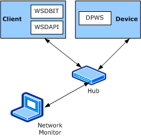

# WSDBIT Testing Environment

This topic describes the physical environment and the device and its hosted service capabilities.

### Network Model

The device and client to test are connected to an Ethernet network segment, and form a single IP subnet. The network addressing scheme (such as IPv4, IPv6, or hostnames) is not relevant as long as both the client and device support at least one scheme in common There must be only one device and one client on the subnet.

To facilitate debugging and troubleshooting, you should use a network monitor to monitor traffic exchanges between the device and client. To monitor all traffic, you must connect the device and client through an Ethernet hub to the network segment. If a hub is not available you might be able to monitor traffic by installing a network monitor on the computer that is running WSDBIT.

The following figure shows the network topology that consists of a device, client, and network monitor--all connected through a hub.

### Test Device

To participate in testing of the device side, you should implement the device as described in the following general guidelines. For more information about the device implementation, see the [WSDBIT Reference](wsdbit-reference.md) and the [Device Profile for Web Services (DPWS)](http://go.microsoft.com/fwlink/p/?linkid=163864) specification.

The following table describes service and interoperability test case dependencies.

Scenario
SimpleService
AttachmentService
EventingService
Device and Service inspection

One or more of SimpleService, AttachmentService, or EventingService

Device control

X

Attachments

X

Eventing

X

 

The test device should host three kinds of services:

-   http://schemas.example.org/SimpleService

-   http://schemas.example.org/AttachmentService

-   http://schemas.example.org/EventingService

### SimpleService

The **SimpleService** service has four methods:

-   **OneWay** is a one-way method with an integer as a parameter.

-   **TwoWay** is a request-response method with two integers in the request and the sum of these integers in the response.

-   **TypeCheck** is a request-response method with a number of different types in the request and exactly the same types in the response, including boolean, decimal, float, and a list of URLs.

-   **AnyCheck** is a request-response method with an XML fragment in the request and the same fragment returned in the response.

### AttachmentService

The **AttachmentService** service sends and receives attachments. The attachment data to send and receive is included in the \\interop directory as two separate files: Image1.jpg and Image2.jpg. This service has two methods:

-   **OneWayAttachment** is a one-way method with an attachment as a parameter.

-   **TwoWayAttachment** is a request-response method with attachments in both the request and response.

### EventingService

The **EventingService** service has two kinds of events that can be subscribed to:

-   **SimpleEvent** is an event without a parameter.

-   **IntegerEvent** is an event that returns an integer.

### Implementing Test Services

To exercise all the interoperability test cases, you have to implement all of these services. In this case, after the initial startup, the device hosts one instance of each of these services.

However, if you want to implement only some of these services, see the table at the beginning of this topic for information about the Service and Interop test case dependencies.

**Note**  To attempt any of the advanced interoperability scenarios (such as [Device control](device-control-scenarios.md), [Attachments](attachments-scenarios.md), and [Eventing](eventing-scenarios.md)), the test device has to at least support the [Device and Service inspection test cases](device-and-service-inspection-scenarios.md). If the device fails this test case, you might be unable to continue with the advanced test cases.

 

The test device and the WSDBIT device (WSDBIT\_server) must be able to do the following:

-   Display the integer input parameter of the **SimpleService** one-way method.

-   Display the value of the types submitted in the two-way type check request.

-   Verify the attachment that is received against the well-known attachment that was expected and must display the result of this verification.

-   Initiate each of the two kinds of events that are described in the **EventingService** through manual input or timer.

-   Display data that is received in extensible (**xs:any**) sections.

-   Use the **xs:anyURI testdevice** as the **wsd:Scopes** element for discovery.

 

 

