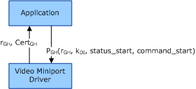

# Authenticated Key Exchange

## 

This section applies only to Windows Server 2003 SP1 and later, and Windows XP SP2 and later.

The following figure shows establishing a secure connection through authentication and key exchange. First, the video miniport driver supplies the graphics hardware certificate to the application. Next, the application extracts the public key from the graphics hardware certificate. After the application generates a data integrity key (kDI), the application uses the public key to encrypt a sequence that includes the data integrity key and supplies the sequence to the driver.

Command and status messages are subsequently passed unencrypted; however, for each message, MACs are created by using the data integrity key.

For more information about MACs, see [Cryptographic Primitives Used by COPP](cryptographic-primitives-used-by-copp.md).

The following table describes the values in the preceding figure.

<table>
<colgroup>
<col width="50%" />
<col width="50%" />
</colgroup>
<thead>
<tr class="header">
<th align="left">Value</th>
<th align="left">Description</th>
</tr>
</thead>
<tbody>
<tr class="odd">
<td align="left">
rGH
</td>
<td align="left">
128-bit random number generated by the driver.
</td>
</tr>
<tr class="even">
<td align="left">
CertGH
</td>
<td align="left">
Variable-length digital certificate used by the graphics hardware.
</td>
</tr>
<tr class="odd">
<td align="left">
PGH(rGH, kDI, status_start, command_start)
</td>
<td align="left">
Start sequence for the secure channel, which consists of the following items concatenated together:

<ul>
<li>
128-bit random number generated by the driver.
</li>
<li>
128-bit random data integrity session key generated by the application.
</li>
<li>
32-bit random starting status sequence number generated by the application.
</li>
<li>
32-bit random starting command sequence number generated by the application.
</li>
</ul>

The application encrypts the sequence by using the public key obtained from the graphic hardware certificate. The sequence is 2,048 bits long; the remainder of the sequence is padded with 0s.
</td>
</tr>
</tbody>
</table>

 

 

 

