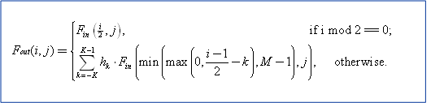
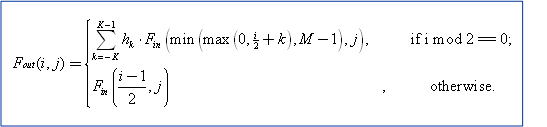
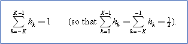

# Bob Deinterlacing Algorithm

## 

If your display driver implements the DXVA [deinterlacing DDI](https://msdn.microsoft.com/library/windows/hardware/ff552701), it must support the bob-style deinterlacing algorithm in addition to any proprietary deinterlacing algorithms. Following is a description of the bob-style deinterlacing algorithm:

Input is a field Fin(i,j) of size MxN such that 0 &lt;= i &lt;= M-1 and 0 &lt;= j &lt;=N-1, where i and j are row and column indices, respectively.

Output is a frame Fout(i,j) of size 2xMxN such that 0 &lt;= i &lt;= 2M-1 and 0 &lt;= j &lt;=N-1, where i and j are row and column indices, respectively.

If Fin(i,j) is a top field:

If Fin(i,j) is a bottom field:

Each definition uses a finite impulse response (FIR) filter with an impulse response h of length 2K. Impulse response h is symmetric about its midpoint, such that h₋₍ₖ₊₁₎ = hₖ for k=0 to K-1 and

The preferred form of bob-style deinterlacing uses K=2 and h₀ = 9/16 (so h₁ = 1/16). This filter should be implemented as (9\*(b+c)-(a+d)+8)&gt;&gt;4, where a, b, c, and d are the four input samples used to produce one output sample.

 

 

