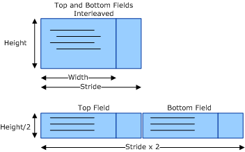

# Bob Deinterlacing Mechanics

## 

All graphics adapters that can perform bit-block transfers can do simple bob-style deinterlacing. When a surface contains two interleaved fields, the memory layout of the surface can be reinterpreted to isolate each field. This is achieved by doubling the original surface's stride and dividing the height of the surface in half. After the two fields are isolated in this way, they can be deinterlaced by stretching the individual fields to the correct frame height.

Additional horizontal stretching or shrinking can also be applied to correct the aspect ratio for the pixels of the video image. A display driver can determine its ability to do this to the DirectX Video Mixing Renderer (VMR). The individual field's height can be stretched vertically by line replication or, preferably, by a filtered stretch. If the line replication method is used, the resulting image has a blocky appearance. If a filtered stretch is used, the resulting image may have a slightly fuzzy appearance.

The following figure shows a video surface that contains two interleaved fields.

If the video sample contains two interleaved fields as specified by the **DXVA\_SampleFieldInterleavedEvenFirst** and **DXVA\_SampleFieldInterleavedOddFirst** members of the [**DXVA\_SampleFormat**](https://msdn.microsoft.com/library/windows/hardware/ff564045) enumeration, the start time of the second field is calculated using the **rtStart** and **rtEnd** members of the [**DXVA\_VideoSample**](https://msdn.microsoft.com/library/windows/hardware/ff564085) structure as follows:

(**rtStart** + **rtEnd**) / 2

The end time of the first field is the start time of the second field.

 

 

