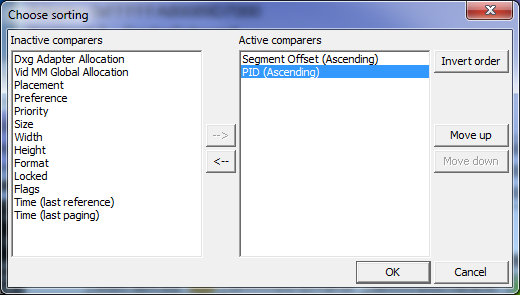

# Choose Sorting Dialog

With the *Choose sorting* dialog, the user can customize the layout of the Segment viewer. The following diagram is a screen shot that shows the *Choose sorting* dialog.

 

The sorting of the data in the main Segment Viewer window is based on the elements found in the *Active comparers* list. Values can be moved from the *Inactive comparers* list to the *Active comparers* list by selecting the specific item and pressing the arrow button that divides the lists. 

The sort order is also dependent on the order of the items in the *Active comparers* list. The topmost item is the primary sort item. 

Each Active comparer can be sorted in ascending or descending order. The sort algorithm does its best to perform a simple comparison of the values in the specific column. 

The *Move up* and *Move down* buttons adjust the selected Active comparer to the appropriate position up or down. 

