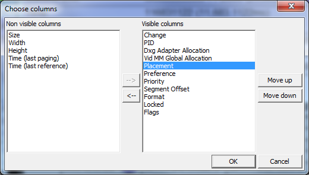

# Choose Columns Dialog

The **Choose columns** dialog is used to customize the displayed columns in the main Segment Viewer window. The following diagram is a screen shot that shows the **Choose columns** dialog.

This dialog is similar to the **Choose sorting** dialog in that items can be moved from one side to the other. In this case, from the **Non visible columns** list to the **Visible columns** list. Select an item to move, press the arrow button, and the item changes its display status. The left-right ordering of the columns in the main Segment Viewer window can be changed by moving items in the **Visible columns** list up or down. The topmost item is the leftmost item. Likewise, the bottommost item is the rightmost in the Segment Viewer window. 
