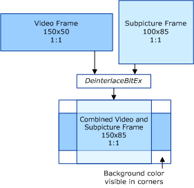

# Combining Two Streams with Different Heights and Widths

## 

This section applies only to Windows Server 2003 with SP1 and later, and Windows XP with SP2 and later.

In the following example, the VMR calls the driver with a video stream and a video substream of different heights as well as widths. The following diagram shows how, in this example, the driver combines the two streams and background color:

Note that in the preceding example the driver's **DeinterlaceBltEx** function should only draw the specified background color over the target rectangle, as shown in the following diagram.

In the preceding example, the VMR is directed to reduce the size of the output image horizontally and vertically by a factor of two. The background color should only be displayed in the target rectangle. The driver must not write to pixels in the destination surface that are outside of the target rectangle (hatched in the preceding diagram). In the preceding example, the destination surface is 300x200 pixels, but the target rectangle is {0, 0,150,100}. The source rectangle for the video stream is {0,0,300,150}; the destination rectangle for the video stream is {0,12,150,87}. The substream source rectangle is {0,0,150,200}; the substream destination rectangle is {37,0,112, 100}. Remember that the target rectangle is the bounding rectangle of the video stream and all substreams.

 

 

[Send comments about this topic to Microsoft](mailto:wsddocfb@microsoft.com?subject=Documentation%20feedback%20[display\display]:%20Combining%20Two%20Streams%20with%20Different%20Heights%20and%20Widths%20%20RELEASE:%20%282/10/2017%29&body=%0A%0APRIVACY%20STATEMENT%0A%0AWe%20use%20your%20feedback%20to%20improve%20the%20documentation.%20We%20don't%20use%20your%20email%20address%20for%20any%20other%20purpose,%20and%20we'll%20remove%20your%20email%20address%20from%20our%20system%20after%20the%20issue%20that%20you're%20reporting%20is%20fixed.%20While%20we're%20working%20to%20fix%20this%20issue,%20we%20might%20send%20you%20an%20email%20message%20to%20ask%20for%20more%20info.%20Later,%20we%20might%20also%20send%20you%20an%20email%20message%20to%20let%20you%20know%20that%20we've%20addressed%20your%20feedback.%0A%0AFor%20more%20info%20about%20Microsoft's%20privacy%20policy,%20see%20http://privacy.microsoft.com/default.aspx. "Send comments about this topic to Microsoft")

