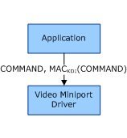

# Command Security and Authenticity

## 

This section applies only to Windows Server 2003 SP1 and later, and Windows XP SP2 and later.

The following figure shows an application sending command messages to the video miniport driver across the secure channel.

These command messages are contained in an envelope. The envelope contains data and MAC sections. The application calculates the MAC of the command data by using the data integrity key and the OMAC. For more information about the MAC and OMAC, see [Cryptographic Primitives Used by COPP](cryptographic-primitives-used-by-copp.md).

The following table describes the values in the preceding figure.

<table>
<colgroup>
<col width="50%" />
<col width="50%" />
</colgroup>
<thead>
<tr class="header">
<th align="left">Value</th>
<th align="left">Description</th>
</tr>
</thead>
<tbody>
<tr class="odd">
<td align="left">
COMMAND
</td>
<td align="left">
Variable-length command data.
</td>
</tr>
<tr class="even">
<td align="left">
MACKDI(COMMAND)
</td>
<td align="left">
128-bit MAC of the command data using the data integrity session key.
</td>
</tr>
</tbody>
</table>

 

 

 

