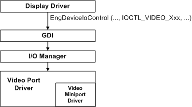

# Communicating IOCTLs to the Video Miniport Driver

The following figure shows how the display driver communicates with the video miniport driver using IOCTLs.

The display driver calls [**EngDeviceIoControl**](/windows/win32/api/winddi/nf-winddi-engdeviceiocontrol) with an IOCTL to send a synchronous request to the video miniport driver. GDI uses a single buffer for both input and output to pass the request to the I/O subsystem. The I/O subsystem routes the request to the video port, which processes the request with the video miniport driver.

Some IOCTL requests require the miniport driver to access video registers, and others store or retrieve information from the miniport driver's data structures. Generally, no requests require the video miniport driver to perform actual drawing operations.

In general, and unless modularity dictates otherwise, the display driver handles drawing and other time-critical operations. Sending an IOCTL to the miniport driver to perform a time-critical function can degrade system performance.

See [Video Miniport Driver I/O Control Codes](/windows-hardware/drivers/ddi/ntddvdeo) for descriptions of system-defined video IOCTLs. You can extend the interface between the display driver and the video miniport driver by adding a *private IOCTL*, which must be formatted as described in [Defining I/O Control Codes](../kernel/defining-i-o-control-codes.md). If you need to write a new IOCTL, you should first contact Microsoft Technical Support.
