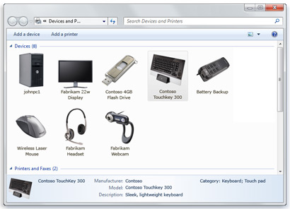

# Container ID support for displays

This topic describes Container ID support for displays—visual representation of devices that are embedded within a display or monitor device.

|                                                                                   |                                          |
|-----------------------------------------------------------------------------------|------------------------------------------|
| Minimum Windows Display Driver Model (WDDM) version                               | 1.2                                      |
| Minimum Windows version                                                           | 8                                        |
| Driver implementation—Full graphics and Display only                              | Mandatory                                |
| [WHCK](https://docs.microsoft.com/windows-hardware/test/hlk/windows-hardware-lab-kit) requirements and tests |  [Functional test for monitor container ID](https://docs.microsoft.com/windows-hardware/test/hlk/testref/2f657caa-368c-4531-8cec-8faf475125f4) |

 

## Container ID device driver interface (DDI)

Implement this function and structure in your display miniport driver:

-   [*DxgkDdiGetChildContainerId*](https://msdn.microsoft.com/library/windows/hardware/hh451349)
-   [**DXGK\_CHILD\_CONTAINER\_ID**](https://msdn.microsoft.com/library/windows/hardware/hh464005)

## Container ID description

New capabilities in monitor devices can provide a better user experience. In particular, Universal Serial Bus (USB) hubs are popular connectors on monitors for connecting mouse and keyboard. Also, connectors such as HDMI support audio, and therefore audio speakers are embedded in monitors as well. Many new display devices support touch capabilities. This provides a great user experience by reducing wire clutter on user desktops.

It's important to visually represent the connectivity and state of these devices to the user in an intuitive way. The **Devices and Printers** page was introduced with Windows 7. As shown here, the **Devices and Printers** folder shows the user the installed devices that are connected to the PC, providing a simple way to check on a printer, music player, camera, mouse, or digital picture frame (to name just a few). At the same time, this page groups those devices that are contained within the same piece of hardware to make it easier for users to discover all their drivers.

With Windows 7 Microsoft introduced the concept of a *container ID* for devices: "a system-supplied device identification string that uniquely groups the functional devices associated with a single-function or multifunction device installed in the computer." (See [Container IDs](http://go.microsoft.com/fwlink/p/?linkid=327784).) The devices are grouped if they contain the same container ID.

For the container ID concept to be successful, all the device classes in Windows must support it, and the entire ecosystem needs to implement it in hardware. In Windows 7, if multiple monitors that support audio are plugged in, it isn't easy for the user to determine which display maps to which audio end points. The same difficulty exists for touch digitizers. In Windows 8, the display device class adds support for container ID. This makes it possible for all the functions of a display device to report the same container ID and get visually paired in the Windows user interface and the APIs.

## Container ID user scenarios

Consider the following workflow for a monitor that has embedded audio speakers:

1.  The user connects the monitor using an HDMI cable.
2.  WDDM driver reports the presence of display device to the Windows graphics stack.
3.  The Windows graphics stack queries WDDM driver for the Container ID, using the device driver interfaces (DDIs) introduced with Windows 8.
4.  The display driver queries the monitor for the container ID and passes it back to Windows.
5.  At the same time, the audio driver must pass the exact same container ID to the Windows audio stack.
6.  If viewed in the **Devices and Printers** control panel, the display and speakers are grouped together.

In some cases, the display device might not contain a container ID. In this case, Windows automatically generates a unique container ID by using the manufacturer ID, product ID, and serial number obtained from the Extended Display Identification Data (EDID). Because these values are unique, the container ID is also unique. Windows 8 provides a DDI that passes the same information to the WDDM driver so that it can be passed to the audio driver to generate the same container ID.

In a few scenarios, the ownership of driving the display is transitioned between Windows, the WDDM display driver, and firmware. These transitions are associated with hardware or the software that is being reset or reconfigured and can cause screen flashes and flickers. Possible transition scenarios and their behaviors are discussed in [Providing seamless state transitions in WDDM 1.2 and later](seamless-state-transitions-in-wddm-1-2-and-later.md).

## Hardware certification requirements

For info on requirements that hardware devices must meet when they implement this feature, refer to the relevant [WHCK documentation](https://docs.microsoft.com/windows-hardware/test/hlk/windows-hardware-lab-kit) on  [Functional test for monitor container ID](https://docs.microsoft.com/windows-hardware/test/hlk/testref/2f657caa-368c-4531-8cec-8faf475125f4).

See [WDDM 1.2 features](wddm-v1-2-features.md) for a review of features added with Windows 8.

 

 

