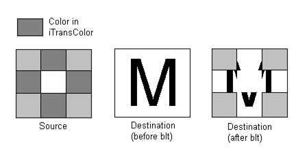

# Copying Bitmaps

## 

**Bit block transfer** (BitBlt) functions implemented by drivers copy blocks of bits from one surface to another. These functions include:

[**DrvBitBlt**](https://msdn.microsoft.com/library/windows/hardware/ff556180)

[**DrvCopyBits**](https://msdn.microsoft.com/library/windows/hardware/ff556182)

[**DrvStretchBlt**](https://msdn.microsoft.com/library/windows/hardware/ff556302)

[**DrvTransparentBlt**](https://msdn.microsoft.com/library/windows/hardware/ff557283)

There is also a display-driver-specific BitBlt function named [**DrvSaveScreenBits**](https://msdn.microsoft.com/library/windows/hardware/ff556278).

If the surface being drawn on is a [*device-managed surface*](https://msdn.microsoft.com/library/windows/hardware/ff556277#wdkgloss-device-managed-surface) or bitmap, the driver must support a minimum level of bit block transfer functions. If the surface is a GDI-managed standard format bitmap, GDI handles only those operations not hooked by the driver.

###  DrvBitBlt

The [**DrvBitBlt**](https://msdn.microsoft.com/library/windows/hardware/ff556180) function provides general bit block transfer capabilities. If a source is used, **DrvBitBlt** copies the contents of the source rectangle onto the destination rectangle. (The *pptlSrc* parameter of this function identifies the upper left corner of the rectangle.) If there is no source rectangle, **DrvBitBlt** ignores the *pptlSrc* parameter. The destination rectangle, the surface to be modified, is defined by two integer points, the upper left and lower right corners. The rectangle is *lower right exclusive*; the lower and right edges of the rectangle are not part of the block transfer. **DrvBitBlt** cannot be called with an empty destination rectangle. The two points of the rectangle are always well ordered; that is, both coordinates of the lower right point are greater than their counterparts in the upper left point.

[**DrvBitBlt**](https://msdn.microsoft.com/library/windows/hardware/ff556180) deals with different ROPs and performs optimizations depending on the device. In some cases, if the ROP is a solid color, a fill rather than a BitBlt can be performed. For devices or drivers that do not support ROPs, such as the Pscript driver, there can be discrepancies between the displayed and printed images.

Optionally, a block transfer handled by [**DrvBitBlt**](https://msdn.microsoft.com/library/windows/hardware/ff556180) can be masked and involve color index translation. A translation vector assists in color index translation for palettes. The transfer might need to be arbitrarily clipped by a display driver, using a series of clip rectangles. The required region and information are furnished by GDI.

Implementing [**DrvBitBlt**](https://msdn.microsoft.com/library/windows/hardware/ff556180) represents a significant portion of the work involved in writing a driver for a raster display driver that does not have a standard-format [*frame buffer*](https://msdn.microsoft.com/library/windows/hardware/ff556280#wdkgloss-frame-buffer). The Microsoft VGA driver that is furnished with the Windows Driver Kit (WDK) provides sample code that supports the basic function for a planar device. Implementing **DrvBitBlt** for other devices may be less complex.

###  DrvCopyBits

The [**DrvCopyBits**](https://msdn.microsoft.com/library/windows/hardware/ff556182) function is called by GDI from its simulation operations to translate between a device-managed raster surface and a GDI standard-format bitmap. **DrvCopyBits** provides a fast path for SRCCOPY (0xCCCC) ROP bit block transfers.

Required for a graphics driver with device-managed bitmaps or raster surfaces, this function must translate driver surfaces to and from any standard-format bitmap. [**DrvCopyBits**](https://msdn.microsoft.com/library/windows/hardware/ff556182) is never called with an empty destination rectangle, and the two points of the destination rectangle are always well ordered. This call has the same requirements as [**DrvBitBlt**](https://msdn.microsoft.com/library/windows/hardware/ff556180).

If a driver supports a device-managed surface or bitmap, the driver must implement the [**DrvCopyBits**](https://msdn.microsoft.com/library/windows/hardware/ff556182) function. At a minimum, the driver must do the following when **DrvCopyBits** is called:

-   Perform a block transfer to and from a bitmap, in the device's preferred format, and to the device surface.

-   Perform the transfer with the SRCCOPY (0xCCCC) [*raster operation (ROP)*](https://msdn.microsoft.com/library/windows/hardware/ff556331#wdkgloss-raster-operation--rop-).

-   Allow arbitrary clipping.

The driver can use the GDI [**CLIPOBJ**](https://msdn.microsoft.com/library/windows/hardware/ff539417) enumeration services to reduce the clipping to a series of clip rectangles. GDI passes down a translation vector, the [**XLATEOBJ**](https://msdn.microsoft.com/library/windows/hardware/ff570634) structure, to assist in color index translation between source and destination surfaces.

If the surface of a device is organized as a standard-format [*device-independent bitmap (DIB)*](https://msdn.microsoft.com/library/windows/hardware/ff556277#wdkgloss-device-independent-bitmap--dib-), the driver can support only simple transfers. If a call comes in with a complicated ROP, the driver can punt the block transfer request back to GDI with a call to the [**EngCopyBits**](https://msdn.microsoft.com/library/windows/hardware/ff564196) function. This allows GDI to break up the call into simpler functions that the driver can perform.

[**DrvCopyBits**](https://msdn.microsoft.com/library/windows/hardware/ff556182) also is called with RLE bitmaps (see the Microsoft Windows SDK documentation) and **device-dependent bitmaps (DDBs)**. The bitmaps are provided to this function as a result of application program calls to several Win32 GDI routines. The optional DDB is supported only by a few specialized drivers.

###  DrvStretchBlt

A driver optionally can provide the [**DrvStretchBlt**](https://msdn.microsoft.com/library/windows/hardware/ff556302) function, even drivers that support device-managed surfaces. This function provides capabilities for stretching block transfers between device-managed and GDI-managed surfaces. **DrvStretchBlt** supports only certain types of stretching, such as stretching by integer multiples.

[**DrvStretchBlt**](https://msdn.microsoft.com/library/windows/hardware/ff556302) also allows a driver to write on GDI bitmaps, especially when the driver can do halftoning. The function also permits the same halftoning algorithm to be applied to GDI bitmaps and device surfaces.

[**DrvStretchBlt**](https://msdn.microsoft.com/library/windows/hardware/ff556302) maps a geometric source rectangle exactly onto a geometric destination rectangle. The source is a rectangle with corners displaced by (-0.5,-0.5) from the given integer coordinates. The points specified in the function parameters lie on integer coordinates that correspond to pixel centers. A rectangle defined by two such points is considered to be geometric, with two vertices whose coordinates are the given points, but with 0.5 subtracted from each coordinate. (GDI [**POINTL**](https://msdn.microsoft.com/library/windows/hardware/ff569166) structures use a shorthand notation for specifying these fractional coordinate vertices.) Note that the edges of any such rectangle never intersect a pixel, but go around a set of pixels. The pixels inside the rectangle are normal pixels for a lower right-exclusive rectangle.

The points defining the corners of the source rectangle are well-ordered; [**DrvStretchBlt**](https://msdn.microsoft.com/library/windows/hardware/ff556302) cannot be given an empty source rectangle. Unlike [**DrvBitBlt**](https://msdn.microsoft.com/library/windows/hardware/ff556180), **DrvStretchBlt** can be called with a single clipping rectangle to prevent round-off errors in clipping the output.

The destination rectangle is defined by two integer points. These points are not well ordered, which means that the coordinates of the second point are not necessarily larger than those of the first. The source rectangle these points describe does not include the lower and right edges. Because the rectangle is not well ordered, [**DrvStretchBlt**](https://msdn.microsoft.com/library/windows/hardware/ff556302) must sometimes perform inversions in the two x coordinates and/or the two y coordinates. (The driver must not attempt to read pixels that do not lie on the source surface). **DrvStretchBlt** cannot be called with an empty destination rectangle.

For color translation, [**DrvStretchBlt**](https://msdn.microsoft.com/library/windows/hardware/ff556302) provides a pointer, *pxlo*, to the [**XLATEOBJ**](https://msdn.microsoft.com/library/windows/hardware/ff570634) structure, which is used to translate between the source and destination surfaces. The XLATEOBJ structure can be queried to find the destination index for any source index. For a high-quality stretching block transfer, **DrvStretchBlt** is required to interpolate colors in some cases. **DrvStretchBlt** also uses the COLORADJUSTMENT structure to define the color adjustment values that are to be applied to the source bitmap before the bits are stretched.

[**DrvStretchBlt**](https://msdn.microsoft.com/library/windows/hardware/ff556302) uses the *iMode* parameter to define how the source pixels are to be combined for output. In particular, *iMode* provides the HALFTONE option that permits the driver to use groups of pixels in the output surface to approximate the color or grey level of the output. Changes to the COLORADJUSTMENT structure are passed to the driver after the next **DrvStretchBlt** call with an *iMode* of HALFTONE. In addition, if the driver requires GDI to handle halftoning for GDI bitmaps, the driver hooks out **DrvStretchBlt**, sets the *iMode* parameter to HALFTONE, and returns it in [**EngStretchBlt**](https://msdn.microsoft.com/library/windows/hardware/ff565025).

If [**DrvStretchBlt**](https://msdn.microsoft.com/library/windows/hardware/ff556302) has hooked a call to the [**EngStretchBlt**](https://msdn.microsoft.com/library/windows/hardware/ff565025) function and is asked to do something that it does not support, it returns the request to GDI so that the appropriate function can handle it.

###  DrvTransparentBlt

The [**DrvTransparentBlt**](https://msdn.microsoft.com/library/windows/hardware/ff557283) function causes a source bitmap to be copied onto a destination bitmap so that portions of the destination bitmap remain visible after the copy. The *iTransColor* parameter of this function specifies the color that is to be made transparent.

The following figure depicts an example of a transparent blt.

From left to right, the preceding figure shows the source bitmap, the destination bitmap before the transparent blt, and the destination bitmap after the transparent blt. Note that the color in *iTransColor* is the same as that in the four regions above, below, and to either side of the central region in the source bitmap.

When the blt operation takes place, these four regions are not copied, which causes any pixel pattern in the destination bitmap under these regions to remain visible. Any pixel pattern under the other regions (the four corners and the center) is overwritten in the transparent blt.

This is illustrated in the right-most image: the portions of the letter 'M' in the four corners and the center were overwritten with the colors in the source bitmap. The portions of the letter 'M' under the four regions whose color is the same as that in *iTransColor* remain visible.

 

 

