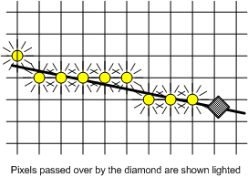

# Cosmetic Lines

## 

A *cosmetic* line is always one pixel wide and is drawn using a solid color brush. It is rendered according to the Grid Intersection Quantization (GIQ) diamond convention, which determines which pixels should be turned on to render the cosmetic line.

The following figure shows a line superimposed on a rectangular grid, in which the pixels are located at the grid intersection points. To determine which pixels should be illuminated, imagine a diamond, centered on the line, and sliding along it. The diamond's width and height are exactly equal to the distance between adjacent pixel centers. As the diamond moves along the line, any pixel whose center is completely covered by the diamond is turned on. If a line passes through a point halfway between two adjacent pixels, the pixel to be turned on depends on the slope of the line and how the adjacent pixels are oriented: horizontally (side by side), or vertically (one above the other).

The following table summarizes these cases.

<table>
<colgroup>
<col width="33%" />
<col width="33%" />
<col width="33%" />
</colgroup>
<thead>
<tr class="header">
<th align="left">Slope of line (absolute value)</th>
<th align="left">Adjacent pixels are oriented</th>
<th align="left">Result</th>
</tr>
</thead>
<tbody>
<tr class="odd">
<td align="left">
Slope &lt; 1

 

or

 

Slope &gt; 1</td>
<td align="left">
Horizontally
</td>
<td align="left">
Light the pixel at diamond&#39;s left vertex.
</td>
</tr>
<tr class="even">
<td align="left">
Slope &lt; 1

 

or

 

Slope &gt; 1</td>
<td align="left">
Vertically
</td>
<td align="left">
Light the pixel at diamond&#39;s top vertex.
</td>
</tr>
<tr class="odd">
<td align="left">
Slope = 1
</td>
<td align="left">
Horizontally
</td>
<td align="left">
Light the pixel at diamond&#39;s top vertex.
</td>
</tr>
<tr class="even">
<td align="left">
Slope = 1
</td>
<td align="left">
Vertically
</td>
<td align="left">
Light the pixel at diamond&#39;s right vertex.
</td>
</tr>
</tbody>
</table>

 

The diamond convention lights one pixel in each column for lines with slopes between -1 and 1, and one pixel in each row for lines with slope greater than 1 in absolute value. This way, a cosmetic line is rendered with no gaps.

Start and end pixels of a cosmetic line are also determined by the diamond convention. A cosmetic line is first-pixel-inclusive and last-pixel-exclusive; that is, if the line starts inside the diamond for a pixel, that pixel is illuminated. Similarly, if the line ends inside the diamond for a pixel, that pixel is not illuminated.

The following graph illustrates the diamond convention for a cosmetic line.

For rendering cosmetic lines, the [**DrvStrokePath**](https://msdn.microsoft.com/library/windows/hardware/ff556316) function follows the GIQ diamond convention. The [**DrvLineTo**](https://msdn.microsoft.com/library/windows/hardware/ff556245) function is an optional entry point that a driver can supply as an optimization for application calls to the Microsoft Win32 **LineTo** function. **DrvLineTo** is simpler than **DrvStrokePath** because it supports only integer end-points and solid cosmetic lines.

For raster devices that support the R2\_NOT mix mode, a binary raster operation that changes the destination color to its inverse, the driver must use exact rendering. Rendering should also be exact for devices that require rendering by both GDI and the driver. This includes devices for which GDI draws on some bitmaps and the driver draws on other surfaces (unless the pixels are too small to make any visible difference). This also includes devices that request GDI to handle complex clipping.

 

 

