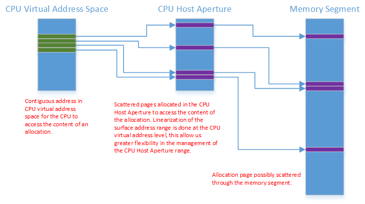
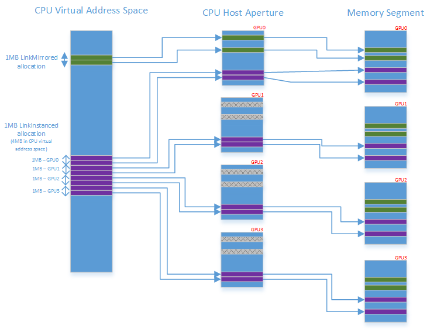

# CPU host aperture

For 32bit OS discrete graphics processing units (GPUs), which don't support resizable BAR or when resizing the frame buffer BAR fails, Windows Display Driver Model (WDDM) v2 will offer an alternative mechanism by which a discrete GPU VRAM can be efficiently accessed. For GPUs, which support a programmable BAR address space, a new CPU Host Aperture functionality is introduced in WDDM v2 to abstract that functionality.

When exposing a CPU host aperture, the kernel mode driver fills out a new [**DXGK\_CPUHOSTAPERTURE**](/windows-hardware/drivers/ddi/d3dkmddi/ns-d3dkmddi-_dxgk_cpuhostaperture) caps structure for every segment supporting a CPU host aperture. This defines the size of the CPU host aperture, this allows driver to reserve some of the BAR for internal purposes. The page size is the same as the GPU pages of the memory segment.

The kernel mode driver then exposes two new device driver interfaces (DDIs) to manage the BAR address space, in particular [*DxgkDdiMapCpuHostAperture*](/windows-hardware/drivers/ddi/d3dkmddi/nc-d3dkmddi-dxgkddi_mapcpuhostaperture) and [*DxgkDdiUnmapCpuHostAperture*](/windows-hardware/drivers/ddi/d3dkmddi/nc-d3dkmddi-dxgkddi_unmapcpuhostaperture).

The memory for the page table behind the CPU host aperture is managed by the driver and setup early during driver initialization. Both [*DxgkDdiMapCpuHostAperture*](/windows-hardware/drivers/ddi/d3dkmddi/nc-d3dkmddi-dxgkddi_mapcpuhostaperture) and [*DxgkDdiUnmapCpuHostAperture*](/windows-hardware/drivers/ddi/d3dkmddi/nc-d3dkmddi-dxgkddi_unmapcpuhostaperture) are expected to be operational immediately after segment enumeration and are used during the video memory manager initialization to map CPU virtual address to the page directory and page table of the system paging process during adapter initialization.

When CPU access to a memory segment is required, the video memory manager reserves pages in the CPU Host Aperture and maps memory segment pages through it. This is illustrated below.

In the linked display adapter configuration things look similar except for the following.

-   *Default* or *LinkMirrored* allocation are always mapped to GPU0.
-   *LinkInstanced* allocation have a virtual address range of **AllocationSize**\***NumberOfGPUInLink** associated with them with various part of the allocation being mapped to different GPU.

This is illustrated below:

 

