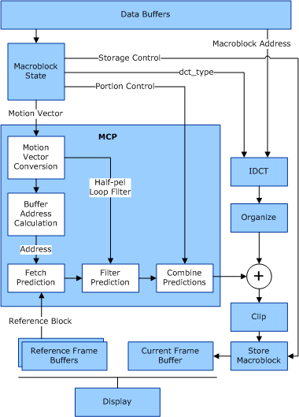

# Decoder Stages

## 

The decoder stages that are depicted in the following figure show the operation of the motion compensation prediction (MCP) and inverse discrete-cosine transform (IDCT) parts of an accelerator. The data indicated as dct\_type is a syntax element that controls the type of IDCT that is performed.

 

 

