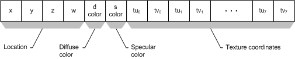
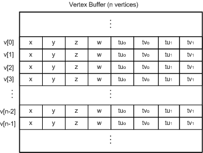

# Determining the Vertex Buffer Data Format

## 

To identify the format of the data in the vertex buffer, a driver should determine the following information:

-   The dimension of the textures (1D, 2D, 3D, or 4D)

-   The components that are present in the FVF data

-   The ordering of the components that are present

### FVF Texture Dimension

The driver should determine the dimension of the textures from the D3DTEXTURETRANSFORMFLAGS texture coordinate count flags (D3DTTFF\_COUNT *n*, described in the DirectX SDK documentation). The number of the count flag signals how many texture coordinates are present. Note that this does not necessarily equate to the dimension of the textures themselves, as explained in the following sections.

### Nonprojected Textures

The following lists nonprojected textures:

-   D3DTTFF\_COUNT1 indicates that the rasterizer should expect 1D texture coordinates.

-   D3DTTFF\_COUNT2 indicates that the rasterizer should expect 2D texture coordinates.

-   D3DTTFF\_COUNT3 indicates that the rasterizer should expect 3D texture coordinates.

-   D3DTTFF\_COUNT4 indicates that the rasterizer should expect 4D texture coordinates.

### Projected Textures

If projected textures are being used, the D3DTTFF\_PROJECTED flag is set to indicate that the texture coordinates are to be divided by the last (COUNTth) element of the texture coordinate set. Thus, for a 2D projected texture, the count would be three, because the first two elements are divided by the third, resulting in two floats for a 2D texture lookup. That is, both D3DTTFF\_COUNT2 and D3DTTFF\_COUNT3 | D3DTTFF\_PROJECTED reference a 2D texture.

### FVF Vertex Data Components

The driver determines which components are present by analyzing the flags specified in the **dwVertexType** member of the [**D3DHAL\_DRAWPRIMITIVES2DATA**](https://msdn.microsoft.com/library/windows/hardware/ff545957) structure. The following table indicates the bitfields that can be set in **dwVertexType** and the components that they identify:

<table>
<colgroup>
<col width="50%" />
<col width="50%" />
</colgroup>
<thead>
<tr class="header">
<th align="left">Value</th>
<th align="left">Meaning</th>
</tr>
</thead>
<tbody>
<tr class="odd">
<td align="left">
D3DFVF_DIFFUSE
</td>
<td align="left">
Each vertex has a diffuse color.
</td>
</tr>
<tr class="even">
<td align="left">
D3DFVF_SPECULAR
</td>
<td align="left">
Each vertex has a specular color.
</td>
</tr>
<tr class="odd">
<td align="left">
D3DFVF_TEX0
</td>
<td align="left">
No texture coordinates are provided with the vertex data.
</td>
</tr>
<tr class="even">
<td align="left">
D3DFVF_TEX1
</td>
<td align="left">
Each vertex has one set of texture coordinates.
</td>
</tr>
<tr class="odd">
<td align="left">
D3DFVF_TEX2
</td>
<td align="left">
Each vertex has two sets of texture coordinates.
</td>
</tr>
<tr class="even">
<td align="left">
D3DFVF_TEX3
</td>
<td align="left">
Each vertex has three sets of texture coordinates.
</td>
</tr>
<tr class="odd">
<td align="left">
D3DFVF_TEX4
</td>
<td align="left">
Each vertex has four sets of texture coordinates.
</td>
</tr>
<tr class="even">
<td align="left">
D3DFVF_TEX5
</td>
<td align="left">
Each vertex has five sets of texture coordinates.
</td>
</tr>
<tr class="odd">
<td align="left">
D3DFVF_TEX6
</td>
<td align="left">
Each vertex has six sets of texture coordinates.
</td>
</tr>
<tr class="even">
<td align="left">
D3DFVF_TEX7
</td>
<td align="left">
Each vertex has seven sets of texture coordinates.
</td>
</tr>
<tr class="odd">
<td align="left">
D3DFVF_TEX8
</td>
<td align="left">
Each vertex has eight sets of texture coordinates.
</td>
</tr>
<tr class="even">
<td align="left">
D3DFVF_XYZRHW
</td>
<td align="left">
Each vertex has <em>x, y, z</em>, and <em>w</em> coordinates.
</td>
</tr>
</tbody>
</table>

 

Only one of the D3DFVF\_TEX *n* flags is set.

### FVF Vertex Component Ordering

Microsoft Direct3D supplies the driver with vertex data whose components are ordered as shown in the following figure.

Direct3D always sends *x,y,z,* and *w* values; the remaining data is sent only as required by an application. Note that this diagram assumes 2D texture coordinates, although 1D, 3D, and 4D textures are also valid for the latest DirectX release.

As shown in the preceding figure, vertex data consists of the following components:

1.  Location (*x,y,z,w*) (required)

    The first vertex component is four D3DVALUEs that identify the position of the vertex. Direct3D always sets the D3DFVF\_XYZRHW bit in **dwVertexType**.

2.  Diffuse Color (optional).

    If present, this component is a D3DCOLOR value that specifies the diffuse color for this vertex. Direct3D sets the D3DFVF\_DIFFUSE bit in **dwVertexType** when this component is present.

3.  Specular Color (optional).

    If present, this component is a D3DCOLOR value that specifies the specular color for this vertex. Direct3D sets the D3DFVF\_SPECULAR bit in **dwVertexType** when this component is present.

4.  Texture Data (optional).

    This part varies based on the dimension of the texture. For each dimension in the texture, a D3DVALUE specifies each of the *u*, *v*, *w*, or *q* components (see explanation of FVF Texture Dimension). For example, if 2D nonprojected textures are being used, two D3DVALUEs per texture are needed to specify the vertex's *u,v* values for each texture up to eight textures total. The number of *u,v* pairs present is *n*, where *n* corresponds to the D3DFVF\_TEX*n* flag set in **dwVertexType**. For example, if D3DFVF\_TEX3 is set in **dwVertexType**, then three *u,v* pairs are supplied with each vertex.

FVF data is always tightly packed; that is, no memory is wasted on components that are not explicitly specified in the vertex buffer. For example, when **dwVertexType** is (D3DFVF\_XYZRHW | D3DFVF\_TEX2), and the texture dimension is 2D, each vertex in the buffer consists of eight tightly packed D3DVALUEs. These specify the location (*x,y,z,w*) and texture coordinates for two textures (tu₀, tv₀, tu₁, tv₁) as shown in the following figure:

In the preceding figure it is assumed that there are only two texture coordinates. The vertex data supplied to the driver is always transformed and lit. The driver never receives normals. All data in the FVF texture coordinate sets are single precision IEEE floats. For implementation details, see the *Perm3* sample driver. For more information about FVF, see the DirectX SDK documentation.

**Note**   The Microsoft Windows Driver Kit (WDK) does not contain the 3Dlabs Permedia3 sample display driver (*Perm3.h*). You can get this sample driver from the Windows Server 2003 SP1 Driver Development Kit (DDK), which you can download from the DDK - Windows Driver Development Kit page of the WDHC website.

 

 

 

