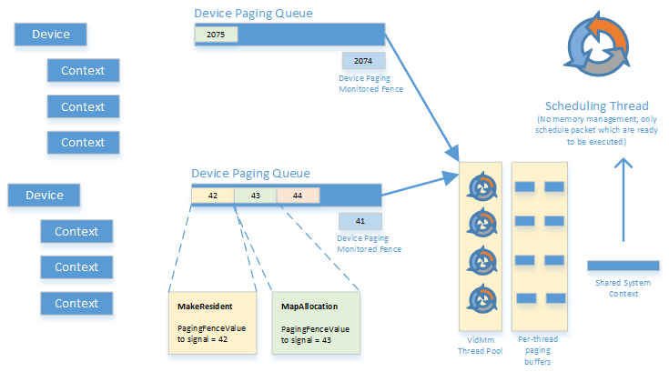

# Device paging queues

Various services exposed by the video memory manager can take a non-trivial amount of time to finish. For example, making an allocation resident can possibly involve bringing the allocation content, which hasn't been used in a long time, back from the page file. Reserving graphics processing unit (GPU) virtual address or mapping a virtual address to an already resident allocation aren't quite as expensive but still involve immediate page table update which needs to be queued onto the paging engine and may take a little while to finish.

Rather than forcing the thread requesting these services to wait until their completion, the video memory manager implements these services using an asynchronous queue. This asynchronous queue is called the device paging queue.

Each graphics device has a dedicated paging queue where various video memory manager requests are queued to the video memory manager thread pool for servicing. A device paging fence object is associated with the queue and every operation gets assigned a unique fence value that gets signaled when the video memory manager completes the operation. An operation that can be done immediately by the video memory manager returns a device paging fence value of zero.

The device paging fence is a regular monitored fence object and the user mode driver can wait on these video memory manager services either on the CPU or on the GPU.

Generally the user mode driver wants to push the synchronization as far as possible and will queue a GPU wait into a context before that context take a dependency on a requested video memory manager operation. For example, after reserving the virtual address for a *tile resource*, the user mode driver must ensure to wait until the reserve operation completes before a GPU engine starts accessing the virtual address range of the tile resource.

To obtain a reference to the device paging fence object a new **GetDevicePagingFenceObjectCb**device driver interface (DDI) is added to the user mode driver. This is illustrated below:

 

 

