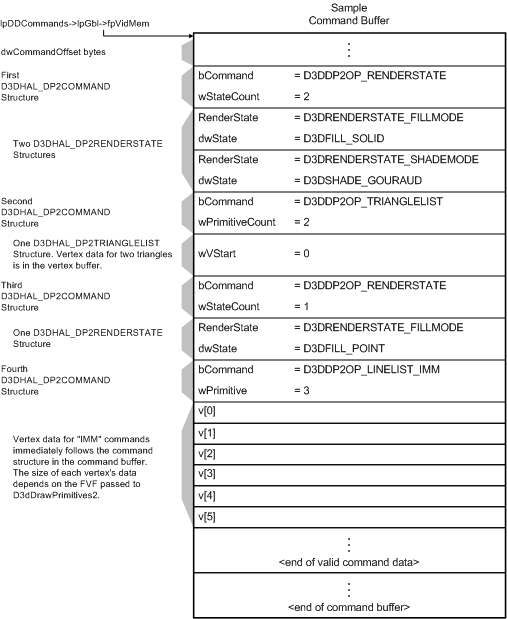

# Direct3D Command Buffers

## 

The following figure shows portions of a sample logical command buffer. The driver's [**D3dDrawPrimitives2**](https://msdn.microsoft.com/library/windows/hardware/ff544704) callback receives a pointer to a command buffer in the **lpDDCommands** member of the [**D3DHAL\_DRAWPRIMITIVES2DATA**](https://msdn.microsoft.com/library/windows/hardware/ff545957) structure. The command buffer is always processed sequentially.

As shown in the preceding figure, a command buffer contains [**D3DHAL\_DP2COMMAND**](https://msdn.microsoft.com/library/windows/hardware/ff545454) structures, where the **bCommand** member of each structure identifies a command. The following lists possible commands:

-   D3DDP2OP\_RENDERSTATE indicates that there are **wStateCount**[**D3DHAL\_DP2RENDERSTATE**](https://msdn.microsoft.com/library/windows/hardware/ff545705) structures that follow in the command buffer. The driver should parse the state from each of these structures and update its private driver state accordingly. The driver should also update the appropriate state in the array to which **lpdwRStates** points. If the driver does not support the state requested in the command buffer, the driver should override the requested value with one that it supports.

-   D3DDP2OP\_TEXTURESTAGESTATE indicates that there are **wStateCount**[**D3DHAL\_DP2TEXTURESTAGESTATE**](https://msdn.microsoft.com/library/windows/hardware/ff545878) structures that follow in the command buffer. The driver should parse the state from each of these structures and update the driver's texture state associated with the specified texture stage accordingly. The driver does not report texture stage state back to the Direct3D runtime.

    A driver is required to properly parse up to eight texture coordinate sets regardless of how many coordinate sets it actually uses.

-   D3DDP2OP\_VIEWPORTINFO indicates that there is one [**D3DHAL\_DP2VIEWPORTINFO**](https://msdn.microsoft.com/library/windows/hardware/ff545936) structure that follows in the command buffer. The driver should parse this structure and update the viewport information stored in the driver's internal rendering context.

-   D3DDP2OP\_WINFO indicates that there is one [**D3DHAL\_DP2WINFO**](https://msdn.microsoft.com/library/windows/hardware/ff545944) structure that follows in the command buffer. The driver should parse this structure and update the w-buffer information stored in the driver's internal rendering context.

-   Any of the remaining D3DDP2OP\_*Xxx* commands indicate that there is enough data following in the command buffer to render **wPrimitiveCount** (a member of the [**D3DHAL\_DP2COMMAND**](https://msdn.microsoft.com/library/windows/hardware/ff545454) structure) primitives. Depending on the primitive command, the driver should parse D3DHAL\_DP2*Xxx* structures from the command buffer and vertex-associated data from either or both the vertex buffer and command buffer. The driver must attempt to process all valid D3DDP2OP\_*Xxx* commands; that is, the driver cannot choose to ignore certain defined primitive types. For more information, see the individual D3DHAL\_DP2*Xxx* structure reference pages.

Depending on the current command, the following additional information is stored in the command buffer:

-   Index information for all D3DDP2OP\_INDEXED*Xxx* primitive commands.

-   Vertex data for the D3DDP2OP\_TRIANGLEFAN\_IMM and D3DDP2OP\_LINELIST\_IMM primitive commands.

-   Additional operations are also defined as D3DDP2OP\_*Xxx* opcodes in the [**D3DHAL\_DP2OPERATION**](https://msdn.microsoft.com/library/windows/hardware/ff545678) structure. These are equivalent to D3DDP2OP\_*Xxx* commands with the same names.

The command buffer occasionally contains commands that are understood only by Direct3D. If the driver's [**D3dDrawPrimitives2**](https://msdn.microsoft.com/library/windows/hardware/ff544704) callback does not recognize the command, the driver should call Direct3D's **D3dParseUnknownCommand** callback to attempt to parse it. When **D3dParseUnknownCommand** returns successfully, the driver should continue parsing and processing the command buffer. If **D3dParseUnknownCommand** fails by returning D3DERR\_COMMAND\_UNPARSED, **D3dDrawPrimitives2** should set the following members of the [**D3DHAL\_DRAWPRIMITIVES2DATA**](https://msdn.microsoft.com/library/windows/hardware/ff545957) structure and return:

-   In **dwErrorOffset**, write the offset of the first unhandled [**D3DHAL\_DP2COMMAND**](https://msdn.microsoft.com/library/windows/hardware/ff545454) structure that is part of the buffer to which **lpDDCommands** points.

-   Set **ddrval** to D3DERR\_COMMAND\_UNPARSED.

For information about how to initialize the **D3dParseUnknownCommand** callback, see [Direct3D Driver Initialization](direct3d-driver-initialization.md).

To simplify implementation of **D3dDrawPrimitives2**, driver writers can copy the parsing code from the *Perm3* sample code and write driver-specific rendering and state update code only.

**Note**   The Microsoft Windows Driver Kit (WDK) does not contain the 3Dlabs Permedia3 sample display driver (*Perm3.h*). You can get this sample driver from the Windows Server 2003 SP1 Driver Development Kit (DDK), which you can download from the DDK - Windows Driver Development Kit page of the WDHC website.

 

Direct3D is not always informed of the current render states. For example, execute buffers are not inspected by the runtime before they reach the driver. The driver can keep track of the render state array with the **lpdwRStates** member of the [**D3DHAL\_DRAWPRIMITIVES2DATA**](https://msdn.microsoft.com/library/windows/hardware/ff545957) structure. This is a pointer to the internal render states array that the driver keeps up to date as state changes occur.

 

 

