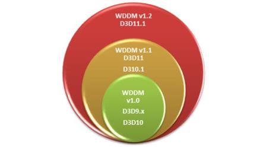

# Direct3D features and requirements in WDDM 1.2

Microsoft Direct3D offers a rich collection of 3-D graphics APIs, which are widely used by software applications for complex visualization and game development. This section describes feature improvements and Windows 8 Direct3D software and hardware requirements.

## In this section

<table>
<colgroup>
<col width="50%" />
<col width="50%" />
</colgroup>
<thead>
<tr class="header">
<th align="left">Topic</th>
<th align="left">Description</th>
</tr>
</thead>
<tbody>
<tr class="odd">
<td align="left">
<a href="directx-feature-improvements-in-windows-8.md" data-raw-source="[DirectX feature improvements in Windows 8](directx-feature-improvements-in-windows-8.md)">DirectX feature improvements in Windows 8</a>
</td>
<td align="left">
Windows 8 includes Microsoft DirectX feature improvements that benefit developers, end users and system manufacturers.
</td>
</tr>
<tr class="even">
<td align="left">
<a href="software-requirements.md" data-raw-source="[Direct3D software requirements in Windows 8](software-requirements.md)">Direct3D software requirements in Windows 8</a>
</td>
<td align="left">
This topic describes software requirements to support Direct3D in Windows 8.
</td>
</tr>
<tr class="odd">
<td align="left">
<a href="hardware-requirements.md" data-raw-source="[Hardware requirements](hardware-requirements.md)">Hardware requirements</a>
</td>
<td align="left">
This topic describes hardware requirements to support Direct3D in Windows 8.
</td>
</tr>
</tbody>
</table>

 

Depending on the capability of the graphics adapter, Direct3D allows applications to utilize hardware acceleration for the entire 3-D rendering pipeline or for partial acceleration. Newer versions of the Direct3D APIs such as Direct3D 9Ex and Microsoft Direct3D 10 are available only starting with Windows Vista because the Windows Display Driver Model (WDDM) provides the display driver interfaces needed for the functionality. This figure shows the incremental versions of Direct3D APIs that are supported on the various versions of WDDM:

**Direct3D APIs supported on various versions of WDDM**

 

 

