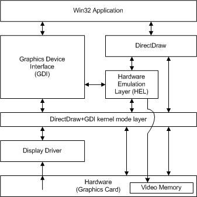

# DirectDraw Architecture

## 

Microsoft DirectDraw includes the following components:

-   User-mode DirectDraw (*ddraw.dll*), which is a system-supplied dynamic-link library (DLL) that is loaded and called by DirectDraw applications. This component provides hardware emulation, manages the various DirectDraw objects, and provides display memory and display hardware management services.

-   Kernel-mode DirectDraw, which is an integral part of *win32k.sys*, the system-supplied graphics engine that is loaded by a kernel-mode display driver. This portion of DirectDraw performs parameter validation for the driver, making it easier to implement more robust drivers. This is a critical design goal because display drivers are trusted components of the Microsoft Windows 2000 and later operating systems. Kernel-mode DirectDraw also handles synchronization with GDI and all cross-process states.

-   The DirectDraw portion of the display driver, which, along with the rest of the display driver, is implemented by graphics hardware vendors. This component is referred to as the DirectDraw driver in this document. Other portions of the display driver handle GDI and other non-DirectDraw related calls.

This document generically refers to both of the system-supplied components as DirectDraw.

The following figure shows a diagram of the DirectDraw driver architecture.

As shown in the preceding figure, an application accesses the display card through GDI (user and kernel-mode portions) and the display driver. The display driver always supports GDI calls and, usually, DirectDraw and Direct3D calls. The device independent bitmap (DIB) engine portion of GDI emulates functionality when it is not supported by the display driver.

When DirectDraw is invoked, it accesses the graphics card directly through the DirectDraw driver. DirectDraw calls the DirectDraw driver for supported hardware functions, or the hardware emulation layer (HEL) for functions that must be emulated in software. GDI calls, on the other hand, are sent to the driver, which must then call back into the DIB engine if the call is unsupported.

**Note**   If the DirectDraw driver fails an operation, DirectDraw does not pass the operation to the DirectDraw HEL, but instead passes the DirectDraw driver's error code back to the application.

 

At initialization time and during mode changes, the display driver returns capability (caps) bits to DirectDraw. This enables DirectDraw to access information about the available driver functions, their addresses, and the capabilities of the display card and driver (such as stretching, transparent blits, display pitch, and other advanced characteristics). Once DirectDraw has this information, it can use the DirectDraw driver to access the display card directly, without making GDI calls or using the GDI specific portions of the display driver.

 

 

