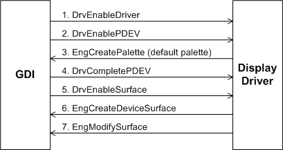
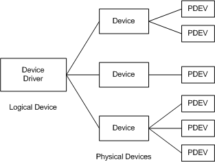

# Display Driver Initialization

Display driver initialization is similar to graphics driver initialization, as described in [Supporting Initialization and Termination Functions](supporting-initialization-and-termination-functions.md). This section provides initialization details that are specific to display drivers.

Video miniport and display driver initialization occur after the NT executive and the Win32 subsystem are loaded and initialized. The system loads the video miniport driver or drivers that are enabled in the registry, and then determines which video miniport driver and display driver pair to use. During this process, GDI opens all necessary display drivers, based on the information provided by Window Manager.

The basic display driver initialization procedure, in which the desktop is created, is shown in the following figure.

1. When GDI is called to create the first device context (*DC*) for the video hardware, GDI calls the display driver function [**DrvEnableDriver**](/windows/win32/api/winddi/nf-winddi-drvenabledriver). Upon return, **DrvEnableDriver** provides GDI with a [**DRVENABLEDATA**](/windows/win32/api/winddi/ns-winddi-drvenabledata) structure that holds both the driver's graphics DDI version number and the entry points of all callable graphics DDI functions that are implemented by the driver (other than **DrvEnableDriver**).

2. GDI then calls the driver's [**DrvEnablePDEV**](/windows/win32/api/winddi/nf-winddi-drvenablepdev) function to request a description of the driver's physical device's characteristics. In the call, GDI passes in a [**DEVMODEW**](/windows/win32/api/wingdi/ns-wingdi-devmodew) structure, which identifies the mode that GDI wants to set. If GDI requests a mode that the display or underlying miniport driver does not support, then the display driver must fail this call.

3. The display driver represents a logical device controlled by GDI. As shown in the following figure, a single logical device can manage several physical devices, each characterized by type of hardware, logical address, and surfaces supported. The display driver allocates the memory to support the device it creates. A display driver may be called upon to manage more than one *PDEV* for the same physical device, although only one PDEV can be enabled at a time for a given physical device. Each PDEV is created in a separate GDI call to [**DrvEnablePDEV**](/windows/win32/api/winddi/nf-winddi-drvenablepdev), and each call creates another PDEV that is used with a different surface.

   Because a driver must support more than one PDEV, it should not use global variables.

   GDI automatically enables DirectDraw after calling [**DrvEnableSurface**](/windows/win32/api/winddi/nf-winddi-drvenablesurface). After DirectDraw is initialized, the driver can use DirectDraw's *heap manager* to perform *off-screen memory* management. See [DirectDraw and GDI](directdraw-and-gdi.md) for details.

   The following figure illustrates logical versus physical devices.

   

4. When installation of the physical device is complete, GDI calls [**DrvCompletePDEV**](/windows/win32/api/winddi/nf-winddi-drvcompletepdev). This function provides the driver with a GDI-generated physical device handle to use when requesting GDI functions for the device.

5. In the final stage of initialization, a surface is created for the video hardware by a GDI call to [**DrvEnableSurface**](/windows/win32/api/winddi/nf-winddi-drvenablesurface), which enables graphics output to the hardware. Depending on the device and the environment, the display driver enables a surface in one of two ways:

   * The driver manages its own surface by calling the GDI function **EngCreateDeviceSurface** method is required for hardware that does not support a standard-format bitmap and is optional for hardware that does.
   * GDI can manage the surface completely as an *engine-managed surface* if the hardware device has a surface organized as a standard-format bitmap. A driver can call [**EngModifySurface**](/windows/win32/api/winddi/nf-winddi-engmodifysurface) to convert the *device-managed* primary bitmap to one that is *engine-managed*. The driver can still hook any drawing operations.

Any existing GDI bitmap handle is a valid surface handle. A driver can call [**EngModifySurface**](/windows/win32/api/winddi/nf-winddi-engmodifysurface) to convert the device-managed primary bitmap to an engine-managed bitmap. If the surface is engine-managed, GDI can handle any or all drawing operations. If the surface is device-managed, at a minimum, the driver must handle [**DrvTextOut**](/windows/win32/api/winddi/nf-winddi-drvtextout), [**DrvStrokePath**](/windows/win32/api/winddi/nf-winddi-drvstrokepath), and [**DrvBitBlt**](/windows/win32/api/winddi/nf-winddi-drvbitblt).

GDI automatically enables DirectDraw after calling [**DrvEnableSurface**](/windows/win32/api/winddi/nf-winddi-drvenablesurface). After DirectDraw is initialized, the driver can use DirectDraw's *heap manager* to perform [*off-screen memory*](video-present-network-terminology.md#off_screen_memory) management. See [DirectDraw and GDI](directdraw-and-gdi.md) for details.

A display driver must implement [**DrvNotify**](/windows/win32/api/winddi/nf-winddi-drvnotify) in order to receive notification events, particularly the DN_DRAWING_BEGIN event. GDI sends this event immediately before it begins drawing, so it can be used to determine when caches can be initialized.

See the [Plug and Play](../kernel/introduction-to-plug-and-play.md) section for more information about the boot process.
