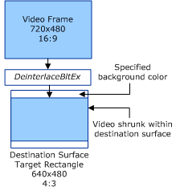

# Displaying 16:9 Video within a 4:3 Destination Surface

## 

This section applies only to Windows Server 2003 with SP1 and later, and Windows XP with SP2 and later.

In the following example, the VMR directs to display a 16:9 video stream within a 4:3 destination surface.

Note that for clarity the preceding example does not contain any video substreams. In the preceding example, the rectangles are as follows:

-   Target rectangle = {0, 0, 640, 480}

-   Video stream:
    -   Source rectangle = {0, 0, 720, 480},
    -   Destination rectangle = {0, 60,640,300}

 

 

