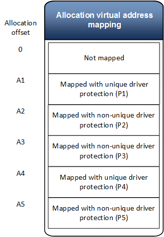

# Driver protection

Along with every virtual address, the video memory manager allows independent hardware vendors (IHVs) to define a driver / hardware specific protection (i.e. page table entry encoding) that is associated specifically with that virtual address. Think about driver protection as extra bit in the page table entry that the video memory manager doesn't know about but that the driver must control in order for the graphics processing unit (GPU) to access memory in an optimum way.

**Note**  Driver protection is optional and can be left at zero on any platform that doesn't require this functionality.

 

When mapping or reserving a GPU virtual address range the driver may specify a 64-bit driver protection value. The specified driver protection is used by the video memory manager when initializing the page table entry corresponding to that specific virtual address. In particular, driver protection is given back to the driver for any [*BuildPagingBuffer*](https://msdn.microsoft.com/library/windows/hardware/ff559587)**DXGK\_OPERATION\_UPDATE\_PAGE\_TABLE** corresponding to the specified virtual address.

Multiple virtual addresses may be mapped to a single allocation using different driver protections. Page table entries for each of these virtual addresses will be updated using the appropriate driver protection.

Driver protection only applies to level 0 page table entries and will be set to zero for any other page table entry levels.

## Paging and unique driver protection

When paging an allocation in or out of a memory segment, the video memory manager assigns a temporary virtual address from the system device address space for the purpose of transferring the allocation's content. When creating this mapping, the driver protection related to the allocation is ambiguous since there could exist multiple mapping in various process address space with different driver protection.

Because of this, the video memory manager will specify a driver protection of zero for any system device mapping used for paging by default.

A driver can change this behavior by setting the **unique** bit when specifying the driver protection associated with a virtual address.

`#define D3DGPU_UNIQUE_DRIVER_PROTECTION 0x8000000000000000ULL`

When this bit is set, the video memory manager will enforce that any mapping to the same allocation range use the same driver protection value, or the mapping request will fail with **STATUS\_INVALID\_PARAMETER**.

An allocation range, mapped with a unique driver protection value, cannot be mapped again with a different protection value. The only way to change the protection in this case is to map the range with no access.

An allocation range that is mapped with a non-unique driver protection value can be mapped again with any protection value.

When evicting an allocation that has virtual address ranges mapped with driver protection set to *unique*, the video memory manager will setup the paging process mapping used for those ranges with the appropriate driver protection value without ambiguity.

The following figure shows VA mapping for an allocation with different driver protection values.

During paging operations the allocation will be copied in chunks:

1. Copy allocation range \[0, A1\] with driver protection 0
2. Copy allocation range \[A1, A2\] with driver protection P1
3. Copy allocation range \[A2, A4\] with driver protection 0
4. Copy allocation range \[A4, A5\] with driver protection P4
5. Copy allocation range \[A5, Size\] with driver protection 0
It is possible that paging process page table entries will be set with one driver protection value when an allocation is evicted and set to a different value when the allocation is committed. It is assumed that the driver should refresh the allocation data after the virtual address mapping is updated.
For example, consider a case when the current allocation mapping set is M1 and the user mode driver called [*UpdateGpuVirtualAddress*](https://msdn.microsoft.com/library/windows/hardware/dn906365) with mapping set M2. Just before the mapping set M2 is applied, the allocation can be evicted by the video memory manager. The mapping set M2 is applied and the allocation is committed back. Now the allocation content in the local memory segment might be different from the original.

## Tiled Resources

For tiled resources, driver protection is specified when reserving a virtual address range. A user mode driver call to [*UpdateGpuVirtualAddress*](https://msdn.microsoft.com/library/windows/hardware/dn906365) will inherit the virtual address current driver protection.

 

 

