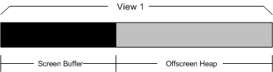
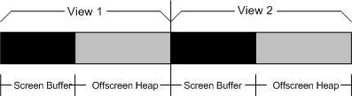
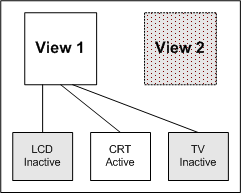
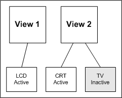

# DualView Advanced Implementation Details

## 

An ideal DualView implementation should recognize when its secondary views are enabled or disabled. When the secondary views are disabled, the primary view should behave as it would without DualView enabled. This means that:

-   The primary display can access all parts of video memory.

-   On a laptop computer, the primary display can be switched to any of the child display devices.

### Video Memory Arrangement

In an ideal DualView implementation, memory buffer usage is optimized so that the entire video memory is used by the primary display when the secondary display is disabled. This optimization is optional, however; the video memory allocation strategy to use is completely up to the driver writer.

When secondary views are disabled, the primary view should be able to access all parts of video memory to maximize system performance. When secondary views are enabled, however, the miniport driver should not just appropriate the primary view's memory. Instead, a miniport driver should reserve video memory for secondary views, prior to changing to DualView mode. Starting with Windows XP (and continuing for later operating system versions), there is a new video request, [**IOCTL\_VIDEO\_SWITCH\_DUALVIEW**](https://msdn.microsoft.com/library/windows/hardware/ff568151) to help driver writers handle video memory arrangement. When Windows XP (and later) handles a call to the **ChangeDisplaySettings** function (described in the Windows SDK documentation), it sends the IOCTL\_VIDEO\_SWITCH\_DUALVIEW request to each DualView-related view before it attempts to change the mode. Drivers can use that information to make video memory arrangements in advance of their need.

The following figure illustrates an arrangement of video memory with DualView disabled.

The following figure illustrates a suggested arrangement of video memory with DualView enabled. Each view has its own screen buffer and offscreen heap.

### Child Relationships

A typical mobile video chip has multiple child devices, such as LCD, CRT, and TV. In SingleView mode, as shown in the following figure, the primary view owns all of these child devices, while the secondary view owns none of them. A user can switch the primary view from one child device to another. Only one device can be active at a time.

In DualView mode, however, each child can be assigned to a different view; the question arises as to which view is associated with which child. The relationships between views and devices can be described in two ways: in terms of *physical child relations* and in terms of *logical child relations*.

*Physical child relations* reflect the relationship between the adapter's video chip and its display devices. After the system boots, the physical relationship between the video chip and the display devices never changes. In the preceding figure and the following figure, the video chip owns the LCD, CRT and TV display devices; hence, all three display devices are physical children of the video chip.

*Logical child relations* reflect the dynamic relationships between the views and the display devices. In the following figure, DualView has been enabled, and the situation is that the primary view (View 1) owns the LCD device, while the secondary view (View 2) owns both the CRT and TV devices. Another way to say this is that the LCD device is the logical child of the primary view, while the CRT and TV devices are the logical children of the secondary view. The miniport driver reports logical child relationships through the [**IOCTL\_VIDEO\_GET\_CHILD\_STATE**](https://msdn.microsoft.com/library/windows/hardware/ff567801) request.

One additional point remains. When DualView is enabled, the primary view may automatically switch children. In SingleView mode, only the CRT, which is associated with the primary (and only) view, is active. All other display devices are inactive. After DualView has been enabled, the preceding figure shows the primary view has switched to display on the LCD device, while the CRT is a child of the secondary view. This switch might be necessary for a laptop computer due to the fact that the secondary view is removable, which means that the LCD device cannot be associated with that view. Whether and how to make this switch is totally under the control of miniport drivers.

 

 

