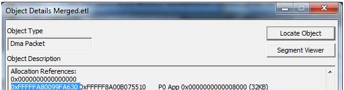

# Elements of the Dialog

## Locate Object Button

The **Object Details** dialog has a very useful, relatively hidden functionality: the **Locate Object** button.

As seen in the preceding diagram, select a memory address or a handle value and then press the **Locate Object** button. The button will invoke the **Object Viewer** dialog and scroll the highlighted object into view.

## Segment Viewer Button

The **Segment Viewer** button invokes all the Segment Viewer windows using the start time of the DMA object that spawned the **Object Details** dialog.
