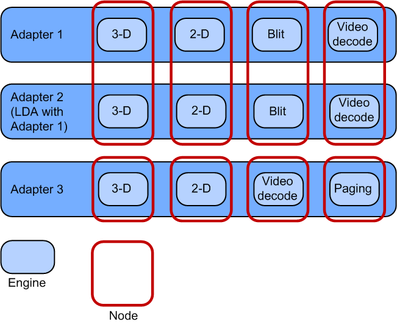

# Enumerating GPU engine capabilities


Starting in Windows 8.1, a display miniport driver must implement the [*DxgkDdiGetNodeMetadata*](https://msdn.microsoft.com/library/windows/hardware/dn265415) function, which is used to query the engine capabilities of a GPU node.

This information helps with the evaluation of how workloads are scheduled and distributed among nodes and improves the ability to debug applications.

## <span id="Engine_capabilities_device_driver_interface__DDI_"></span><span id="engine_capabilities_device_driver_interface__ddi_"></span><span id="ENGINE_CAPABILITIES_DEVICE_DRIVER_INTERFACE__DDI_"></span>Engine capabilities device driver interface (DDI)


This interface provides the engine capabilities of a specified GPU node:

-   [*DxgkDdiGetNodeMetadata*](https://msdn.microsoft.com/library/windows/hardware/dn265415)
-   [**DXGKARG\_GETNODEMETADATA**](https://msdn.microsoft.com/library/windows/hardware/dn265405)
-   [**DXGK\_ENGINE\_TYPE**](https://msdn.microsoft.com/library/windows/hardware/dn265417)

A pointer to the [*DxgkDdiGetNodeMetadata*](https://msdn.microsoft.com/library/windows/hardware/dn265415) function is provided by the **DxgkDdiGetNodeMetadata** member of the [**DRIVER\_INITIALIZATION\_DATA**](https://msdn.microsoft.com/library/windows/hardware/ff556169) structure.

## <span id="GPU_node_architecture"></span><span id="gpu_node_architecture"></span><span id="GPU_NODE_ARCHITECTURE"></span>GPU node architecture


Each display adapter on the system has a number of different engines available to schedule tasks on. Each engine is assigned to only one node, but each node may contain more than one engine if that node is associated with multiple adapters—such as in linked display adapter (LDA) configuration, where multiple physical GPUs are linked to form a single, faster, virtual GPU.



Different nodes represent the asymmetrical processing cores of the GPU, while the engines within each node represent the symmetrical processing cores across adapters. That is, a 3-D node contains only identical 3-D engines on several adapters, and never a different engine type.

Because the engines are always grouped together in nodes by engine type, the engine type information can be queried based on a specified node. The types of engine that the display miniport driver can specify are listed in the [**DXGK\_ENGINE\_TYPE**](https://msdn.microsoft.com/library/windows/hardware/dn265417) enumeration.

## <span id="Example_implementation_of_node_metadata_function"></span><span id="example_implementation_of_node_metadata_function"></span><span id="EXAMPLE_IMPLEMENTATION_OF_NODE_METADATA_FUNCTION"></span>Example implementation of node metadata function


This code shows how a display miniport driver can implement some of the engine types that can be returned by the [*DxgkDdiGetNodeMetadata*](https://msdn.microsoft.com/library/windows/hardware/dn265415) function.

```ManagedCPlusPlus
NTSTATUS
IHVGetNodeDescription(
        IN_CONST_HANDLE                     hAdapter,
        UINT                                NodeOrdinal,
        OUT_PDXGKARG_GETNODEMETADATA        pGetNodeMetadata
        )
{
    DDI_FUNCTION();
    PAGED_CODE();

    if(NULL == pGetNodeMetadata)
    {
        return STATUS_INVALID_PARAMETER;
    }

    CAdapter *pAdapter = GetAdapterFromHandle(hAdapter);

    //Invalid handle
    if(NULL == pAdapter)
    {
        return STATUS_INVALID_PARAMETER;
    }

    //Node ordinal is out of bounds. Required to return
    //STATUS_INVALID_PARAMETER
    if(NodeOrdinal >= pAdapter->GetNumNodes())
    {
        return STATUS_INVALID_PARAMETER;
    }

    switch(pAdapter->GetEngineType(NodeOrdinal))
    {
        //This is the adapter&#39;s 3-D engine. This engine handles a large number
        //of different workloads, but it also handles the adapter&#39;s 3-D 
        //workloads. Therefore the 3-D capability is what must be exposed.
        case GPU_ENGINE_3D:
        {
            pGetNodeMetadata->EngineType = DXGK_ENGINE_TYPE_3D;
            break;
        }

        //This is the adapter&#39;s video decoding engine
        case GPU_ENGINE_VIDEO_DECODE:
        {
            pGetNodeMetadata->EngineType = DXGK_ENGINE_TYPE_VIDEO_DECODE;
            break;
        }

        //This engine is proprietary and contains no functionality that
        //fits the DXGK_ENGINE_TYPE enumeration
        case GPU_ENGINE_PROPRIETARY_ENGINE_1:
        {
            pGetNodeMetadata->EngineType = DXGK_ENGINE_TYPE_OTHER;

            //Copy over friendly name associated with this engine
            SetFriendlyNameForEngine(pGetNodeMetadata->FriendlyName,
                                     DXGK_MAX_METADATA_NAME_LENGTH,
                                     PROPRIETARY_ENGINE_1_NAME);
            break;
        }
    }

    return STATUS_SUCCESS;
}
```

 

 


