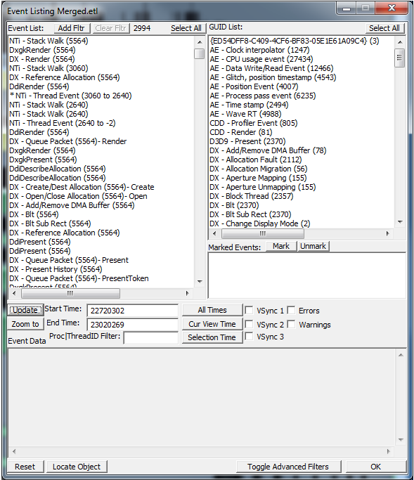

# Event Listing Dialog Box  

The **Event Listing** dialog box's main purpose is to allow for detailed exploring of events (or classes of events) over specific periods for a specific focus. The dialog box works in conjunction with the main display window so that the user can see exactly where the specific events take place relative to what the operating system does as a whole.  

The following figure shows a screen shot of what you might see when you open the dialog box, after you zoom in on a small region in the event file. Some of the dialog box's main areas and features are outlined after the figure.  

> [!NOTE]
> When the **Event Listing** dialog box is initially created, it reads the current viewport time and makes it the default time period. The GUID List represents all the different types of events that GPUView finds in the ETL file.

The following sections describe the **Event Listing** dialog box.  

## GUID List

The list in the upper-right corner of the dialog box is the **GUID List**. All of the different events that GPUView finds in the ETL file are displayed in the **GUID List**. The number of occurrences of an event GUID is also displayed in the parentheses to the right of the GUID's name. **GUID List** is a multi-select list; that is, you can press the CTRL key while you select multiple classes of events using the mouse.  

> [!NOTE]
> **GUID List** displays only events that GPUView found in the ETL file when the ETL file was loaded into GPUView. For a complete listing of all event GUIDs that GPUView is aware of, open the GuidStats.txt file that is logged after GPUView loads.  

The data format of each item in **GUID List** is the GUID's friendly name (For instance, DX - Allocation Fault) followed by the number of times that the event GUID appears in the ETL file.  

## Event List 

Every time a GUID class is selected in **GUID List**, the dialog box repopulates the **Event List** with that class of event GUIDs that were found in the ETL file during the ETL file's specified time period. The **Event List** is also a multi-select list. Every time an item is selected, a vertical red line is drawn in the main window of GPUView. This red line denotes the position of that particular event relative to all the other events.  

Also, when events are logged, there might be extra information that is associated with each event. This information is displayed in the **Event Data** control area in the lower-left corner of the dialog box. If more than one event is selected, the dialog box displays information in the **Event Data** area for the first highlighted message in **Event List**.   

The maximum number of entries for the **Event List** is 5000. The current number of entries is shown just to the right of the **Clear Fltr** button.   

The data format of each item in the **Event List** is the event's friendly name (or function name) followed by the identifier of the thread that owns the event (if a thread exists) followed by extra information that the user might find interesting.  

## Event Data  

The **Event Data** control is in the lower-left corner. Extra information associated with events that are selected in **Event List** is displayed in the **Event Data** area. Each event type is different; therefore, the output varies from type to type.  

## Time  

The time period is displayed in the **Start Time** and **End Time** edit controls. The three buttons to the right of these two edit controls apply standard time intervals for the dialog box to process. The **All Times** button sets the **Start Time** value to zero and the **End Time** value to 0xFFFFFFFF (which translates to 4294967295). The **Cur View Time** button sets **Start Time** and **End Time** values based on the time span being viewed in the main window. The **Selection Time** button sets the **Start Time** and **End Time** values to the time period that is associated with a selection, if there is a selection (**Cur View Time** behavior otherwise).

## VSync

The **VSync** check boxes enable the viewing of vertical lines in the main UI of GPUView. Selecting one of the **VSync** check boxes highlights all **DX VSync DPC** events for the corresponding monitor with either a blue or green vertical line. The **VSync** that corresponds to a particular monitor will have the same color.  

## Marked Events

The **Marked Events** list is a storage location for important events that might be used as key reference points while debugging. The **Mark Selected**, **Select All**, and **Unmark All** buttons are associated with this functionality. If the user clicks the **Mark Selected** button, **any highlighted** event in **Event List** is marked by displaying the event in **Marked Events**. Events that are marked are displayed in light yellow in the main window. If the marked event is selected, it is displayed in bright yellow. To clear the marked events, press the **Unmark All** button. The **Select All** button selects all the events in the **Event List** so that you can mark them.  

## Proc|ThreadID Filter

GPUView tags some events as being owned by a particular thread so that you can filter on events that are owned by particular threads. For example, if the **DX - Profiler Event** GUID is selected and the value in the **ThreadID Filter** control is set to a particular thread, only profile events from that thread are displayed in **Event List**. Thread identifiers are displayed in the main window that precedes the thread name.  

## Zoom to

The **Zoom to** button, if pressed, adjusts the main window to display the selected events in **Event List**. If one event is selected in **Event List**, that event is centered in the main window. If multiple events are selected in **Event List**, the first and last events are used as the start and end events in the main window.  

## Update 

The **Update** button acts as a refresh button.

## Add Fltr and Clear Fltr

The **Add Fltr** and **Clear Fltr** buttons work as a filter bag for profile-type events. Specifically, you can use these buttons when you view **DX - Profiler Event** GUIDs. If you click the **DX - Profiler Event** GUIDs, the **Event List** control displays functions that have run in the video kernel. You can then add functions to the filter bag by selecting the function in the **Event List** control and by clicking the **Add Fltr** button. GPUView then filters out these functions, which simplifies your view.  

## Select All

The **Event List** and the **GUID List** controls have their own **Select All** button. They select all the events in that control.  

## Locate Object

The **Locate** button affects selections in the **Event Data** control. You can use this button to look up memory, device, or adapter information. When you press this button, the **Object Viewer** dialog box starts. GPUView then uses the selected item in the **Object to locate** control. You can then search for the object in the list.  

To see this button in action, select something like the **DX - Reference Allocation** GUID followed by a **DX - Reference Allocation** in the **Event List**. Then, in the **Event Data** control, select one of the hexadecimal numbers that represents a memory allocation. Then, click the **Locate Object** button. The **Object Viewer** dialog box should start, and the object should be highlighted in the **Object tree** control.  

## Reset

The **Reset** button sets the state of the dialog box back to an original state.  

## Toggle Advanced Filters

The **Toggle Advanced Filters** button extends the bottom of the **Event List** to allow for searching through the manifest-based events and their properties.   

## Errors and Warnings Check Boxes

GPUView performs some background processing after loading files and looks for performance warnings and glitch events. When it finds them in the file, it saves them for future viewing. Enabling these two check boxes will enable the displaying of these types of events. The warning events are displayed as a vertical yellow and white dashed line. The error events are a vertical red and white dashed line.  

## Mouse Functionality

Only single left-clicking is supported in the **GUID List** dialog box. When a selection occurs, the **Event List** control is filled with the events of that type for the given viewport time period.  

Both a single- and double-click are supported in the **Event List** control. A single click selects the item and decodes its payload in the **Event Data** control. If the item is double-clicked, the data is decoded and the main UI zooms to that event as the center point of the main UI.  
