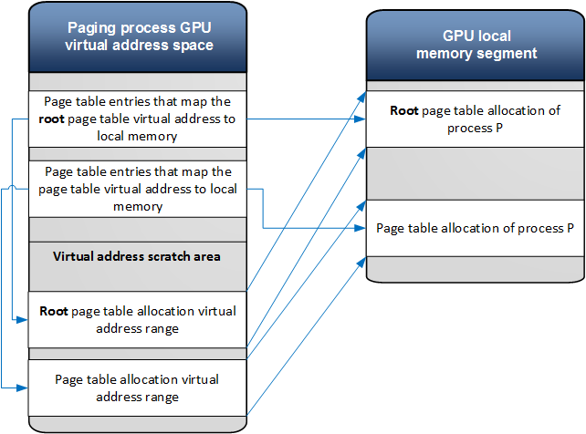
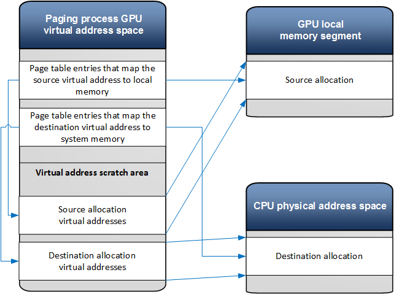
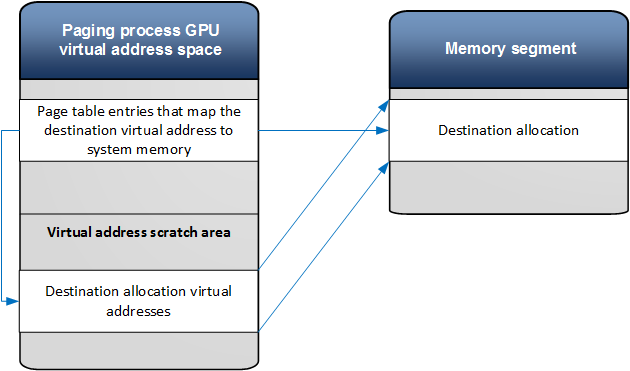

# GpuMmu Example Scenarios

This topic describes common usage scenarios and the sequence of operations necessary to implement them.

These scenarios include:

-   [Updating page table entries of a process](#updating-page-table-entries-of-a-process)
-   [Transferring allocation content from one location to another](#transferring-allocation-content-from-one-location-to-another)
-   [Filling an allocation with a pattern](#filling-an-allocation-with-a-pattern)
-   [Making an allocation resident in system memory](#making-an-allocation-resident-in-system-memory)
-   [Initialization of the memory manager control structures](#initialization-of-the-memory-manager-control-structures)

## Updating page table entries of a process 

Here is the sequence of operations to update page table entries to map an allocation that belong to a process (P) to physical memory. It is assumed that the page table allocations are already resident in a graphics processing unit (GPU) memory segment.

1.  The video memory manager allocates a virtual address range in the paging process context for the root page table allocation of the process P.
2.  The video memory manager allocates a virtual address range in the paging process context for the page table allocations of the process P.
3.  The video memory manager calls [*DxgkDdiBuildPagingBuffer*](https://msdn.microsoft.com/library/windows/hardware/ff559587) with the *UpdatePageTable* command to map the paging process page table entries to the process P page tables and the page directory.
4.  The video memory manager calls [*DxgkDdiBuildPagingBuffer*](https://msdn.microsoft.com/library/windows/hardware/ff559587) with the *FlushTLB(PagingProcessRootPageTable)* command.
5.  The video memory manager calls [*DxgkDdiBuildPagingBuffer*](https://msdn.microsoft.com/library/windows/hardware/ff559587) with the *UpdatePageTable* command to fill the process page table entries with physical address information.
6.  The video memory manager calls [*DxgkDdiBuildPagingBuffer*](https://msdn.microsoft.com/library/windows/hardware/ff559587) with the *FlushTLB(process P root page table)* command.
7.  The paging buffer is submitted for execution in the paging process context.

## Transferring allocation content from one location to another

Here is the sequence of operations when transferring an allocation content from one location to another (ex. from local memory to system memory).

1.  The video memory manager allocates virtual address ranges for the source allocation and the destination allocation in the paging process virtual address scratch area.
2.  The video memory manager calls [*DxgkDdiBuildPagingBuffer*](https://msdn.microsoft.com/library/windows/hardware/ff559587) with the *UpdatePageTable* command. The command maps the paging process page table entries for the source virtual address range to the allocation physical address in the local GPU memory.
3.  The video memory manager calls [*DxgkDdiBuildPagingBuffer*](https://msdn.microsoft.com/library/windows/hardware/ff559587) with *UpdatePageTable* command. The command maps the paging process page table entries for the destination virtual address to system memory.
4.  The video memory manager calls [*DxgkDdiBuildPagingBuffer*](https://msdn.microsoft.com/library/windows/hardware/ff559587) with the *FlushTLB(paging process root page table)*.
5.  The video memory manager calls [*DxgkDdiBuildPagingBuffer*](https://msdn.microsoft.com/library/windows/hardware/ff559587) with the *TransferVirtual* command to perform a transfer operation.
6.  The paging buffer is submitted to the GPU for execution in the paging process context.

## Filling an allocation with a pattern 

Here is the sequence of operations when an allocation needs to be filled with a pattern.

1.  The video memory manager allocates a virtual address range for the destination allocation in the paging process virtual address scratch area.
2.  The video memory manager calls [*DxgkDdiBuildPagingBuffer*](https://msdn.microsoft.com/library/windows/hardware/ff559587) with the *UpdatePageTable* command. The command maps the paging process page table entries for the destination virtual address.
3.  The video memory manager calls [*DxgkDdiBuildPagingBuffer*](https://msdn.microsoft.com/library/windows/hardware/ff559587) with the *FlushTLB(paging process root page table)*.
4.  The video memory manager calls [*DxgkDdiBuildPagingBuffer*](https://msdn.microsoft.com/library/windows/hardware/ff559587) with the *FillVirtual* command to perform the operation.
5.  The paging buffer is submitted to the GPU for execution in the paging process context.

## Making an allocation resident in system memory

The following operations are performed when [**D3DKMTMakeResident**](https://msdn.microsoft.com/library/windows/hardware/dn906775) is called to make an allocation resident. It is assumed that the application process page tables are resident in memory.

In the application thread context:

1.  Allocate and pin physical system memory pages for the allocation virtual address range (if the allocation is resident in system memory).
2.  Generate a new paging fence ID for the application device.
3.  Submit a [**MakeResident**](https://msdn.microsoft.com/library/windows/hardware/dn906775) command to the video memory manager worked thread.
4.  Return to the application.

In the video memory manager worker thread context:

1.  Update the application process page table entries (see the corresponding section above).
2.  If the allocation is resident in a local memory segment, fill the allocation with zeros (see the corresponding section above).
3.  Submit the *SignalSynchronizationObject* command to the scheduler with the paging fence ID.

## Initialization of the memory manager control structures

The paging process initialization  

The Microsoft DirectX graphics kernel initializes the paging process virtual address space when the graphics device is switched to the *D0* power device state

1.  The paging process is created with [*DxgkDdiCreateProcess*](https://msdn.microsoft.com/library/windows/hardware/dn906337).
2.  The system device is created with [*DxgkDdiCreateDevice*](https://msdn.microsoft.com/library/windows/hardware/ff559615). At this point the kernel mode driver can reserve a virtual address range in the paging process address space.
3.  Page table allocations are created for the paging process.
4.  The page table allocations are committed to the memory segments that are defined in the virtual addressing capability structure.
5.  [*UpdatePageTable*](https://msdn.microsoft.com/library/windows/hardware/ff560815) operations are called to initialize the page tables.

A client process initialization  

When a new process is created, the DirectX graphics kernel will:

-   Create the initial page table allocations.
-   Initialize the page table allocations when the first allocation from the process is made resident.

 

 

