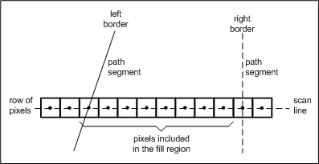

# Filling Areas (Closed Paths)

## 

As in line drawing, pixels for filling are considered to be at integer coordinates. Each scan line in a region is bordered on the left and right by a segment of the path. Pixels that fall between the left and right borders are considered inside the fill region. Pixels that are exactly on the left border are also inside, but those exactly on the right border are excluded. If a top border is exactly horizontal, any pixels exactly on the border are inside while pixels exactly on the lower border are excluded.

The following figure shows how the pixels included in the fill region are determined relative to left and right borders of the region. Stated mathematically, the region is considered to be "closed" on the left and top, and "open" on the right and bottom.

The convention described above for the x-axis of the fill region also applies to the y-axis by substituting the left border with the top border and the right border with the bottom border.

 

 

