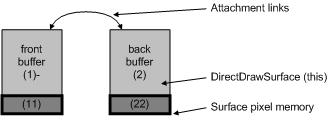

# Flipping

## 

Using a back buffer that can be flipped with a front buffer is the best way to take advantage of DirectDraw. Page flipping is essential for smooth, tear-free animation in games and video playback.

The *primary surface* is the area of memory that is being read from to draw the screen that is currently being displayed. If a primary surface has one or more attached back buffers, it is a *flippable* surface.

Flipping structures are used to page flip in DirectDraw. Conceptually, they can be thought of as linked lists made of surfaces. The front buffer is the "visible" buffer. The back buffer and all attached flippable surfaces must be the same size and pixel depth as the front buffer. Most modern graphics cards have enough memory for flippable front and back buffers in high resolution modes.

All types of surfaces can be flipped in DirectDraw; page flipping is the common special case. For instance, flipping is not limited to the primary surface on cards that support overlays, or on 3D capable display cards that have texture memory. In these cases, overlays and textures can be flipped in the same way as the primary surface, with the same driver entry point.

Surfaces that are not used for flipping can have any dimension and can store nonflippable objects such as image data. Image data may also be stored in system memory, but in that case DirectDraw may use the hardware emulation layer (HEL) because hardware blitters cannot normally reach system memory to blit the image data. Some cards allow hardware blitters to have direct memory access (DMA) to system memory, so DirectDraw performs a check for DMA.

The following figure illustrates the relationship between two flippable surfaces.

If a front buffer has one or more back buffers attached, it is a flippable surface, as shown in the preceding figure. The back buffer and all attached flippable surfaces must be the same size and pixel depth as the front buffer. A back buffer surface becomes the primary surface using a flip. A flip simply changes a pointer so it points to a different flippable surface, thereby displaying the new surface. The front buffer (which is no longer the primary surface) then becomes accessible, and can have new data written to it.

Flipping solves most screen flicker problems. The ability to render to a surface that is not being displayed allows smooth, tear-free animation for game play and video playback.

 

 

