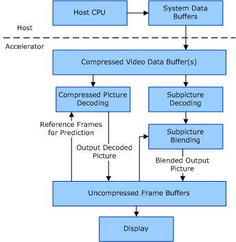

# Frame Buffer Organization

## 

All picture buffers are assumed to have frame-organized buffers as described in the MPEG-2 video specification (sample locations are given as frame coordinates).

It is possible to use an implementation-specific translation layer to convert prediction blocks without loss (see [*lossy compression*](https://msdn.microsoft.com/library/windows/hardware/ff556305#wdkgloss-lossy-compression)) that are described in frame coordinates to field coordinates. For example, a single frame motion prediction can be broken into two separate, top and bottom macroblock-portion predictions.

Three video component channels (Y, Cb, Cr) are decoded using interfaces defined for DirectX VA. Motion vectors for the two chrominance components (Cb, Cr) are derived from those sent for the luminance component (Y). The accelerator is responsible for converting any of these motion vectors to different coordinate systems that may be used.

The following figure shows how video data buffering is implemented in the host and accelerator.

 

 

[Send comments about this topic to Microsoft](mailto:wsddocfb@microsoft.com?subject=Documentation%20feedback%20[display\display]:%20Frame%20Buffer%20Organization%20%20RELEASE:%20%282/10/2017%29&body=%0A%0APRIVACY%20STATEMENT%0A%0AWe%20use%20your%20feedback%20to%20improve%20the%20documentation.%20We%20don't%20use%20your%20email%20address%20for%20any%20other%20purpose,%20and%20we'll%20remove%20your%20email%20address%20from%20our%20system%20after%20the%20issue%20that%20you're%20reporting%20is%20fixed.%20While%20we're%20working%20to%20fix%20this%20issue,%20we%20might%20send%20you%20an%20email%20message%20to%20ask%20for%20more%20info.%20Later,%20we%20might%20also%20send%20you%20an%20email%20message%20to%20let%20you%20know%20that%20we've%20addressed%20your%20feedback.%0A%0AFor%20more%20info%20about%20Microsoft's%20privacy%20policy,%20see%20http://privacy.microsoft.com/default.aspx. "Send comments about this topic to Microsoft")

