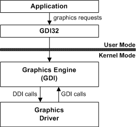

# GDI from the Driver's Perspective

## 

GDI is the intermediary support between a Microsoft Windows NT-based graphics driver and an application. Applications call Microsoft Win32 GDI functions to make graphics output requests. These requests are routed to kernel-mode GDI. Kernel-mode GDI then sends these requests to the appropriate graphics driver, such as a display driver or printer driver. Kernel-mode GDI is a system-supplied module that cannot be replaced.

GDI communicates with the graphics driver through a set of graphics device driver interface (graphics DDI) functions. These functions are identified by their *Drv* prefix. Information is passed between GDI and the driver through the input/output parameters of these entry points. The driver *must* support certain *DrvXxx* functions for GDI to call. The driver supports GDI's requests by performing the appropriate operations on its associated hardware before returning to GDI.

GDI includes many graphics output capabilities in itself, eliminating the need for the driver to support these capabilities and thereby making it possible to reduce the size of the driver. GDI also exports service functions that the driver can call, further reducing the amount of support the driver must provide. GDI service functions are identified by their **Eng** prefix, and functions that provide access to GDI-maintained structures have names in the form *Xxx*<strong>OBJ*\_</strong>**Xxx*.

The following figure shows this flow of communication.

 

 

