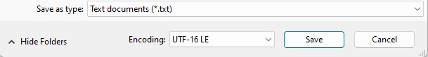

# General Unicode requirement in INF files

INF files should be saved and encoded as Unicode (UTF-16 LE); they must not be ANSI or UTF-8.

**To check for Unicode in INF files**

1.  Use Microsoft Notepad to open the INF file.
2.  On the **File** menu, click **Save As**.
3.  If **ANSI** appears in the **Encoding** field of the dialog box, change the encoding to **UTF-16 LE** (**Unicode** on older versions of Notepad) and save the file under a new name.

This figure shows the **Save As** dialog box for a file that has ANSI encoding:

The proper default value is shown in this figure:

On older versions of Notepad, it may look like this figure:

 

 

