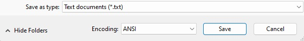
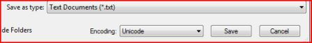

# General Unicode requirement in INF files

INF files should be saved and encoded as Unicode; they must not be ANSI.

**To check for Unicode in INF files**

1.  Use Microsoft Notepad to open the INF file.
2.  On the **File** menu, click **Save As**.
3.  If **ANSI** appears in the **Encoding** field of the dialog box, change the encoding to **Unicode** and save the file under a new name.

This figure shows the **Save As** dialog box for a file that has ANSI encoding:

The proper default value is shown in this figure:

 

 

[Send comments about this topic to Microsoft](mailto:wsddocfb@microsoft.com?subject=Documentation%20feedback%20[display\display]:%20General%20Unicode%20requirement%20in%20INF%20files%20%20RELEASE:%20%282/10/2017%29&body=%0A%0APRIVACY%20STATEMENT%0A%0AWe%20use%20your%20feedback%20to%20improve%20the%20documentation.%20We%20don't%20use%20your%20email%20address%20for%20any%20other%20purpose,%20and%20we'll%20remove%20your%20email%20address%20from%20our%20system%20after%20the%20issue%20that%20you're%20reporting%20is%20fixed.%20While%20we're%20working%20to%20fix%20this%20issue,%20we%20might%20send%20you%20an%20email%20message%20to%20ask%20for%20more%20info.%20Later,%20we%20might%20also%20send%20you%20an%20email%20message%20to%20let%20you%20know%20that%20we've%20addressed%20your%20feedback.%0A%0AFor%20more%20info%20about%20Microsoft's%20privacy%20policy,%20see%20http://privacy.microsoft.com/default.aspx. "Send comments about this topic to Microsoft")

