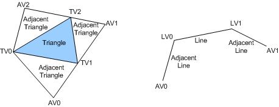

# Geometry Shader Stage

The geometry shader (GS) stage runs application-specified shader code with vertices as input and can generate vertices on output. Unlike vertex shaders, which operate on a single vertex, the geometry shader's inputs are the vertices for a full primitive (that is, two vertices for lines, three vertices for triangles, or a single vertex for a point) plus the vertex data for the edge-adjacent primitives (that is, an additional two vertices for a line or an additional three vertices for a triangle). The following figure shows examples of primitives that are input to a geometry shader.

Another input to the geometry shader is a primitive ID that is auto-generated by the input assembler (IA). A primitive ID allows the geometry shader to fetch or compute, if required, per-face data.

The geometry shader stage can output multiple vertices to form a single selected topology. Available GS output topologies are *tristrip*, *linestrip*, and *pointlist*. The number of primitives that a geometry shader emits can vary, though the maximum number of vertices that a geometry shader can emit must be declared statically. Strip lengths that a geometry shader emits can be arbitrary (there is a **cut** command).

The output of the geometry shader can be sent to the rasterizer and to a vertex buffer in memory. Output that is sent to memory is expanded to individual point, line, and triangle lists (similarly to how output is passed to the rasterizer).

The geometry shader stage can implement the following algorithms:

-   Point Sprite Tessellation: The shader takes in a single vertex and generates four vertices (two output triangles) that represent the four corners of a quad with arbitrary texcoords, normals, and other attributes.

-   Wide Line Tessellation: The shader receives two line vertices (LV0 and LV1) and generates four vertices for a quad that represents a widened line. Additionally, a geometry shader can use the adjacent line vertices (AV0 and AV1) to perform mitering on line endpoints.

-   Fur/Fin Generation: Rendering multiple offsets potentially with different textures (extruded faces) to simulate the parallactic effects of fur. Fins are extruded edges that often fade out if the angle is not oblique. Fins are used to make objects look better at oblique angles.

-   Shadow Volume Generation: Adjacency information that is used to determine whether to extrude.

-   Single Pass Rendering to Multiple Texture Cube Faces: Primitives are projected and emitted to a pixel shader six times. Each primitive is accompanied by a render-target array index, which selects a cube face.

-   Set up barycentric coordinates as primitive data so the pixel shader can perform custom attribute interpolation.

-   A pathological case: An application generates some geometry, then n-patches that geometry, and then extrudes shadow volumes out of that geometry. For such cases, multi-pass is the solution with the ability to output vertex and primitive data to a stream and circulate the data back.

**Note**   Because each call to the geometry shader can produce a varying number of outputs, parallel calls to hardware are more difficult at this stage than when running other pipeline stages (such as vertex or pixel shader stages) in parallel. While hardware implementations will run geometry shader calls in parallel, the complex buffering that is required to accomplish parallel geometry shader calls means that applications should not require the level of parallelism achievable at the geometry shader stage to be as much as other pipeline stages. In other words, the geometry shader could become a bottleneck in the pipeline depending on the program load that the geometry shader has. However, the goal is that algorithms that use the geometry shader's capability will still run more efficiently than the application that has to emulate the behavior on hardware that is not able to generate geometry programmatically.

 

The Direct3D runtime calls the following driver functions to create, set up, and destroy the geometry shader:

[**CalcPrivateGeometryShaderWithStreamOutput**](https://msdn.microsoft.com/library/windows/hardware/ff538291)

[**CalcPrivateShaderSize**](https://msdn.microsoft.com/library/windows/hardware/ff538315)

[**CreateGeometryShader**](https://msdn.microsoft.com/library/windows/hardware/ff540648)

[**CreateGeometryShaderWithStreamOutput**](https://msdn.microsoft.com/library/windows/hardware/ff540650)

[**DestroyShader**](https://msdn.microsoft.com/library/windows/hardware/ff552805)

[**GsSetConstantBuffers**](https://msdn.microsoft.com/library/windows/hardware/ff566848)

[**GsSetSamplers**](https://msdn.microsoft.com/library/windows/hardware/ff566853)

[**GsSetShader**](https://msdn.microsoft.com/library/windows/hardware/ff566855)

[**GsSetShaderResources**](https://msdn.microsoft.com/library/windows/hardware/ff566860)

 

 

