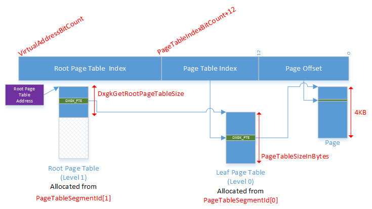

# GPU virtual address

graphics processing unit (GPU) virtual addresses are managed in logical 4KB or 64 KB pages at the device driver interface (DDI) level. This allows GPU virtual addresses to reference either system memory, which is always allocated at a 4KB granularity, or memory segment pages, which may be managed at either 4KB or 64KB.

The video memory manager supports a multilevel virtual address translation scheme, where several level of page tables are used to translate a virtual address. The levels are numbered from zero and the level zero is assigned to the leaf level. Translation starts from the root level page table. When the number of page table levels is two, the root page table can be resized to accommodate a process with variable GPU virtual address space size. Every level is described by the [**DXGK\_PAGE\_TABLE\_LEVEL\_DESC**](https://msdn.microsoft.com/library/windows/hardware/dn906832) structure which is filled by the kernel mode driver during a [*DxgkDdiQueryAdapterInfo*](https://msdn.microsoft.com/library/windows/hardware/ff559746) call. The kernel mode driver also fills out the [**DXGK\_GPUMMUCAPS**](https://msdn.microsoft.com/library/windows/hardware/dn906348) caps structure to describe the GPU virtual addressing support.

Each process has its own GPU virtual address space. Before a graphics context of a process can be set for execution the kernel mode driver will get a [*DxgkDdiSetRootPageTable*](https://msdn.microsoft.com/library/windows/hardware/dn906342) call which sets the root page table address.

The virtual address translation for the case of two page table levels is shown in the following diagram.

The GPU virtual address has [**DXGK\_GPUMMUCAPS**](https://msdn.microsoft.com/library/windows/hardware/dn906348)::**VirtualAddressBitCount** bits.

The low bits \[0 - 11\] represent an offset in bytes in a page. The next [**DXGK\_PAGE\_TABLE\_LEVEL\_DESC**](https://msdn.microsoft.com/library/windows/hardware/dn906832)::**PageTableIndexBitCount** bits represent the index of a page table entry in a leaf level page table.

The number of entries in a page table is 2DXGK\_PAGE\_TABLE\_LEVEL\_DESC::PageTableIndexBitCount and the page table size is [**DXGK\_PAGE\_TABLE\_LEVEL\_DESC**](https://msdn.microsoft.com/library/windows/hardware/dn906832)::**PageTableSizeInBytes** bytes.

The rest of the bits represent an index to a page table entry in the root page table. The root page table is resizable for the 2-level translation scheme and a new [*DxgkDdiGetRootPageTableSize*](https://msdn.microsoft.com/library/windows/hardware/dn906339)DDI is introduced to obtain its size.

The [**DXGK\_PTE**](https://msdn.microsoft.com/library/windows/hardware/ff562008) structure is used through the DDI to represent a page table entry. This structure represents information about each entry, which the Microsoft DirectX graphics kernel manages. The driver uses this information to build hardware-specific page table entries.

## Creation of page table allocations

Page tables are created as implicit allocations and do not have a user mode driver or a kernel mode driver handle.

To allocate a page table, the video memory manager allocates an allocation of size [**DXGK\_PAGE\_TABLE\_LEVEL\_DESC**](https://msdn.microsoft.com/library/windows/hardware/dn906832)::**PageTableSizeInBytes** from the segment, specified in **DXGK\_PAGE\_TABLE\_LEVEL\_DESC**::**PageTableSegmentId**. After creation, the video memory manager initializes every entry in the page table to *invalid* using the new [*UpdatePageTable*](https://msdn.microsoft.com/library/windows/hardware/ff560815) paging operation. Page tables never change size, except for the root page table in the 2-level translation scheme.

The video memory manager supports resizing of the root page table in the 2-level translation scheme. When a root page table, covering a specified amount of address space, is being created, the video memory manager calls the new [*DxgkDdiGetRootPageTableSize*](https://msdn.microsoft.com/library/windows/hardware/dn906339)DDI to determine the required allocation size for it. The video memory manager then allocates an allocation of that size in the segment, specified by [**DXGK\_PAGE\_TABLE\_LEVEL\_DESC**](https://msdn.microsoft.com/library/windows/hardware/dn906832)::**PageTableSegmentId** for the root level. After creation, the video memory manager initializes every entry in the page table to invalid using the new [*UpdatePageTable*](https://msdn.microsoft.com/library/windows/hardware/ff560815) paging operation. The root page table can grow or shrink as the amount of video address space required by a process expands and shrinks. Once the root page table is created, the video memory manager calls the new [*DxgkDdiSetRootPageTable*](https://msdn.microsoft.com/library/windows/hardware/dn906342)DDI to associate the newly created root page table with the various context that will execute within.

In linked display adapter configurations, root page tables are created as *LinkMirrored* allocations, which have identical content and are located at the same physical address on each GPU in the link. Lower level page tables are allocated as *LinkInstanced* allocation to reflect the fact that their content may vary between GPU, typically because of different peer mapping. The content of page tables is updated separately on all GPUs.

## Growing and shrinking a root page table

This section is applicable only for systems with two levels of page tables. When the number of page table levels is greater than two, the page table size for each level is defined by the virtual addressing caps and is fixed.

When the user mode driver requests GPU virtual addresses, the video memory manager grows the size of the address space of a process to accommodate the request. This is accomplished by growing the size of the current root page table (if necessary) as well as allocating new page tables for the new range.

To grow a root page table the video memory manager creates another root page table allocation, makes it resident, and initializes its entires using [*UpdatePageTable*](https://msdn.microsoft.com/library/windows/hardware/ff560815) operations, and destroys the old allocation. The [*DxgkDdiGetRootPageTableSize*](https://msdn.microsoft.com/library/windows/hardware/dn906339) function is used to get the size of the new page table in bytes.

To shrink a root page table, the video memory manager creates a new page table allocation, makes it resident, copies a portion of the old page table to the new one using the *CopyRootPageTable* paging operation and destroys the old allocation.

After the resize operation completes, the video memory manager calls the [*DxgkDdiSetRootPageTable*](https://msdn.microsoft.com/library/windows/hardware/dn906342)DDI to associate the impacted contexts with their new root page table.

## Updating page table

As surfaces move around in memory, the video memory manager updates the content of page tables to reflect the new location of surfaces. This is done through the new [*UpdatePageTable*](https://msdn.microsoft.com/library/windows/hardware/ff560815) paging DDIs.

## Moving a page table

Page tables may be relocated or evicted by the video memory manager when a device is idle or suspended. When moving a page table, the video memory manager updates the higher levels page table to reference the new location of the page table by using the [*UpdatePageTable*](https://msdn.microsoft.com/library/windows/hardware/ff560815)DDIs.

When the root page table itself is relocated, the video memory manager calls the [*DxgkDdiSetRootPageTable*](https://msdn.microsoft.com/library/windows/hardware/dn906342)DDI to inform impacted contexts of the new location of their page directory.

## Physical page size

As mentioned previously the video memory manager supports two page sizes. System memory is always managed in 4KB pages, while memory segments may be managed at either 4KB or 64KB granularity as determined by the kernel mode driver.

When opting for virtual memory to be managed in 64KB pages, all allocations are automatically aligned and sized to be multiple of 64KB.

Expanding all allocations to 64KB can have a significant memory impact. It is the responsibility of the user mode driver to pack small allocations into a larger one as to avoid wasting memory.

When mapping a GPU virtual address to a large 64KB memory segment page, the video memory manager will map 4KB page table entries to 16 contiguous 4KB pages in the memory segment. Both the virtual address and the physical address are guaranteed to share the same 64KB alignment (i.e. the bottom 16bits of the virtual address and the physical address are guaranteed to match.).

 

 

