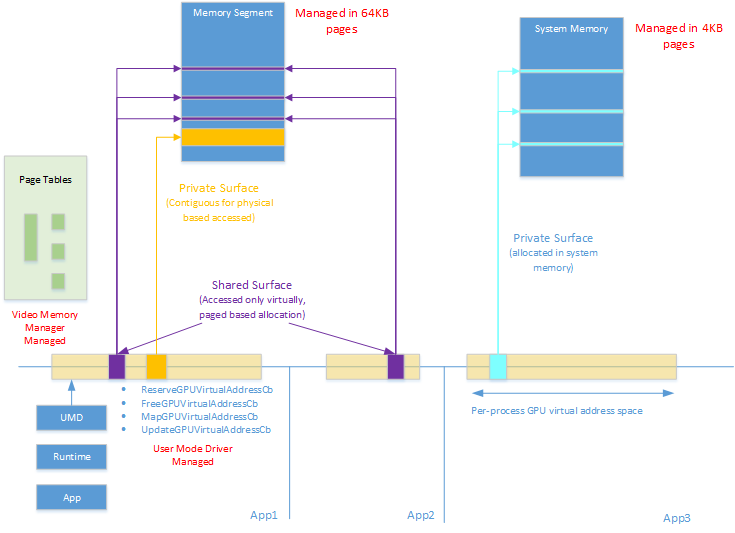

# GpuMmu model

In the *GpuMmu* model, the graphics processing unit (GPU) has its own memory management unit (MMU) which translates per-process GPU virtual addresses to physical addresses.

Each process has separate CPU and GPU virtual address spaces that use distinct page tables. The video memory manager manages the GPU virtual address space of all processes and is in charge of allocating, growing, updating, ensuring residency and freeing page tables. The hardware format of the page tables, used by the GPU MMU, is unknown to the video memory manager and is abstracted through device driver interfaces (DDIs). The abstraction supports a multilevel level translation, including a fixed size page table and a resizable root page table.

Although the video memory manager is responsible for managing the GPU virtual address space and its underlying page tables, the video memory manager doesn't automatically assign GPU virtual addresses to allocations. This responsibility falls onto the user mode driver.

The video memory manager offers two set of services to the user mode driver. First, the user mode driver may allocate video memory through the existing [*Allocate*](https://msdn.microsoft.com/library/windows/hardware/ff568893) callback and free that memory through the existing [*Deallocate*](https://msdn.microsoft.com/library/windows/hardware/ff568898) callback. Just like today, this returns the user mode driver a handle to a video memory manager allocation, which can be operated on by a GPU engine. Such allocation represents only the physical portion of an allocation and may be referenced by an engine, operating physically, through allocation list reference.

For engines running in the virtual mode, a GPU virtual address needs to be explicitly assigned to an allocation before it may be accessed virtually. For this purpose the video memory manager offers the user mode driver services to reserve or free GPU virtual addresses and to map specific allocation ranges into the GPU virtual address space of a process. These services are very flexible and allow the user mode driver fine grain control over a process GPU virtual address space. The user mode driver may decide to either assign a very specific GPU virtual address to an allocation, or let video memory manager automatically pick an available one, possibly specifying some min and max GPU virtual address constrains. A single allocation may have multiple GPU virtual address mappings associated with it and services are provided to the user mode driver to implement the *Tile Resource contract*.

Similarly, in a linked display adapter configuration, the user mode driver may explicitly map GPU virtual address to specific allocation instances and choose for each mapping whether the mapping should be to self or to a specific peer GPU. In this model, the CPU and GPU virtual addresses assigned to an allocation are independent. A user mode driver may decide to keep them the same in both address spaces or keep them independent.

GPU virtual addresses are managed logically at a fixed 4KB page granularity through the DDI interface. GPU virtual addresses may reference allocations, which are resident in either a memory segment or system memory. System memory is managed at 4KB physical granularity while memory segments are managed at either 4KB or 64KB at the driver's choice. All video memory manager allocations are aligned and sized to be a multiple of the page size chosen by the driver.

Access to an invalid range of GPU virtual addresses results in an access violation and termination of the context and/or device that caused the access fault. To recover from such a fault, the video memory manager initiates an engine reset which gets promoted to an adapter wide timeout detection recovery (TDR) if unsuccessful.

The *GpuMmu* model is illustrated below:

 

 

