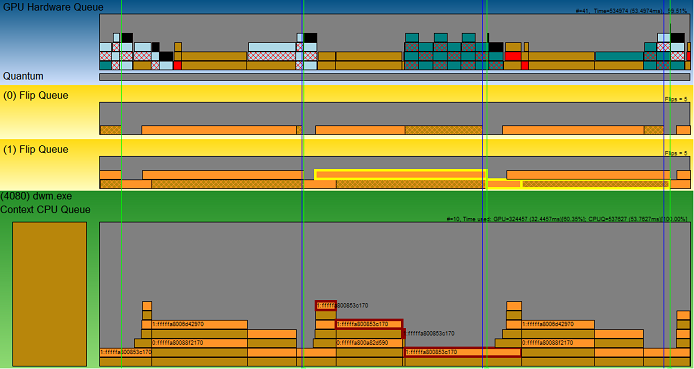
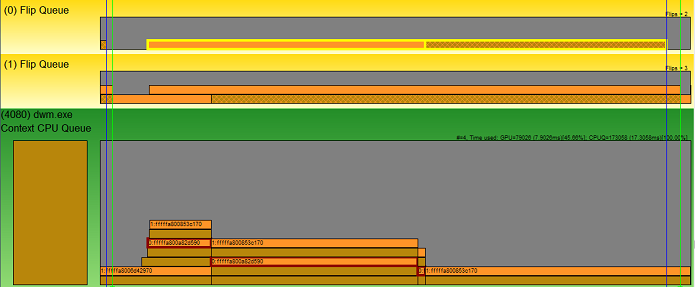
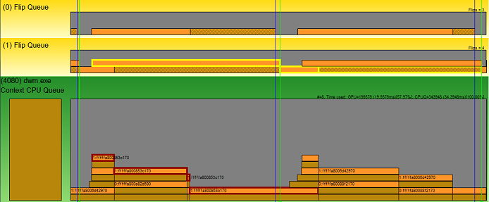

# GPUView Flip Queue

The following figure shows a zoomed-in screen shot of the main UI with a focus on the Flip Queues. The Flip Queues show the relationship between the Vertical Synchronization (VSync) of the monitors and the present data from the applications. The location of the Flip Queues in the UI is directly related to the GPU Hardware Queue. If there were two adapters on the system where this trace was taken, you would see a GPU Hardware Queue following by its Flip Queue (one per monitor) followed by a second GPU Hardware Queue followed again by its Flip Queue (again, one per monitor). 

The following diagram represents just over three frames of data. With this snapshot, the first two VSync locations are drawn to help denote frames. (For more information, see [Event Listing Dialog Box](event-listing-dialog-box.md) for the check boxes to enable the VSyncs.) 

 

The thing to notice with the Flip Queues is that it is broken up into a solid-color section and a crosshatched section. The solid-color section represents the time when the application (in this case DWM) is working to produce the content that needs to be displayed. The crosshatched section represents the idle time that the data waits for the flip moment (the VSync). 

Zooming in on the center frame shows the alignment to the VSyncs. 

 

Here it is a little clearer that Flip Queue 0 is aligned to the blue VSync line and Flip Queue 1 is aligned to the green VSync line. Also notice that the second present packet is selected in the DWM Context CPU Queue (highlighted in red), and GPUView has highlighted the Flip Queue present packet that is associated. 

Looking more closely at that Flip Queue present packet, you see that the solid-color section represents the start and end of the present packet. This is the period of time when the GPU performs the work requested by the DMA packet. The following crosshatched section shows the time spent waiting for the next moment where the data can be displayed to the user. That moment happens at the Vertical Refresh (VSync) on the monitor. 

The following diagram shows the association with the second monitor. 

Here, the DWM Present Packet just above the previous one is selected (highlighted in red here) and GPUView has highlighted the corresponding Flip Queue packet. Notice that the work, time that the GPU spent processing the data in the DMA packet, took longer than the first frame. The result is that the information is shown to the user at the end of the second frame.

