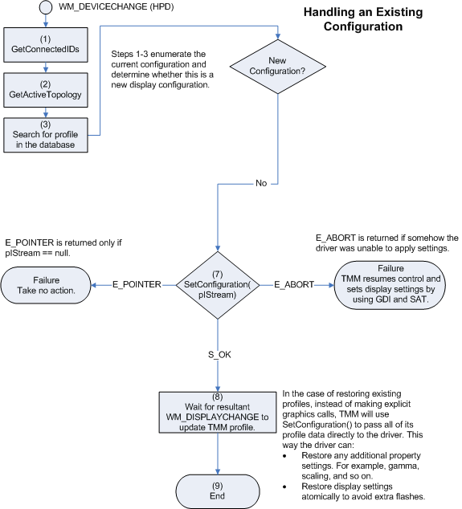

# Handling Existing Monitor Configurations

Besides detecting new monitors and launching the TMM dialog in a two-monitor configuration, TMM also must restore previous display configurations. TMM can restore display configurations by passing display data to the user-mode display driver through the [**IViewHelper::SetConfiguration**](https://msdn.microsoft.com/library/windows/hardware/ff568176) method. TMM will allocate memory and store display modes and topology information in the memory. TMM passes this memory in an **IStream** interface that the *pIStream* parameter of **SetConfiguration** points to. The user-mode display driver can also modify or fold in other display data (for example, gamma or TV settings). When the driver is finished with the display data, the driver calls the **IStream::Release** method to free the memory.

The following figure shows the flow of operations that occur when TMM restores an existing monitor configuration.

 

 

